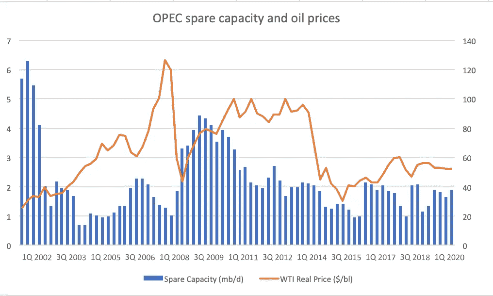
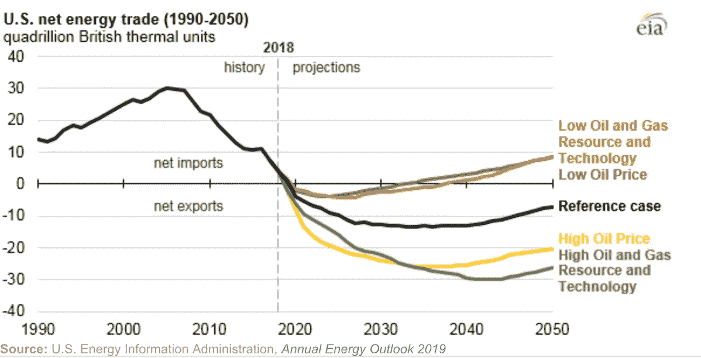
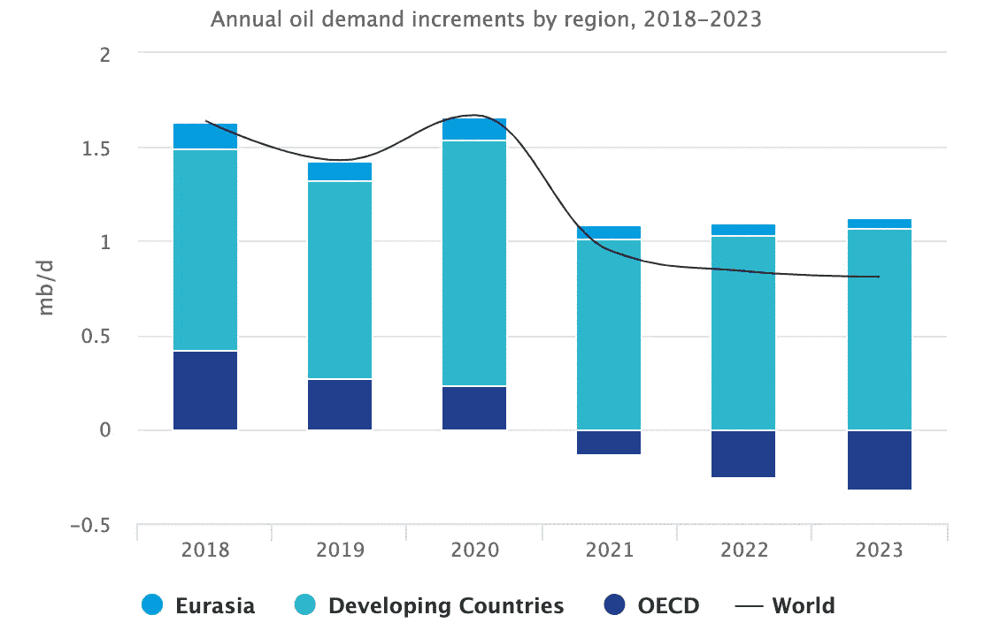

# 石油:制裁和贸易不确定性的故事

> 原文：<https://medium.datadriveninvestor.com/oil-a-tale-of-sanctions-and-trade-uncertainty-2ae5b855b5f0?source=collection_archive---------10----------------------->

概要:美国恢复了对伊朗的制裁，迫使其主要买家将石油进口量降至零。这导致油价短暂反弹，但现货升水很可能在这里发挥作用，因为目前的油价低于 4 月份。诚然，伊朗不太可能完全停止出口，而石油输出国组织的闲置产能将足以弥补伊朗石油产量的损失，因此油价将在 53-57 美元的区间内波动。

***制裁对油价来说是短暂的恩惠*** 。

美国加强了对伊朗的制裁，要求伊朗原油进口商停止购买石油。同时，伊朗伊斯兰共和国向中国(28%)、印度(22%)、韩国(18%)、日本(8.2%)、意大利(8%)和法国(5.9%)出口石油。因此，石油输出国组织和俄国可能会弥补失去的伊朗石油。过去，制裁曾导致油价大幅上涨，布伦特原油价格逼近 80 美元，WTI 原油价格远高于 65 美元。由于美国页岩以及俄罗斯和沙特阿拉伯创纪录的产量，最近几个月由制裁推动的反弹似乎有所缓解。

 [## 另一场精心策划的全球经济危机正在逼近？如果我们的数据经济可以帮助它，就不会了-数据…

### 我们的 DApp 的开发，称为 DECENTR，目前正与我们的 R&D 同步进行，作为我们即将到来的…

www.datadriveninvestor.com](https://www.datadriveninvestor.com/2019/03/06/another-engineered-global-economic-crisis-looming-not-if-our-data-economy-can-help-it/) 

***伊朗原油进口商不太可能停止购买***

虽然石油市场上存在伊朗的可行替代方案，但中国对美国的制裁不太感兴趣，因为根据伊朗国家通讯社的报道，中国在伊朗油田投资 50 亿美元，签署了 150 亿美元的谅解备忘录。此外，两国之间持续稳步增长的双边贸易和不断加深的经济联系。根据 Shariatinia 和 Azizi (2017)的说法，伊朗参与一带一路将促进东方的连通性和金融一体化，而中国将成为该地区的主要通道。与此同时，伊朗不太可能将出口降至零，很可能会使用关闭船舶传输等其他手段来规避美国的监控。

***石油输出国组织余力相救***

随着制裁生效，石油输出国组织可能会向全球市场供应失去的伊朗石油。如图所示，石油输出国组织的闲置产能将取代伊朗提供的高质量原油。再加上俄罗斯和沙特阿拉伯创纪录的产量，这应该会阻止布伦特原油价格大幅飙升至 80 美元/日。

***欧洲的特殊目的不可能庇护伊朗的经济收益***

欧洲的特殊目的工具 Instex 旨在保护在伊朗做生意的欧洲公司，不太可能确保联合综合行动计划(通常称为伊朗核协议)中商定的经济收益。因此，像法国道达尔、空中客车和 PSA/标致这样的公司；丹麦的马士基、德国的安联、西门子；意大利的埃尼；日本的马自达和三菱 UFJ 金融集团；由于担心被美国市场和银行系统排斥，英国石油公司已经限制了商业活动。

Source: [EIA](https://www.eia.gov/todayinenergy/detail.php?id=38152)

***美国驾驶季快到了！***

随着美国驾驶季节的到来，美国消费者将购买大量原油。因此，如果家庭收入因价格上涨而受到贸易战的影响不大，油价就有可能出现短暂上涨。生产商目前正在消化与关税相关的成本，这对家庭收入和石油需求来说是个好兆头。即便如此，EIA 对美国原油的预测仍然乐观，到 2020 年出口可能超过进口。因此，美国页岩革命可能会支撑任何短暂的需求过度，尽管相对于美国创纪录的产量来说不太可能。

Source: [OPEC Secretariat](https://woo.opec.org/chapter.html?chapterNr=3)

***全球平衡:石油需求增长和贸易不确定性***

诚然，油价的周期性结果可以用更严厉的制裁和全球贸易不确定性的平衡来解释。虽然恢复对伊朗和委内瑞拉的制裁旨在收紧市场，但全球贸易的不确定性对全球石油需求产生了不利影响，因为企业推迟了投资计划，而收紧的金融环境无助于支持全球价值链。因此，人们应该警惕过度乐观，因为油价可能会将短期情绪与阻止持续反弹的基本面更紧密地联系在一起。

如上图所示，2019 年石油需求增长预计将低于 2018 年，2018 年同步的周期性上涨支撑了全球经济和石油需求。与此同时，货币紧缩、全球贸易和政治不确定性仍是 2019 年石油需求增长和 GDP 结果的重大阻力。不仅国际货币基金组织将 2019 年国内生产总值预测从 2018 年 1 月的 3.1%下调至 3.3%，日益加剧的美中贸易关税战也将影响石油需求和全球增长。后者也应该有助于防止对新一轮反弹过于乐观。

***油价下一步走向何方？***

随着油价在短期内与基本面脱节，并越来越多地受到情绪和全球政策不确定性的驱动，预测仅反映基本面可能是错误的。我的模型目前预测油价在 53-57 美元之间；我的理由不仅在于石油输出国组织的闲置产能，还在于向市场输送更多石油所需的时间。然而，美中贸易战的降级可能会向油价发出更持久的看涨信号。

**参考列表**

1)挑战预期:中国的伊朗贸易与投资，Emma Scott，2016 年 4 月，可点击此处获得[https://www . mei . edu/publications/Defying-Expectations-China-Iran-Trade-and-Investments](https://www.mei.edu/publications/defying-expectations-chinas-iran-trade-and-investments)

2)路透社 2017 年 12 月发表文章称，在西方公司推迟投资之际，中国向伊朗经济注入数十亿美元

3)丝绸之路经济带中的伊朗-中国合作:从战略理解到操作理解，穆赫森·沙里亚特尼亚，哈米德雷扎·阿齐齐