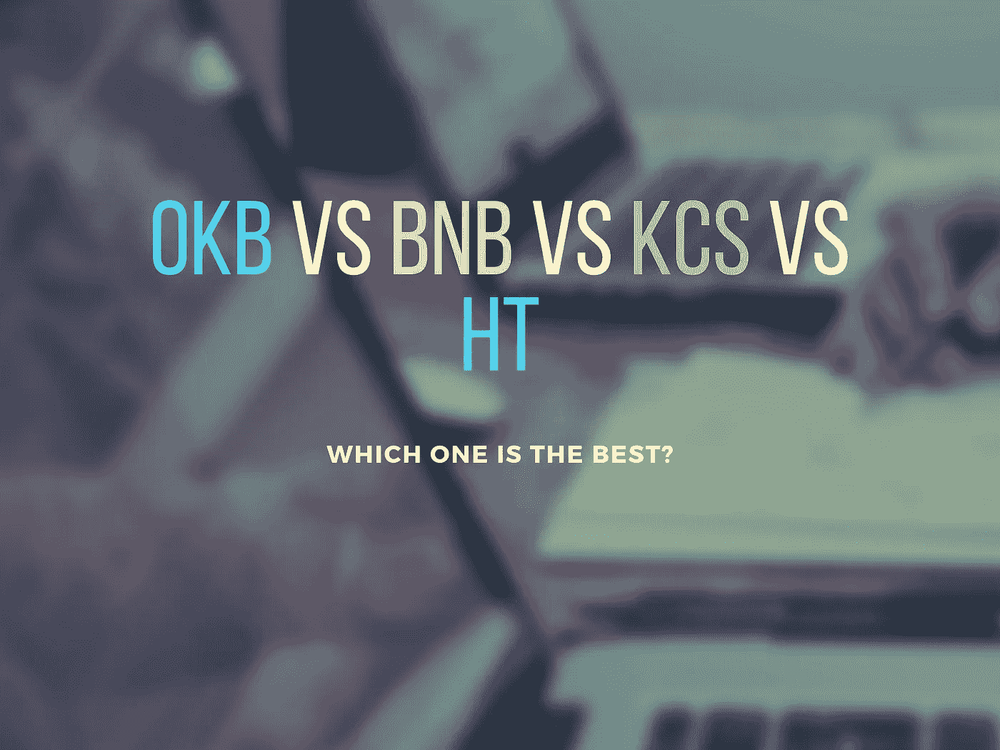
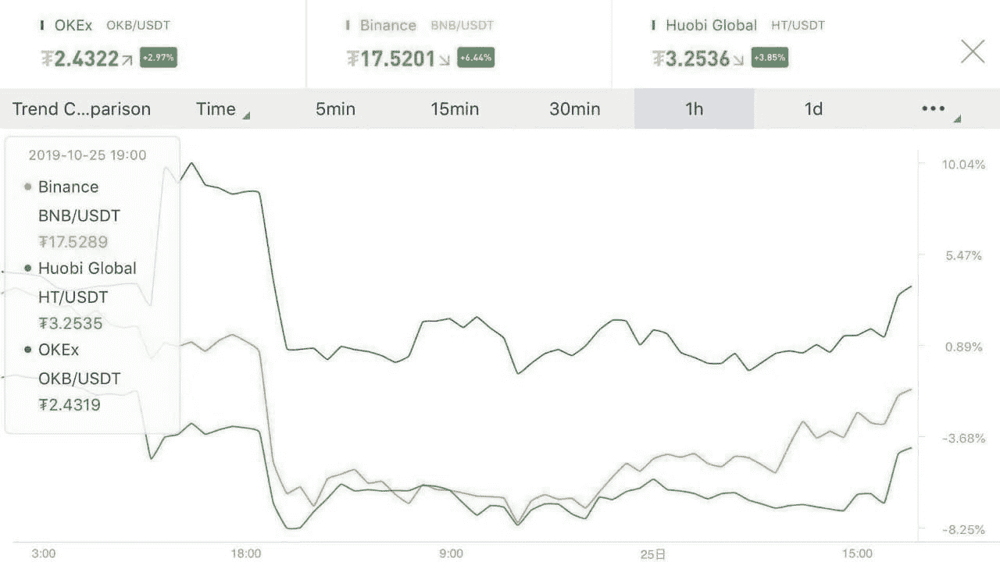

# OKB、BNB、KCS 和 HT:哪一个更好？

> 原文：<https://medium.datadriveninvestor.com/okb-bnb-kcs-and-ht-which-one-is-better-8596456f1b0c?source=collection_archive---------3----------------------->

## 顶级加密交易所的本地令牌概述

2019 年被证明是加密社区非常发生的一年，尽管存在不确定性和波动性，市场仍在扩大。此外，脸书的 libra 公告帮助加密货币获得了一些合法性，并将许多怀疑者变成了潜在的支持者。越来越多的人开始谈论虚拟货币对传统金融体系带来颠覆的可能性。届时，密码交易所将成为主要的交易中心。它们促进了加密货币交易。现在，除此之外，他们还在开发自己的本土硬币。这使他们能够扩大用户群，并筹集资金。

当交易所用户投资于其数字令牌时，他们能够开发一个加密交换生态系统。作为回报，他们获得交易费折扣、一些治理权和其他奖励。他们还受益于本机令牌价值的指数增长，因为加密交易所实施了几种策略来提高它们的价值。

 [## 2019 年十大区块链课程|数据驱动的投资者

### 渴望在区块链发展吗？你想知道区块链是如何工作的，但不知道在哪里？或者就是太多了…

www.datadriveninvestor.com](https://www.datadriveninvestor.com/2019/03/08/top-10-blockchain-courses/) 

我们来看看四大密码交易所提供的原生币。

【与 OKEx 的 OKB 相比，币安的 BNB 和 Huobi Global 的 HT 在 10 月 25 日的市值大幅下跌。OKB 仍然是本土代币中表现最好的。]

## [OKB 令牌(OKEx)](https://www.okex.com/)

OKB 是 OKEx 的原生货币，就衍生品月度交易量而言，OKEx 是顶级加密货币交易所。总部位于马耳他的 crypto exchange 的令牌生态系统旨在充当全球区块链团队可用于开发全球生态系统的基础令牌。

OKEx 的原生硬币拥有相当大的用户基础，因为它可以在该交易所的几个应用程序中使用。用户数量很快就会大幅增加，因为 OKB 持有者可以用他们的代币购买 BitTorrent 的订阅。流行的点对点文件传输协议拥有数百万用户。此外，数字资产信贷金融服务平台 LinkEye 允许其用户使用 OKB 进行财富管理和贷款服务。多链数字钱包 KCASH 和金融平台 Molecular Future 现在也支持 OKEx 的原生硬币。

OkEx 最近与三家著名的安全公司 Slowmist、Beosin 和 Certik 合作，为持有其本地令牌的用户保护其交易所。由于这些合作关系，他们现在可以使用 OKB 购买这三家公司提供的服务和保护。

OKB 是今年表现最好的数字代币之一，占据了相当大的市场份额。2019 年 7 月，它飙升了 163%。许多人认为，OKB 将继续增长，因为它有巨大的潜力。一些密码专家预测，到 2020 年，OKEx 的令牌可能会增长 1500%以上。截至 2019 年 10 月 25 日，OKB 的市值为 4760 万美元；现在的交易价格是 2.38 美元。目前，在总共 3 亿张钞票中，有 2000 万张在流通。

## BNB ( [币安](https://www.binance.com/en)币)

BNB，或币安硬币，是受欢迎的币安密码交易所的本地令牌。它的用户可以用它在交易所获得交易折扣。但是，折扣率会随着时间的推移而降低，用户在第四年后就没有折扣了。此外，币安用户可以使用 BNB 支付交易费和提现费。他们也可以在店内付款。此外，他们还可以用 BNB 兑换其他加密货币。

由于交易折扣的减少，BNB 的价值下降。为了阻止货币贬值，币安创造了一个叫做“燃烧”的过程根据交易所的交易量，它每个季度都会摧毁 BNB。计划是继续销毁，直到 BNB 总供应量的 50%(1 亿)被烧掉。币安打算只流通 1 亿 BNB，这将增加其价值。2019 年 10 月 17 日，币安宣布完成第 9 次季度令牌燃烧，燃烧了 2，061，888 BNB。

截至 2019 年 10 月 25 日，BNB 的市值为 26.7 亿美元；它的交易价格是 17.22 美元。目前总发行量为 2 亿份，其中有 1.5554 亿份在流通。预计到 2020 年底，BNB 的价值将达到 390.815 美元。

## KCS ( [库币](https://www.kucoin.com/)股份)

库币的生态令牌是库币股份，或 KCS。OKB 和 BNB 都是实用的象征，而 KCS 是礼节的象征。库币交易所用其赚取的交易费总额的 50%从市场上购买 KCS，然后作为奖金重新分配给至少拥有 6 个 KCS 的 KCS 持有者。它还通过提供交易费折扣和非常低的取款费来回报他们。而且，他们会自动获得 KuCoin 的独家促销、优惠和其他奖励。KCS 持有者可以用它来交易瑞士联邦理工学院、BTC、USDT、尼奥、DRGN 和长期资本。

根据价格预测，KCS 的价格将长期上涨。预计未来五年将增长 1126%。截至 2019 年 10 月 25 日，KCS 的市值为 1.0394 亿美元；它的交易价格是 1.18 美元。目前，在总共 2 亿部中，有 8780 万部在流通。在这 2 亿美元中，1 亿美元属于创始团队和早期投资者，而另外 1 亿美元对用户公开。

## HT ( [火币](https://www.hbg.com/en-us/)令牌)

Huobi Global 的原生 token 是 Huobi Token，简称 HT。像其他本地令牌的用户一样，HT 用户也可以获得交易折扣和特定活动的特殊访问权限。此外，HT 锁定和挖掘操作会奖励锁定其 HT 的 HT 用户。为此，交易所将其拥有的所有 HT 合并到 HPT 空投奖励计算中。

在总共发行的 5 亿个代币中，该交易所计划赠送 3 亿个代币作为购买积分卡的礼物。1 亿留作团队激励，以 4 年归属时间表为准；由此每年解锁 2500 万个 HT 代币。交易所把剩下的一亿用于用户奖励和平台业绩。

此外，它还承诺将 20%的收入用于回购其原生代币，并在每个季度烧掉它们。

截至 2019 年 10 月 25 日，HT 的市值为 7.6683 亿美元；它的交易价格是 3.17 美元。目前，在总共 5 亿枚代币中，有 2.4142 亿枚在流通。HT 是一项长期盈利的投资，预计其价值将在 2024 年底前达到 5.379 美元。

*免责声明:这不是财务建议。本邮件或其他媒体中的观点、陈述、估计和预测仅属于作者个人。这篇文章的内容不是由任何人赞助的，文中提到的观点是作者个人的观点。*