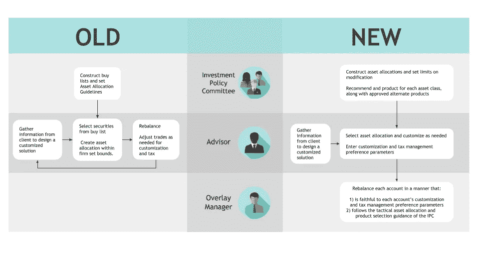

# 新旧财富管理第二部分:角色转变

> 原文：<https://medium.datadriveninvestor.com/old-vs-new-wealth-management-part-ii-role-changes-dcce7818ed2b?source=collection_archive---------7----------------------->

杰拉德·迈克尔

*财富管理领域最大的变化发生在职能角色上*

这篇[帖子](https://www.smartleaf.com/our-thinking/smartleaf-blog/oldvsnew-wealth-management-partii)最初发表在 [Smartleaf](https://www.smartleaf.com) 上。

上周的文章《新旧财富管理》是我们阅读量最高的博客。永远不会。

显然，人们对这个话题很感兴趣。我们想从一个不同的角度来看这个话题:财富管理的角色将如何变化。这些变化的核心是新的责任分工和更高水平的专业化。特别是，过去由顾问承担的不同职能现在被分成了三个专家小组:顾问、投资政策委员会和(一个新角色)重叠经理。我们将依次了解这些角色。

# 投资政策委员会

***旧:***IPC 构建核准证券的买入清单，并设定资产配置指导原则。

***新增:***IPC 构建资产配置，并为每种资产类别建议产品(如共同基金、ETS、证券加权清单)。同样重要的是，IPC 对定制资产分配和替代产品选择的构建设置了合规性限制。IPC 还可以对资产类别和/或证券漂移设定限制。IPC 将制定坚定的再平衡政策。

# 顾问

***旧:***顾问交易投资组合，从公司的买入清单中选择证券，确保投资组合符合公司的资产配置准则。顾问在为每个账户选择交易时会考虑定制和税务管理。

***新增:***顾问为每个帐户构造定制解决方案。顾问为每个账户选择最适合投资者需求的 IPC 创建的资产分配。该顾问修改该资产分配和/或产品组合，并设置过渡、税务管理、ESG 和其他参数，以满足投资者的个人需求。

# 叠加管理器

***旧:***不适用，叠加经理不是传统财富管理中存在的角色。

***新:***覆盖管理器以忠实于 IPC 的联合指令和由顾问设置的定制参数的方式交易每个账户。

本文开头的图表总结了这些角色的变化。实施这种新的财富管理并不简单，但回报是巨大的:

*   效率要高得多。
*   *它将定制和税务管理的增量成本降至零，因此为所有客户提供高水平的定制和税务管理变得经济实惠。*
*   *顾问可以花更多的时间和客户在一起。*
*   *比较一致。相似的账户会有相似的结果。IPC 的政策变更通常会在一个工作日内在整个业务范围内实施。*
*   *更顺从。通过捕获客户定制标准并自动执行大部分实施，合规性成为流程的一个“内置”功能，而不仅仅是一个事后审查。*

正如我们在上一篇文章中得出的结论，新的财富管理比旧的更好。这对客户来说更好，他们受益于更大的定制化、更好的税务管理和更多与顾问在一起的时间。这对大多数顾问来说更好，他们可以花更多的时间指导客户满足他们的财务需求。