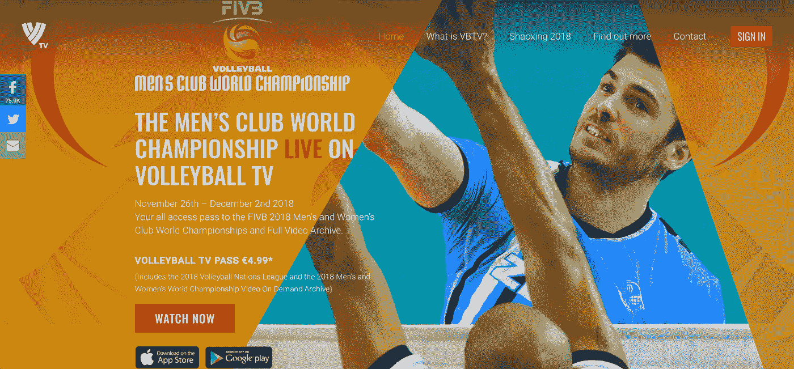
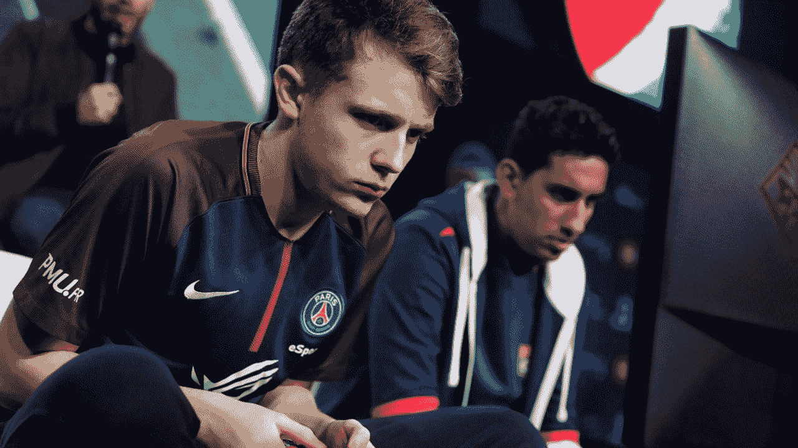

# 奥林匹克体育联合会用 OTT 平台塑造未来

> 原文：<https://medium.datadriveninvestor.com/olympic-sports-federations-shape-the-future-with-ott-platforms-b2ae67e040b8?source=collection_archive---------27----------------------->

在日内瓦湖畔，三个奥林匹克运动联合会最近宣布推出 OTT 平台。OTT 代表 over-the-top，它旨在通过提供一系列观看体验来成为体育广播的未来，因此挑战体育营销人员找到一种可持续的商业模式来开辟新的收入来源。在这篇文章中，我展示了一些成功的模式，并研究了数字和模拟广播的未来是如何形成的。

第一个“超越巅峰”的 IF 是 FIVB，它与微软达成了合作伙伴关系。通过这笔交易，排球联合会通过更新数据库架构并开始向球迷提供直播服务，为数字生态系统的发展奠定了基础。FIVB 电视台在全新的排球国家联盟(VNL)期间向公众开放，并吸引了人们的期望，看看球迷们在到达付费墙时会有什么反应。这项流媒体服务向€收取了 2018 年 VNL 和 2018 年男女世界锦标赛的 4.99 英镑。虽然比赛日程更受网络观众的青睐，但 IMG 已经将引人注目的动作内容带到了手机屏幕上。综合考虑所有因素，FIVB 市场部现在拥有大量数据来分析客户转化率和保留率，以应对付费墙模式。

在附近的图雷利城堡，FIH 也热衷于利用 OTT 平台的力量来提高曲棍球的全球知名度。去年，FIH 收回了奥运会直播的所有媒体权利。据 FIH 电视台的安迪·奥兰姆称，现在，联合会计划从 2018 年 1 月 10 日起提供免费服务，以流媒体形式播放“所有曲棍球比赛”。该战略与国际排联略有不同，它专注于运动员，试图使这项运动民主化，从而最大限度地促进曲棍球的发展。与总部位于伦敦的数字机构 Little Dot Studios 的合作突显了 FIH 正计划如何制作直播节目，并向网民强调网民们构想的内容。与 FIVB 一样，FIH 将拥有该平台产生的大数据的所有权，并有机会补充营销努力，以吸引新的赞助商。

不要忘记更大的球员，现在让我们看看欧洲足联和国际篮联对视频平台的做法，作为另一个恰当的例子。欧洲足球协会(European football association)正准备推出一个顶级的 OTT 频道，以促进五人制足球、青少年比赛，尤其是女子足球的发展，后者是该战略的核心。像 FIH 一样，其背后的驱动力是发展，而旗舰欧洲联赛和冠军联赛仍然依赖于现有的电视转播权和协议。然而，欧足联最近在美国的 B/R 直播平台和拉丁美洲的脸书直播了决赛，因此利用了第三方服务。总的来说，欧足联的数字团队希望其最先进的视频平台能够重现、扩展和补充电视观众。最终，欧足联将自己定位于媒体融合过程的中心。然而，打击盗版流媒体的斗争也可能会扩大。

就其本身而言，国际篮联仍然忠于 YouTube 包，这对于将篮球带到奥运会社交媒体排行榜的首位至关重要。国际篮联在 YouTube 上的 555，000 名用户让他们有可能与谷歌巨头谈判更好的交易，从而释放其全部的营销潜力。事实上，作为优质在线篮球内容的主要来源，国际篮联受益于既定的消费习惯，以保持其在每场比赛后国际奥委会第二组收入分配中的相关性。

然而，尽管一些奥运项目的转播前景似乎并不明朗，但电子竞技正成为真正的好生意。由于在网上长大的一代网民的巨大吸引力，基于数字的游戏趋势在全球范围内的影响是无与伦比的。因此，我们在传统媒体销售过程中看到了一个相反的趋势，即电视广播公司竞标本地数字体育的媒体权。2016 年，高盛对电子竞技的估值为 5 亿美元，并预计该市场将以每年 22%的速度增长，因此可以理解为什么传统媒体公司也想利用这一在线业务。毫不夸张地说，电子竞技模式统治着市场，这一成功有一个关键的收获:就内容而言，游戏玩家的反应和表现是该节目的主要驱动力，这是某种现代的偷窥行为。

混合模拟-数字合作伙伴关系的排练始于 2016 年，当时国际奥委会推出了奥林匹克频道。位于维迪的旧奥林匹克办公室已经与附属联合会举行了无数次圆桌讨论，以使新的奥林匹克频道总监了解在由传统广播公司主导的现有媒体全景中，该如何定位业务。除了向附属联盟提供直播服务和体育内容之外，还通过在美国与电视频道 NBC 以及在中东和北非地区与 beIN Sports 的扩展合作伙伴关系，在数字和传统项目的交叉领域协调利益冲突。

抓住与数字世界共存的需要，电视台和媒体权利人也在开发自己的 OTT 平台。欧洲体育的情况就是如此，这可能不仅仅是因为如今购买互联网比有线电视更容易。在互联网方面，像 Dazn 和 Mycujoo 这样的新生玩家也已经出现，他们建立在智能设备上，特别是电视设备上。可以肯定的是，观众是在线的，在线观众需要更多的娱乐。因此，OTT 平台必须创造流行的服务和独家内容，而不仅仅是复制电视广播。趋势是直播和电视广播在内容处理上有很大不同。

如果你喜欢这篇文章，请点击“喜欢”按钮，分享你的宝贵意见。