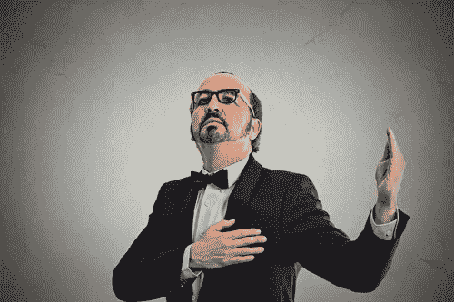
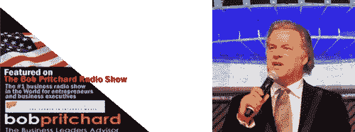
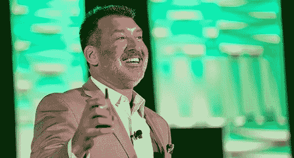
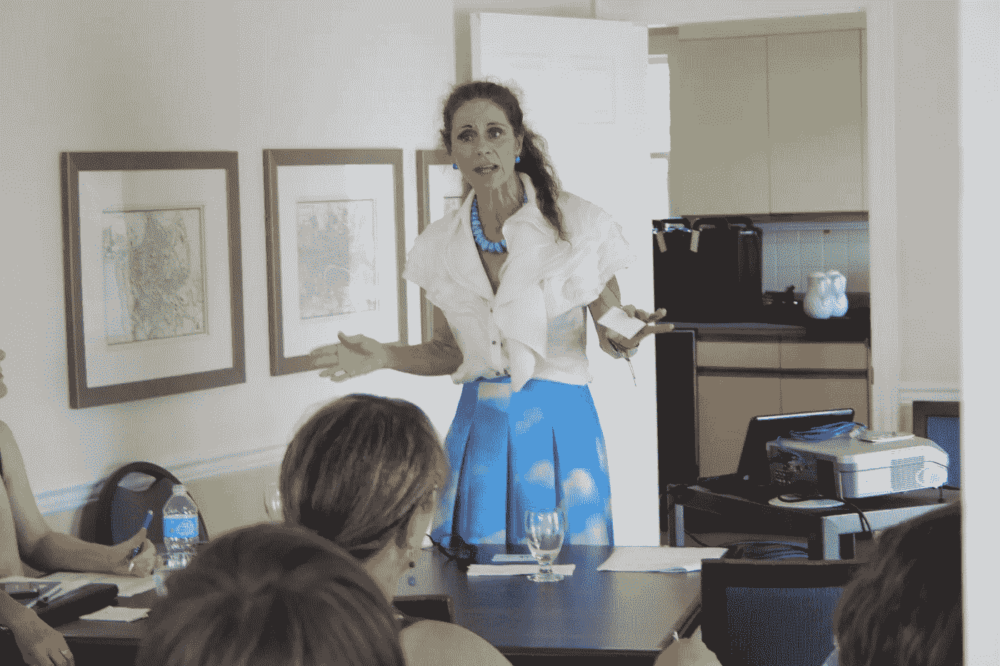

# 天哪，我太棒了，我受不了了，今天就雇佣我吧

> 原文：<https://medium.datadriveninvestor.com/omg-i-am-so-wonderful-i-cant-stand-it-hire-me-today-569a9e69369d?source=collection_archive---------2----------------------->

Deposit photos

我的演讲教练奥维尔·雷·威尔逊是世界上最著名的(也是当之无愧的)五大销售演说家之一，他写过几本畅销书(包括《游击队销售》)

在竞争激烈的职业演说家的世界里，我也是其中一员，并不缺少自我中心的沾沾自喜。这是一个吸引那些迫切需要观众认可的人的行业，他们成为演讲者不一定是为了服务客户，而是为了支撑一个严重受伤的自我，或者修复一种怪诞的不安全感。那绝不是我们所有人。那些在这个行业获得巨大成功的人都是极度以客户为中心的。那些从这种独特而富有挑战性的生活方式中创业的白发人在这个过程中变得非常卑微。

嗯，至少有一些。

作为你的早餐读物，让我和你们分享奥维尔·雷向我发射的让我大笑的东西:

**世界上最物有所值的商务演讲者**

*   六大洲 30 年的商业顾问
*   获奖者*“年度国际营销人员”*
*   1966 年在 63 个国家的商业演讲:基调，主持人，专题小组成员
*   91 家财富 500 强客户
*   5 本国际畅销商业书籍的作者
*   著名的鲍勃·普里查德商业广播节目主持人，在 voiceamericabusiness 主持了 8 年，向全球广播
*   采访 360 多位世界上最成功的商业人士
*   每日:30 秒阅读《商业通讯》,分发给 176 万商业主管和企业家

**宝马…**我们有史以来最好的演讲者

将知识、信息、讨论、幽默、乐趣和互动参与注入到你的员工和客户会议中。

以洛杉矶为基地。联系 margie@bobpritchard.com的玛吉获取信息。

尽管语法不好，但我认为在我的整个职业生涯中，我从未见过一个演讲者如此自鸣得意地推销自己。这张纸上没有一件事能说明某人可能从这个吹牛大王那里得到的价值。

**meme meme meme meme meme meme。**我太棒了。我太棒了。雇用我。

没有。

作为一个行业，专业演讲是由卡维特·罗伯特(Cavett Robert)认真开创的，他的慷慨精神在他于 1973 年创立的组织中仍然受到许多人的称赞。他全心全意地支持其他演讲者，为客户服务，并回馈社区。那些国家安全局的成员每年在全国会议上庆祝卡维特奖，以表彰最能体现其遗产的演讲者。对我来说，这就是这个行业的一部分。然而，会议本身并不完全是谦逊的表现。

Deposit photos

想象一下，参加一个全国性的会议，与会者都是从事或声称从事演讲行业的人。大约 3000 人对你喋喋不休，试图向其他人推销他们的服务(这在很大程度上毫无意义)，他们是世界上最糟糕的听众。每年可能有 33%或更多的流动率，因为专业演讲是一个残酷的挑战性行业。像所有的创业努力一样，销售是最重要的。这也完全是关于客户的。在过去的十年里，我一直在做这件事，我越来越注意到加入这个行业的演讲者更关注他们的品牌，而不是他们给客户带来的价值。在脸书的帖子里，我看到关于什么颜色的夹克，什么颜色的口红，我应该染头发，等等等等的讨论。

伙计们，没人在乎。

作为一个多年来为财富 100 强销售和提供培训的人，这种以自我为中心、以我为中心的废话是对我的职业的侮辱。作为一个曾经雇佣过演讲者和顾问的人，客户只关心一件事。哪些可衡量、可操作的结果将改善我的业务？无论你是一个幽默作家还是一个关注行为结果的商业演说家，这都没有区别。没有人会雇佣一个不能传递价值的演讲者，更不用说请他回来了。

David Avrin, a very good speaker in the NSA family

演讲行业是独一无二的，因为我们擅长做大多数人害怕做的事情:站在观众面前。起立鼓掌就像女英雄 high，一种喂养自我怪物的华丽阿片类药物——我有我的一份，我可以证明如果你不非常非常小心，你可以在自己的特殊性上喝得多醉。那些读了他们自己的节目后“快乐清单”的演讲者，就像上面的 Pritchard 先生一样，完全相信他们是多么的伟大——忘记他们是来为谁服务的。

从业近 40 年后，我注意到最好的演讲者已经明白他们存在的原因只有一个:服务。句号。不管有什么样的荣誉、奖项、快乐的床单、新闻稿，不管有多少人告诉他们他们有多伟大，他们都明白这最终不是关于他们的。世界上最好的演说家无非是容器。

这就是我的意思，对于这篇文章，让我只说说话，尽管所有伟大的工作都是如此，无论是建筑还是街道清扫还是在柬埔寨扫除地雷。

The author delivering a seminar in Halifax, Canada

当你到达一个点，当你把自己交给更高的力量，并让那种力量在舞台上通过你发挥作用时，你的一部分在一个深层次上意识到*你不是那个说话的人*。是的，你练习过。是的，你研究过。是的，你用心学习舞台艺术。然而，在某个时刻，你放下了一切，话语就来了。正确的词语。正确的情绪。正确的一切。你与此事无关。你不再重要了。你不能做这个演讲，这个研讨会。

你不重要，除了作为信使。当你结束你的演讲，你得到了那个地位，如果你真的做了你的工作，你会意识到这个地位不是给你的。

这是终极快感。我感觉到了。世界上没有什么比当你几乎不记得你说过什么，或者你是怎么说的时候更令人谦卑、更令人振奋的了。*它刚刚来了*。*它刚刚工作。*

**但是你没有做到。**

史蒂文·普莱斯菲尔德在他宏伟的、残酷的《艺术之战》一书中写道:

当奎师那告诉阿尔诸那，我们有权享用我们的劳动，但无权享用我们的劳动成果时，他是在劝告战士们要按领土行事，而不是按等级行事。我们必须为了工作而工作，而不是为了财富、关注或掌声。

Scene from the Bhagavad-Gita

他指的是有史以来最伟大的宗教著作之一,*博伽梵歌。在一系列关于工作、艺术和自我的改变人生的小书中，普雷斯菲尔德迫使我们认识到，当我们作为艺术家到达某一点时(任何作品都是艺术，如果你以这种方式拥抱它)，那么你是为了艺术而艺术。在某些时候，你意识到你的自我，你的全能的自我，在那神圣的土地上没有位置。那些力量通过你找到一条路，它们是神圣的。*

引用 Pressfield:

《博伽梵歌》告诉我们，以这种方式劳动是冥想的一种形式，也是精神奉献的最高形式。

你的宗教信仰是什么并不重要。这是把你的工作交给上帝。哪里有上帝，哪里就没有全能的我。在那里，无论你是谁，无论你是谁，上帝都会以一种非常神圣的方式通过你发挥作用。但是如果你挡在路上就不会。

64 岁的 Orvel Ray 在他的工作中处于精通水平，他花了很多时间在全国各地的 NSA 分会免费介绍程序。从这项工作中，他得到了客户，但这里的一块。这项工作源于他对语言社区的慷慨。许多人受益于他广博的知识。不收费。那些想和他一起工作的人找到了他。作为一个使用过他的服务，并在他的帮助下写了两本获奖书籍的人，我可以亲自证明他能为客户提供什么。人们获得了相当大的价值，这还不包括他自吹自擂自己有多伟大。他只是出去服务。工作来了。

Photo by [Louis Hansel](https://unsplash.com/@louishansel?utm_source=medium&utm_medium=referral) on [Unsplash](https://unsplash.com?utm_source=medium&utm_medium=referral)

这是工作在这个词的最高意义上变得神圣的地方。这不是一朝一夕的事。这是艰苦的个人劳动，对你的手艺的深深的强烈的承诺，以及努力审视你的小我需求的意愿。

我们每个人都有从事神圣工作的潜力。那是什么工作无关紧要。当我们为了工作本身而工作时，它就变得神圣了。我们最终提升了他人，也通过这种方式提升了我们自己。但我们要明确一点。那不可能是我们的第一动机。

虽然普里查德先生享有一定程度的成功，如果我们相信他的废话，在某种程度上，如果我们所做的事情没有被神圣化，这是非常空洞的。神圣的工作是艺术，艺术是为艺术本身而做的，交给上帝，不管这对我们每个人意味着什么。这改变了一切。在那一点上，我们深深感激有机会表达我们服务于更高者的独特人性。

那就是在优雅和感恩中生活和工作。

在这个痴迷于自拍的世界里，在全能的我的世界里，这的确是越来越罕见的事情。

这让它更加珍贵。我只感觉过几次。如果我足够幸运并继续努力，也许这可以成为一种生活方式。那么我可以说我是一个艺术家，而不仅仅是一个职业演说家。