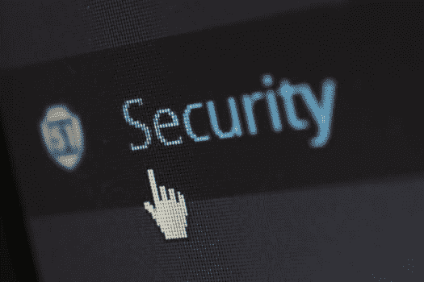
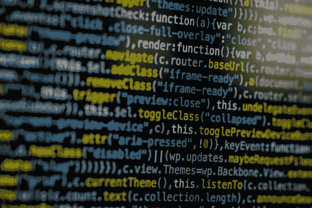
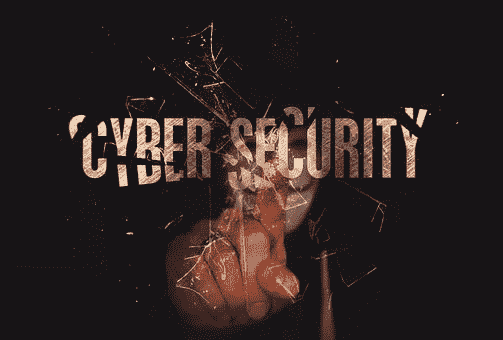
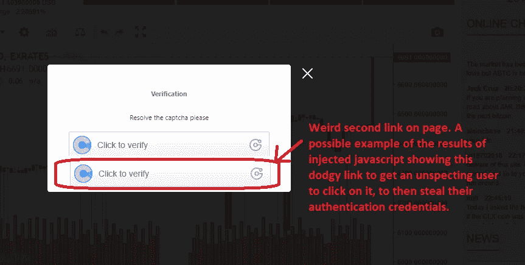

# OMG…我被黑了

> 原文：<https://medium.datadriveninvestor.com/omg-ive-been-hacked-34c4ed8927e7?source=collection_archive---------21----------------------->

几天前，我第一次被黑了。我在 [**Exrates.me**](https://exrates.me) 交易所有一个加密货币账户被黑了。小偷从那个账户偷走了我所有的密码。正如你们中的一些人可能知道的，我一直是**均衡器**项目的倡导者。目前，平等硬币(EQL)正在外汇交易所交易。这是一个伟大的项目，我想确保我是这个了不起的项目的一部分，购买支持社区和平等硬币。

登录后发现有问题是一种可怕的感觉。有一种直接的感觉，就像里面的东西掉到了我的胃的底部，一种恐惧的感觉穿过我的身体。这有点像在你差点发生事故，比如从自行车上摔下来，或者就在车祸之前的那一瞬间。那种知道的感觉…但是一切都太晚了，什么都做不了。

我以前听说过也读过一些人被黑客攻击的故事，还有几年前在 2014 年发生的臭名昭著的 Mt Gox“黑客”事件，当时属于客户和公司的大约 85 万个比特币不翼而飞。

黑客从我的账户中偷走了价值 670 美元的加密货币。对一些人来说，这听起来可能不算多，但对悉尼一个有抵押贷款的家庭中的 4 个孩子的父亲来说，这是我能拿出的全部资金。

## 小偷偷的东西

我购买了大约 41 万枚 EQL 的均衡器加密货币硬币。我也有进一步的 EQL 购买订单购买与 BTC 和瑞士联邦理工学院。我想确保在我全部取出之前，我买了 50 万 EQL。所以小偷从我这里偷走了将近 0.1 比特币(BTC)，大约 670 美元(在我写这篇文章的时候)。最初，他们偷的不仅仅是我的密码，还有我的梦想，那就是成为均衡器社区的重要一员，并拥有巨大的利益。幸运的是，一两个月前，我在我的 Agama 钱包里购买并提取了一些 EQL，谢天谢地，这些钱仍然是安全的。

在汇率上留下如此大量的密码是我的主要错误之一。我没有理由把那么多硬币留在交易所里，而是应该一买下 EQL 就把它取出来。

我看到其他人的账户和推文声称 Exrates 窃取了他们的密码，并警告其他人不要使用这种交换。查看推特网站，看看人们对汇率的问题列表。‏My 对这些“故事”的最初反应是嗤之以鼻，我只是认为他们可能做了一些糟糕的交易，只是想为此责备某人。但事后看来，警钟应该已经在我的脑海中响起。这些其他投资者声称 Exrates 偷了他们的硬币的账户，从最好的方面来看，显示了他们在维护安全网站方面的糟糕记录，从最坏的方面来看，鉴于持续的黑客攻击和有趣的交易，可能会向 Exrates 的人展示更黑暗的一面。我会让你从中得出自己的结论。

我没有早点退出，因为我以前从来没有被黑过，认为这永远不会发生在我身上。

这个黑客有两个部分:

1.  进入汇率交换网站
2.  从交易所撤回加密货币

第一部分是最难的，如何通过认证并进入 Exrates exchange 站点。我认为这种情况已经发生了，而且很可能会再次发生，除非 Exrates 做些什么来修复它，那就是通过跨站脚本(XSS)。XSS 是 OWASP 定义的十大黑客方法之一。

对于那些不知道的人来说， **OWASP** (开放 Web 应用程序安全项目)是一个提供关于计算机和互联网应用程序的公正、实用、经济的信息的组织。OWASP 信息被世界各地的公司用来帮助加强他们的系统抵御攻击和黑客。

我在澳大利亚做了大约 30 年的软件开发员。我目前在一家澳大利亚认可的存款机构(ADI)工作，每年所有员工都要接受 OWASP 十大攻击的培训。跨站点脚本(XSS)在过去十年或更长时间里一直位于 OWASP 十大攻击之一，这意味着它是最常见的攻击之一，也是大多数公司接受过培训的攻击之一。澳大利亚的 ADI 和银行受到监管，并被要求确保所有员工每年都接受 OWASP 十大培训。问题是使用不可信的、不受监管的、没有被强制遵循任何严格安全措施的外国交易所和机构。世界上大多数国家监管他们的银行实施现代互联网安全方法。然而，据我所知，加密货币交易所没有这样的压力来实施同样的安全和安全测试。我认为一般来说，较小的加密交易所都急于进入市场，像充分的安全测试和 PEN 测试(渗透测试)这样的要求是满足最后期限的首要条件。

## XSS 进入并冒充我

我相信 XSS 被用来进入我的账户。

> XSS 允许攻击者在受害者的浏览器中执行脚本，从而劫持用户会话、篡改网站或将用户重定向到恶意网站。

 [## 前 10 名-2017 A7-跨站点脚本(XSS) - OWASP

### XSS 是 OWASP 十大问题中第二常见的问题，在大约三分之二的应用程序中出现…

www.owasp.org](https://www.owasp.org/index.php/Top_10-2017_A7-Cross-Site_Scripting_%28XSS%29) 

## 会话劫持

每次你访问一个网站时，你都会得到一个“会话”,其中包含了某些安全信息，可以在该网站上验证你的身份。我相信我的会话被劫持了，然后攻击者能够冒充我并通过验证进入我的 Exrates 帐户。从那里他们关闭了 2FA(双因素认证)。Exrates 网站没有检查会话令牌是来自我的浏览器还是攻击者。它所检查的只是它是否有一个有效的会话令牌，它这样做是因为攻击者能够复制我的令牌，并开始使用它来冒充我。良好的编程实践是定期终止会话令牌。

黑客们把我所有的均衡器币(EQL)倒卖成了比特币(BTC)。他们立即将所有比特币换成美元卖出。然后，他们用这些美元购买以太坊(ETH ),然后将 ETH 放入自己的钱包。

他们撤回的黑客钱包地址是:
0xe 540624 d9d 813 e 86 e 5028 DDC 77 c 77 dfe 4 cfcb 565

我可以看到交易，也可以看到窃贼后来移动了 Eth。

XSS 的一部分是让受害者在不知情的情况下点击一个带有恶意软件的链接，该链接会将当前活动会话的会话信息返回给攻击者。这样，攻击者就可以将相同的会话凭据传递(复制并粘贴)到对 Exrates 网站的请求中。如果 Exrates 网站没有正确开发软件，它就不会检查这种类型的攻击，所以只会接受请求并做攻击者想做的任何事情。

我怀疑这一切都发生在我登录的时候。我记得登录 Exrates 网站时有一个异常，在同一个窗口上显示了两次“点击验证”链接，如下所示。我怀疑其中一个是真正的链接，另一个是恶意链接，被构建成看起来像真的一样(像特洛伊木马)。当时我没有多想，也只是点击了一下。

如果软件中存在“漏洞”和漏洞，攻击者通常会在网站中注入 javascript，以某种形式“添加”他们的恶意链接，让用户在不知道它会将受害者的身份验证信息发送给攻击者的情况下点击该链接，然后攻击者可以利用网站松散的安全性冒充受害者。写得不好的网站通常不会“净化”用户在字段中输入的数据。这使得黑客可以将 javascript 注入(键入恶意代码)到普通用户会键入的字段中。通过这样做，攻击者向窗口添加了额外的行为，因此当它呈现给一个有效的用户时，它会利用用户会话中的行为，并将其发送给攻击者，然后进行劫持。

根据 OWASP:

> 典型的 XSS 攻击包括会话窃取、帐户接管、MFA 绕过、DOM 节点替换或篡改(如特洛伊木马登录面板)、针对用户浏览器的攻击(如恶意软件下载、按键记录)以及其他客户端攻击。

## 现在怎么办？

我意识到我对这件事的反应完全取决于我自己。我可能会生气，沮丧，放弃这一切。我觉得这样不对。我不想在因果的尽头。我宁愿不要延续爱暴力、愤怒和消极的小我的罪行。我不希望这件事决定我如何生活，如何前进。是的，痛苦和失望就在那里，但我宁愿承认它是什么，然后继续前进。我希望在这件事发生之前，我能保持同样积极的状态，但是意识到如果我一直背负着这个包袱，我就做不到。

我仍然非常看好 Equaliser 项目，它为那些传统上买不起房子的人提供了负担得起的、坚固的、节能的房子。Equaliser 项目将继续前进，寻找其他有兴趣提供良好服务的交易所，并花费时间和精力来适当开发他们的网站，并继续对维护安全的加密货币交易所感兴趣。据我所知，Exrates 有一段黑客攻击的历史，我听说过一些可能的“黑幕”做法。我对汇率没有信心，我建议任何有资金的人尽量降低风险，尽快撤回他们没有积极交易的硬币。

有关均衡器的更多信息，请点击下面的链接。

带着爱与和平，

保罗·克拉克

中号:果冻

推特: [@greenbergblue](http://twitter.com/greenbergblue)

**链接**

有关**均衡器**的更多信息，请点击:

 [## 平衡装置

### 均衡器是一个基于区块链的解决方案，旨在提供负担得起的，强大的，节能和美丽的家园…

equaliser.org](https://equaliser.org/) 

加入我们的 **Discord** 娱乐节目，聊聊均衡器

 [## EqualiserDiscord

### 参加

的乐趣和聊天的不和谐. gg](https://discord.gg/GFAnKGz) 

我们非常感谢您的捐赠，您可以将钱存入我的以下地址-

比特币(BTC):35 fjf 5 ztp FB 8 crhogjbxdmsf 9 cmknqvhmm
以太坊(ETH):0x 2 f 14 f 76 A8 BBA 608 c 7d 0 C4 Fe 27 b 66d 3 e 54075 BC 26

KMD/EQL:rse 7h 22 jkeykxnt 4 knypmjtbfe 5 fiz p8d

关于均衡器的短片

均衡器白皮书