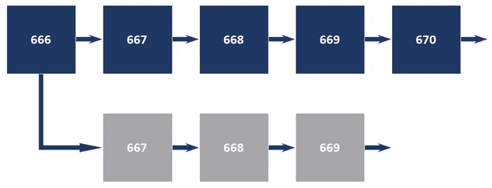
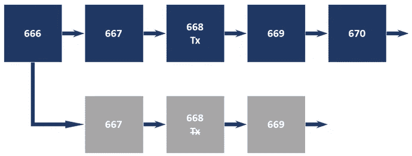
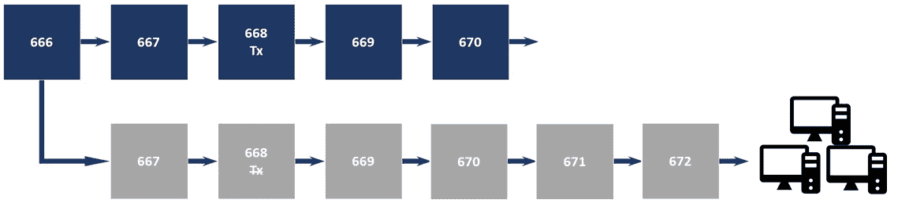
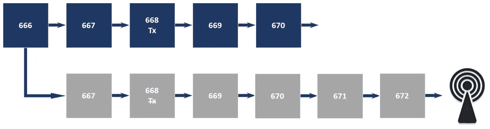
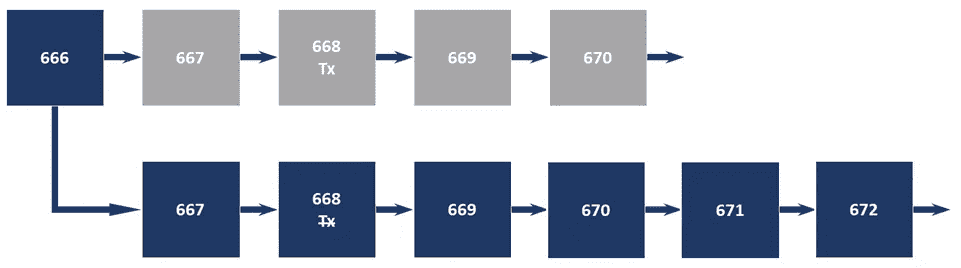
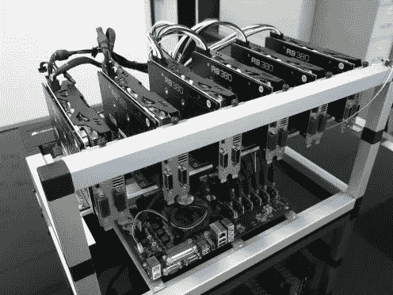
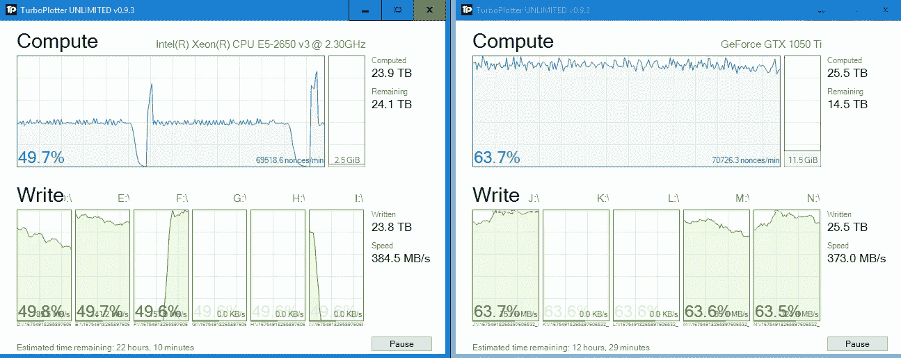
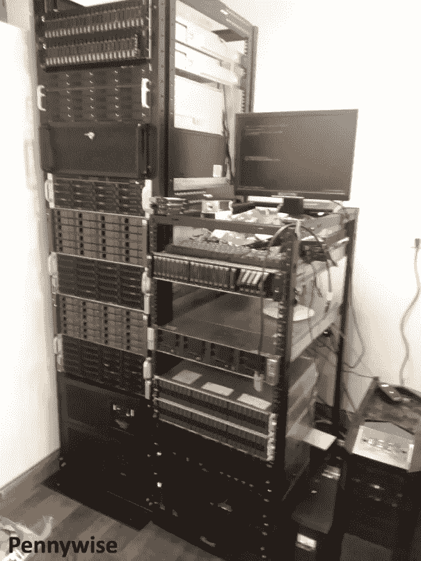
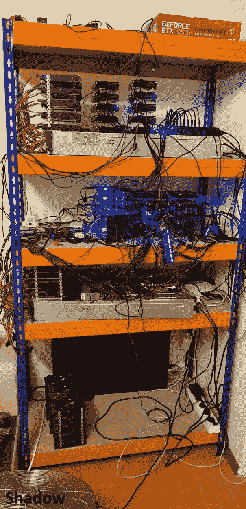

# 论 51%攻击:攻击的架构

> 原文：<https://medium.datadriveninvestor.com/on-51-attacks-the-architecture-of-aggression-57f105517328?source=collection_archive---------7----------------------->

## 最近在 r/CryptoCurrency subreddit 上发布了一则公告，宣布将在一周后启动对爱因斯坦区块链的 51%攻击并进行直播，我们这些渴望封锁的观众在宣布的时间聚集在 given Twitch 频道。流开始了，在 20 分钟左右的音频和视频流质量调整和阅读 Satoshi 论文后，潜在的攻击者试图启动计划的攻击，然后切换到比特币私人并试图攻击区块链，然后被禁止，根本没有攻击发生。

Image credits: [Wikipedia](https://en.wikipedia.org/wiki/File:Fleet_5_nations.jpg)

这一次双重花费攻击甚至没有开始，更不用说发生或成功了，但成功的双重花费攻击在密码世界中并不新鲜。已经有几个成功的记录在案的攻击，包括针对加密交易所的攻击，包括 [Monacoin](https://www.newsbtc.com/2018/05/22/japans-monacoin-network-still-suffering-selfless-mining-attack/) 、[比特币黄金](http://fortune.com/2018/05/29/bitcoin-gold-hack/)、[三次魅力边缘](https://blockexplorer.com/news/third-times-a-charm-verge-suffers-51-attack-yet-again/)和[莱特币现金](https://www.ccn.com/litecoin-cash-latest-small-cap-altcoin-to-suffer-51-percent-attack/)，这些攻击导致了数万到 1800 万美元的资金损失，并给开发团队和受影响加密货币的持有者带来了许多其他问题。

双倍消费或 51%攻击是区块链的固有概念。区块链是一个分布式公共分类帐，由一个存储交易数据的共识协议管理。存储在账本(或区块链)中的数据的完整性和不变性取决于诚实的节点([根据 Satoshi 论文中陈述的结论)](https://bitcoin.org/bitcoin.pdf)以及它们达成的共识。网络上可能会出现恶意节点，但是只要大多数网络参与者是诚实的节点，存储在区块链上的数据就保持安全和不可改变。共识通过总是延长最长的链来维持，这通过在节点已经执行了事务有效性的充分证明之后添加新的事务块来实现。

**双花费攻击的时间线**

双重支出攻击的目的正是如此——对存储在区块链上的资金进行双重支出。它由具有达成共识所需的 51%的资源的挖掘器或节点开始，分叉该链，而不向网络参与者的其余部分广播新的块。

The malicious node forks off the chain at block height 667 without broadcasting blocks to the network

在框 668 中，恶意节点现在将在**公共**链上执行事务。由于私有链不广播交易或阻止，执行蓝色块 668 中的交易的账户仍然持有私有链上的块 668 中的资金。

The transaction in block 668 happened on the public chain, while in the forked chain the pertinent account still holds the funds.

此时，恶意挖掘者/节点可用的资源量开始发挥作用——在公共区块链上执行事务后，恶意挖掘者必须以比在公共链上发布块更快的速度开始在私有区块链上发布块，而仍然不将它们广播给其他网络参与者。

Blocks are issued at a faster rate on the private chain than on the public chain, thanking to the malicious miner, who has more resources for mining blocks than the rest of the network.

在攻击者在私有链上产生了足够多的块，超过了公有链的块高度之后，他们会将私有链中的块以及其中包含的事务广播到网络。

The attacker broadcasts the forked chain to the network.

由于区块链的共识总是延伸最长的链，攻击者产生的分叉链和块现在成为公共链。由于现在最长的链没有在框 668 中执行的交易的记录，攻击者可以再次花费已经花费的资金。

The forked chain now becomes the longest chain, where there is no record of transaction from block 668.

**双倍花费攻击的代价**

发动 51%攻击的主要原因是财务收益，因此最初的可行性研究必须包括准备和执行攻击的费用。根据将被攻击的区块链所使用的共识类型、它的分散性(确保区块链安全的节点/矿工的数量)以及通过攻击可以获得的加密货币的价格，发起攻击的成本与财务收益可以有很大的不同。

目前正在运行的区块链项目中实现了许多证明。根据用于生产区块的资源类型，可以确定三大类证据:工作证据、利益证据和能力证据。

*工作证明*

工作共识的证明是最初的，也是最广泛使用的共识类型。它基于挖掘者执行实时散列以挖掘下一个块。这种类型的计算需要快速的 CPU 和 GPU，即原始哈希能力。承蒙 [Crypto51](https://www.crypto51.app/) 网站作者的好意，我们可以看到他们对租用原始哈希函数对使用工作共识证明的选定区块链发动一小时 51%攻击的成本的估计。正如预期的那样，最昂贵的攻击是攻击挖掘最多的比特币区块链，价格接近每小时 60 万美元，而攻击较小的链，如 Einsteinium，估计每小时成本不到 20 美元。尽管所有记录在案的成功的 51%攻击都是针对工作证明区块链执行的，但是有必要注意到，尤其是在激发本文的失败攻击之后，原始散列能力不足以成功。一些技能和知识也是一项要求，以及不要提前一周向公众宣布攻击计划。

GPU mining rig. Source: [ToughNickel](https://toughnickel.com/personal-finance/How-to-Mine-Bitcoins-With-a-GPU-Using-CGMiner).

*股权证明*

利益一致性证明要求参与节点持有一定量的加密货币，以便伪造一个块。基于他们持有的赌注硬币的数量，节点有更好的机会签署区块。因此，使用这种共识对区块链发起双重花费攻击的成本将等于所需加密货币的价格——其供应量的 51%。如果有人真的试图购买 51%的硬币供应量——人们可以猜测——对价格的影响可能会使价格飙升，特别是如果有人试图在短时间内收购的话。

*能力证明*

容量一致性证明算法利用存储空间进行挖掘。同样，更高的散列能力为工作证明矿工提供了开采区块的更好机会，而更多的赌注硬币为赌注证明节点提供了伪造区块的更好机会——更大的存储容量使能力证明矿工能够更频繁地开采区块。由于采矿设置的特定方法，必须从绘图过程开始，对区块链管辖的能力证明进行 1 小时双倍花费攻击的成本估算。

为了在爆裂区块链(唯一使用容量共识证明的区块链)上开采区块，矿工们首先预先计算 Shabal256 哈希并将它们存储到硬盘上。哈希被分组为随机数，每个随机数包含 8192 个哈希，占用 256 KiB 的存储空间。绘图可以使用 CPU 或 GPU 来完成。

Plotting using CPU (Intel Xeon CPU E5–2650 with 2x10cores/20 threads) and GPU (GeForce GTX 1050Ti) — producing cca 70.000 nonces/minute, screenshots courtesy of Haitch.

绘图完成后，采矿软件读取绘图文件，搜索可用于签署下一个区块的哈希值，并计算最后期限，其中最短的期限决定了开采下一个区块的矿工。

在一篇受宣布的攻击区块链的计划启发的帖子中，匿名开发商集团[能力证明财团](https://www.burst-coin.org/contributors)的发言人 [rico666](https://www.reddit.com/user/therico666) ，推动了 Burst 区块链的开发，对 Burst51%的攻击成本进行了估算[。](https://www.reddit.com/r/burstcoin/comments/9m5h44/my_estimate_of_51_attack_cost_on_burst/)

根据这一估计，基于 Burstcoin 矿工网络的当前规模，潜在攻击者将需要获得并规划 240 PB 的存储，以便对突发区块链部署双重支出攻击。

如果以公开的[可用价格](https://aws.amazon.com/s3/pricing/)从 AWS 租赁存储，并且绘图尽快完成——使用 1.688 加速计算[p2.8x 大型实例](https://aws.amazon.com/ec2/instance-types/)在 2 小时内，费用将达到 500 万美元以上。

Images courtesy of admins of [Burst-Team](http://pool.burst-team.us) and [.RO](https://pool.burstcoin.ro/) Burstcoin pools

如果有人试图购买硬盘并建立容量矿工证明(如上图所示，其中两个的最低价格为 20 美元/TB)和所有其他必要的设备(机架、钻机、电缆),对突发区块链部署双重支出攻击的成本将上升到 600 万美元以上。

随着区块链技术的发展，越来越多复杂的共识算法被设计和实现，目的是提高项目的性能和安全性。有像 Block Collider 这样的项目——它使用了一种共识，这种共识是利益证明和采矿块工作证明的混合，就“战争材料”而言，这肯定不会使双重支出攻击变得更容易或更便宜。一些区块链具有安全机制，例如在每第 n 个块存储区块链的快照，这可以防止在该块之前挖掘的块在双重花费攻击的情况下被改变，从而减少攻击的潜在损害，如果攻击发生的话。然而，毫无疑问，总会有“恶意节点”找到金融和“山头之王”的动机来尝试攻击一个链。随着对矿产资源的需求不断增加，这种攻击的结果仍有待观察。

该文章的文本可以在[突发区块链](https://www.burst-coin.org/download-wallet)上获得，并且可以使用 CLOUD-QJ6D-u4g 3-G2JK-5m3u 2[CloudBurst ID](https://burstwiki.org/wiki/Burst_Software#CloudBurst)进行检索。