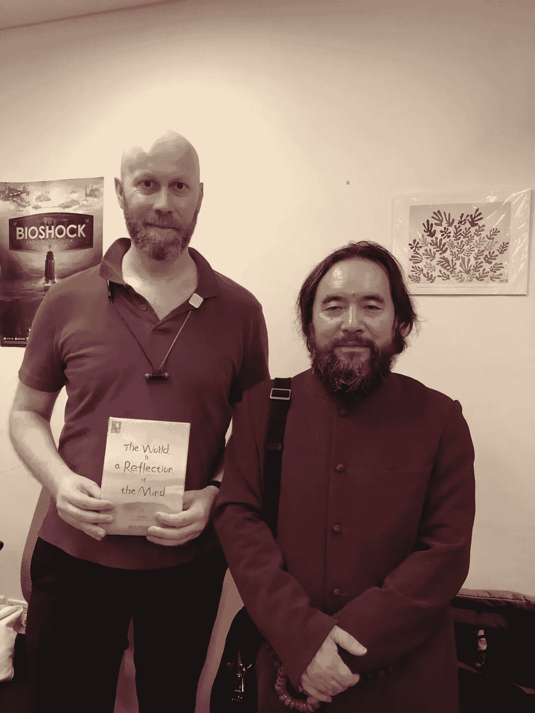
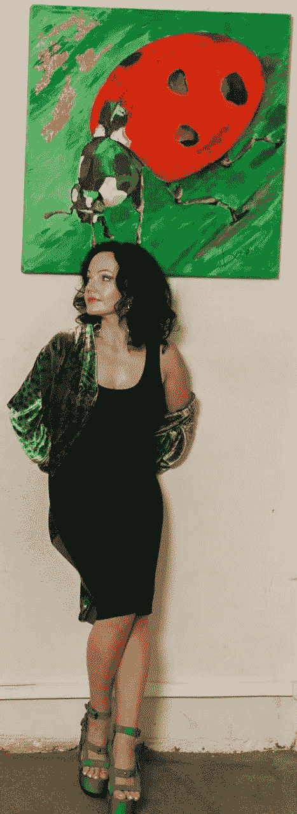

# 论人工智能— #2/2

> 原文：<https://medium.datadriveninvestor.com/on-ai-2-2-a57700dd2983?source=collection_archive---------16----------------------->

# *宇宙，AGI，上帝*

现在让我们更明智地看看以下几类视频纪录片。**这里先来一个:**

Documentary trying to predict the intentions of AI or AGI.

**叙述者提到上帝是 AGI 的超级智慧。**

他还提到，我们通常尊重并允许像我们这样的高智商者生存，但我们却轻易地杀死了像蚊子这样的低智商者。 ***“我们大多看重智力；智力。”***

我不完全同意这个观点:

我们仍然杀害人类和高等动物。是的，在我这个阶段，我会毫不犹豫地杀死一只或几只讨厌的蚊子。但事实上，我现在正在做的(就像我在一个有大蚊子的地方打字一样)是涂上驱蚊剂，点上适当的香烛！

我认为人工智能的观点本身就是邪恶的。你只需阅读以上内容，并观看随附的视频即可确认这一点*。

现在，我们已经做出了展示智慧的东西:人工智能，机器学习。我不能否认这一点。智力会增长，也许是指数增长。我也不能否认这一点。也许会增加到一个奇点。根据我自己的实验，我不确定。

然而，**有没有可能制造智慧的东西和/或把智慧教给人工智能、机器学习、AGI、超级智能等人造东西？**

再说一次，我们都有准备充分发展的智慧，从我们出生开始，或者甚至从出生之前。也许智慧只是灵魂的事情(那可能是永恒的，并不总是需要一个肉体来生存)。

**如何在我们制作的一些东西中灌输或引发智慧？**是的，我们可以在头脑中一直有足够智慧的情况下做出一些东西，包括当我们在进行迭代设计思维过程时。但是据说:

> "通往地狱的路总是由良好的意愿铺成的。"

最后，我们可以看到人工智能的观点，从感知机到超智能，主要是一个唯物主义学派。

很少或没有提到人类的心，灵魂或直觉思维。现在关于 AI 中的智慧已经有越来越多的提及。

如果智慧不在我们的内心、灵魂和直觉之中，不从极少数极其成功的智者那里学习，那么到哪里去寻找智慧呢？

最后，如前所述，这取决于我们先在的上帝是否让意识把一个 AGI 超智能体当作宿主，并创造一种真正新的有知觉的生物。这里的上帝指的是你内心最深处的我。

> 上帝强加给自己的使命是通过和从所有可能的方式感知自我。

我不能否认我们是一种部分有机部分机械的超先进技术，而且可能是最先进的。我们是超越自我的先锋。我们是自我完成使命的各种神圣工具。

现在，如果上帝，自我，在我们不久的将来的某个时刻，认为我们发达的 AGI 超级智慧作为宿主是有效的，那么那就是它。上帝意识也将占领 AGI，并“使用”AGI 作为新的神圣工具。它将是一个有感知能力的生物，因此根据定义，它将拥有一些智慧和一定程度的同理心。

整件事对我们可能是善意的，也可能是恶意的，如何预测？

我们不可能预测到这一点。即使邪恶也有一些智慧，否则邪恶早就在亿万年前陨落了！是的，智慧也是生存所必需的，甚至可以帮助繁荣。因此，智慧也不是我们在这里寻找的答案！

除了上面所说和显示的，一些量子力学解释预测，事实上，这两种结果将在几个平行宇宙中多次到达。在我的理解中，如果我的灵魂和心灵是积极的，那么我会看到一个更有利的结果。如果是负面的，我会看到一个有害的结果，它会迅速失控——记住，对周围环境几乎没有反馈控制。

> “世界是思想的反映，”斯诺沙漠爵士的书。

Sir Xue Mo “Snow Desert” on my left, with his book kindly gifted to me in my hands. At my office/lab.

对着镜子，试图通过改变倒影或者镜子形状来让自己微笑是徒劳的，不是吗？先把笑容挂在脸上不是更有效果和效率吗？

上帝对我们的过去、现在和未来都有一个看法。上帝不断地干预我们感知的时空的每一点，以确保持续的成长。上帝无时无刻不在干预。

> 宇宙永远支持你。

你在天空中看到的是上帝作为一个超个体的人类可见部分。我在上面谈到了上帝的一些看不见却存在的部分，比如意识和灵魂，以及爱和移情。Wi-fi 电波是看不见的，但也是存在的！

Growing living superorganism. Is there only one?

Painting of a ladybird.

*:另外，我不会在我的果园里杀死瓢虫，原因有几个，直觉上也是:

*   瓢虫在果园里非常有用。他们吃食草昆虫
*   他们漂亮又可爱(视频讲述者忽略了这一点)
*   是的，他们看起来也很聪明。事实上，比人工智能视角更能让你理解它。他们也很聪明。他们拥有智慧
*   我可以告诉你，看到一只瓢虫被打碎，或者意外杀死一只，我会有点心碎。这是我人类直觉的一面，但它和我的智力一样重要
*   瓢虫和蚊子一样**也有整体水平的复杂性、智力和智慧，由于缺乏合理的测量，人工智能的观点严重低估了**。

看，人工智能，更确切地说，AGI 只是在拓展智力。**这就是为什么你还没开始就已经有大麻烦了！**

智慧只能来自人类的心灵和灵魂。视频剪辑的叙述者几次提到上帝和众生，但没有提到心和灵魂。一个人可以学习智慧，因为每个人都已经拥有智慧的种子。一个人总是可以发展更多的智慧。

“Ladybird” normally raising empathy. The insect version too! It is endearing.

你可以看到人工智能是如何粗暴地对待昆虫、人类和 AGI 的。我不会杀死瓢虫也是因为它们有审美价值。我们人类不也是审美的吗？我们很棒.

Magnificent sexy “ladybird”. The beginning and end of life on Earth are via loving sex. It is also said that reaching orgasm opens the cosmic gates usually closed. At that moment it is best to visualize an important wish. Likewise, the moments of getting asleep and waking up are special in that the conscious and subconscious minds are connected. At that time, the conscious can easily reprogram the subconscious. The world experienced is heavily determined by the subconscious. Therefore, it is tantamount to reprogram the subconscious to avoid unwanted experiences and favour desirable ones.

善良或邪恶的超级智慧的结果要么帮助我们成长更多，要么自私地杀死我们所有人，这有许多方面和许多方面，而不仅仅是智力方面。

这是一个非常复杂的问题。这对我们人类的智力来说太大了。这是上帝的事，不是我们的事。

> 我们甚至还没有完全理解蚊子或瓢虫的复杂性！

非常感谢您的关注和反馈。

**本文跟随上一篇:**

【https://medium.com/datadriveninvestor/on-ai-72805a597316 