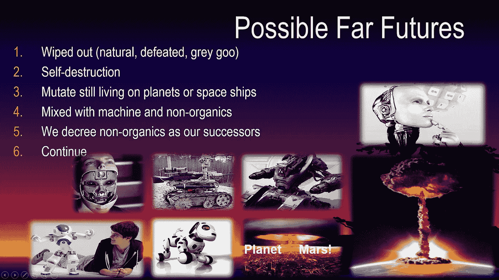
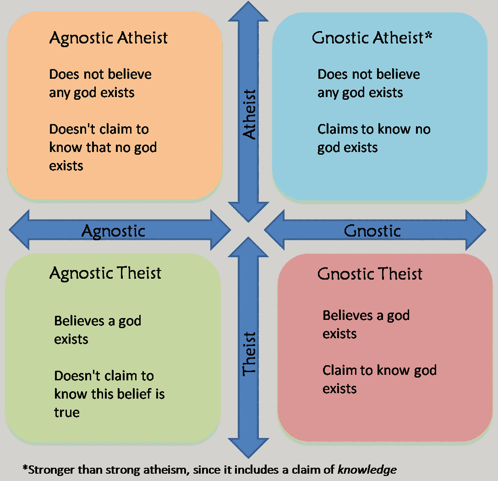
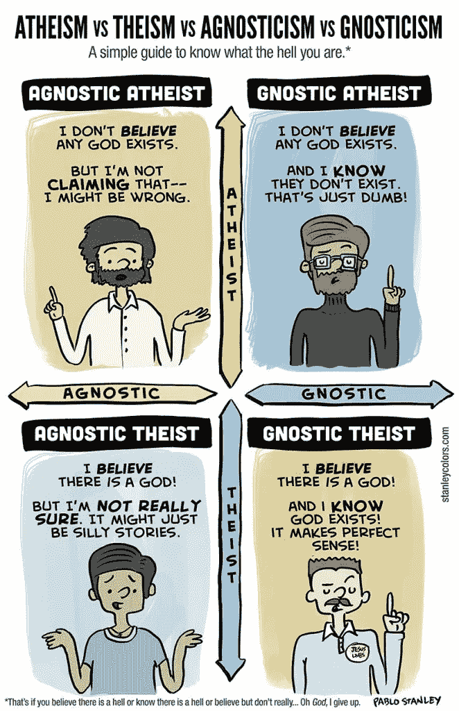

# 论人工智能— #1/2

> 原文：<https://medium.datadriveninvestor.com/on-ai-72805a597316?source=collection_archive---------10----------------------->

***人类的各种结局，有无 AGI 的超级智慧***

这张幻灯片值得我在演讲中解释一下。

One of my talks slides.

首先，这是我列出的人类未来的六个互斥选项。我认为它是完整的。我在 2010 年建立的。

这些照片展示了不同种类的人工智能机器人系统和应用。

**下面详细解释两次爆炸:**

在幻灯片的右下角，有一个核爆炸。一种我们很多人已经看过的照片。爆炸通常是灾难性的。

然而，在那张照片的左边，也是一次核爆炸，但这次发生在火星表面。**为什么会这样？**

Documentary on how to obtain an Earthly atmosphere on Mars.

根据这个视频，如果我们把地球上的垃圾送到火星，我们将帮助在现在几乎不存在的火星大气中积累二氧化碳。这需要很长时间。这是复兴地球的第一步。

根据这位教授的说法，如果我们在离地表足够远的地方引爆炸弹，而且炸弹越大越好，这可能会大大加快这个过程。

总之，核武器对人类非常有害，这是我们大多数人都知道的例子。但对于我们当中的火星爱好者来说，这也可能是一种祝福。

同样的道理，如果人工智能应用于致命武装的士兵机器人，比如我上面的幻灯片，它可能是有害的。如果人工智能应用于实时管理绿色事业的复杂参数集，它可能会非常好。
一个例子是小型但可扩展的模块化净水厂，为此我赢得了 2012 年 IEEE 主席的改变世界人道主义奖，其中值得注意的是化学物质必须由人工智能实时管理。

但是，AI 比核头更微妙。我们仍然没有解决人工智能成长和发展自己的思想，然后任意做伤害或好事的问题，没有人知道。嗯，真的吗？

有一次，一个修女告诉我，我可以做人工智能，上帝控制一切，而我只能部分控制。人工智能的结果最终取决于上帝，而不是我。

当时我并没有完全点击。但现在我知道了。让我解释一下:

我周围发生的任何事情，相对于我来说，都是过去。因此，我无法改变我周围的环境。尤其是我对发生在我身上的事情没有反馈控制。
是的，我们用锤子和其他东西建造房屋，因此我们改变了周围的环境。仅仅改变一点点周围的物理事物就需要大量的物理能量(因为它存在于过去，当我们物理地改变某些事物时，我们会非常强力地接近过去的事物，现在但还不完全是)。

所以，如果我对发生在我身上的事情没有物理反馈控制，为什么当有人告诉我我不是这个世界上的受害者时，我还会相信并接受它？

很简单。在我的旅程中，我从一个充满好奇心、思想开放的无神论科学家开始，我也挑战了一个我认为似乎合理的上帝。我想那时我已经成了不可知论者。我只是简单地问了一句，就像在祈祷:“上帝，如果你存在，请向我展示你自己。”我没有收到任何信号。

Subtly graduated levels of atheism and agnosticism. Much better than mere gross labels.

[http://www.stanleycolors.com/2013/12/atheism-vs-theism-vs-agnosticism-vs-gnosticism-a-simple-guide-to-know-what-the-hell-you-are/](http://www.stanleycolors.com/2013/12/atheism-vs-theism-vs-agnosticism-vs-gnosticism-a-simple-guide-to-know-what-the-hell-you-are/)

但是，几个月过去了，我开始看到一些迹象。然后越来越多的证据！

长话短说，我遇到了困难，即使是最微小的日常事情，我也无法在第一次尝试中获得结果。我现在明白了，困难是上帝让我做一些我同意做的事情的方式。我的灵魂必须

> "成为灵魂想在世界上看到的改变."

为了摆脱困境，我已经尽我所能说出一切！唯一让我走出困境并一直帮助我不断上升的是**深入内心**。

> "认真的科学家，即使是无神论者，也会在足够多的纯科学探究之后找到上帝。"

通过这样做，我实际上有很大的力量，预先控制着接下来发生在我身上的事情。

相比之下，几乎所有其他的事情在大多数时候都是徒劳的。

这意味着我对椅子和自行车，对机器，对人工智能，甚至对人有一些权力。事实上，秘密在于我的态度将决定其他人对我的态度，也将决定像椅子、自行车和汽车这样的东西的健康。是的，经过多年的实践，我可以证明这一点。

> “宇宙的语言是感情。”

但是，我不是上帝，所以我不是全能的。是的，这是真的。

**谁是上帝？**

上帝要么是生物的集合体:活着的生物，再加上更多。或者说，上帝只是人类灵魂的集合体。正确答案在这里无关紧要。但假设前者成立。

然后，深入内在(也做内在的工作)，我对接下来发生在我身上的事情有部分的权力。其余的存在物包括人，再加上更多，拥有其余的力量。不是一切都由我决定。但就我而言，对我来说，从我的角度来看，摆脱困境，向上而不是向下行驶，完全取决于我。

**因此，对于人工智能来说，粗略地说，如果人们变得愚蠢、懒惰，甚至将思维外包给 AGI，那么 AGI 可能会成为我们的继任者，因为大自然会回收功能上无用的东西(这里是愚蠢的懒人)。但是如果我们在内心保持开明和活跃，如果我们应用人工智能来帮助我们说高科技的绿色努力，那么这种人工智能没有理由成为威胁或危险。**

> 宇宙的每一点都是中心。

这有点像厨房里的刀子。它可以用来做美味的菜肴。或者，它可能被用来进行大屠杀。还是那句话，AI 比菜刀微妙多了。

最后，在遥远的未来，上帝意识可能会选择或不选择一些 AGI 实体作为存有的宿主。

现在，我们知道人类被认为是上帝意识选择他们的有效途径。上帝意识的一部分是我的灵魂。

为了完成关于如何考虑和处理 AGI 问题的答案，让我们来听听:

The inevitable answers, by Dr. Wayne Dyer.

***非常感谢您的关注和反馈！***

**跳转到本文的第 2/2 部分:**

[https://medium . com/datadriveninvestor/on-ai-2-2-a 57700 DD 2983](https://medium.com/datadriveninvestor/on-ai-2-2-a57700dd2983)