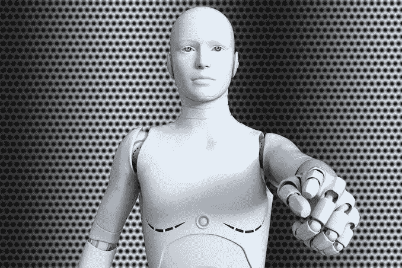

# 关于 AI: kill_fast_let_young_go

> 原文：<https://medium.datadriveninvestor.com/on-ai-kill-fast-let-young-go-8194c019fd3c?source=collection_archive---------13----------------------->

人类是创造者。我们进化故事的胜利在于我们有能力逃脱它:给我们寒冷，我们找到皮毛，给我们天气，我们建造庇护所。多年来，我们克服环境的方式最终导致了我们创造自己的环境，现在我们能够创造我们自己的智慧。我的终极问题是:我们现在是否处在一个我们正在创造自己的进化压力的点上，并且在这个过程中，迎来了我们自己的灭绝？

要回答这个问题，我们需要考虑进化不仅仅发生在自然环境中，而是发生在更多的地方。

 [## 模式和机器人:复杂的现实|数据驱动的投资者

### 哈耶克的名著《复杂现象理论》(哈耶克，1964)深入探讨了复杂性的话题，并断言…

www.datadriveninvestor.com](https://www.datadriveninvestor.com/2019/03/04/patterns-and-robotics-a-complex-reality/) 

## 环境#1:经济的本质

假设人工智能接管了世界上的每一项工作，创造出的是一个可以控制这项新技术的计算机工程师“统治阶级”，其他人都是多余的。我的问题是:谁购买这些机器制造的产品？我问这个问题是基于这样的假设，即这些机器正在提供服务(例如，作为一名会计或出纳员)，并且正在控制所有领域的装配线。假设这将使我们没有工人阶级，这意味着将没有足够的人有足够的钱继续购买产品和刺激经济。这可能意味着我们开始了一场新性质的衰退:与 20 世纪 30 年代的大衰退或 2008 年的崩盘形成对比，当时人们过度借贷(因此过度支出)，而我们用这种新技术迎来的衰退可能是支出过少的结果。

然而，上述论点的错误是双重的:如果我们创造一个机器做所有工作的经济，那么从技术上来说，银行将会扭曲他们的手，发放更多的贷款来保持经济扩张，这意味着我们可能面临的衰退可能是同样的旧恶魔。这实际上可能成为一种普遍的基本收入，被许多领先的经济学家吹捧为现代经济不平等的解决方案。其次，电脑虫(因为缺乏更好的集合名词)将不是统治阶级的唯一组成部分:他们将加入研究人员、科学家和哲学家的行列，他们整合思想和创造与人类问题相关的新概念的能力意味着，在一段时间内，他们将是不可替代的，成为向我们的计算机竞争对手提供数据的主要创造者，这表明不是每个人都变得多余， 就业市场的性质将会发生变化:在获得学位并随后寻求工作是当前惯例的地方，人们可能会期望这种变化变成获得基础学位、博士学位、找到癌症的治疗方法、教计算机如何使用它，并从中受益。

## 环境 2:政治的本质

我坚持认为，在劳动力中引入一种新的结构将会不可逆转地改变我们人类情感的提议。我这样说，并不是想把我们(可能)的未来状况与工业革命带来的一些政治不稳定进行比较(我想到的是我九年级课本中一幅被裁减的农场工人的愤怒素描)，而是想问一个问题，一个人工智能结构是否应该包含在政治提议和结构中。如果它是聪明的，难道它没有分析思维，对是非的感知，并以此为基础，有一套自己的要求吗？作者 Yuval Noah Harari 反对这种观点，指出 AI 是与意识分离的智能，也就是说，它不会感到压迫，也不会伤害自己:它足够智能，可以在一些编程限制内操作复杂的任务，当出现故障时，它可以被修复。但是，假设人工智能能够学习，那么它能不能学会认识到，尽管它是产品的主要生产者，但它并不参与社会系统？

战争是一个非常政治化的问题。那么，假设我们在战争中使用人工智能。如果我们在人工智能是从意识中分离出来的智能的前提下运作，那么我们甚至可以提出人工智能在战争中会导致更少的人类死亡，因为它可以代替士兵，但我对此的问题是双重的:假设交战双方都在使用人工智能。他们出现在滑铁卢，而不是满足拿破仑，他们满足对方。假设每小时公告报告说，该国 50 名人工智能士兵在战斗中出现功能障碍，但这对我们任何人都无关紧要，因为我们大多数人不知道第二次世界大战中“死亡”枪支的数量，但知道死亡犹太人的数量。我想这样一来，我的第一个问题就变成了一个解决方案:如果没有人关心战争的代理人(人工智能士兵)，会有人觉得有必要一开始就发动战争吗？

当然，这忽略了战争的本质也可能改变:头条新闻将不再是实体战争，而是网络战争。国家会窃取机密，并在更大范围内影响选举，但假设现在是 50 年(后人类冗余)，每个人都很穷，没有人创建自己的数据，因为他们买不起促进这一过程的蜂窝设备，那么什么都不偷有意义吗？或者数据会不会从伪装数据变成奥威尔式的监控数据？

其次，使用人工智能意味着战争可能更道德，但也更不道德。假设你给你的军队编程‘kill _ fast _ let _ young _ go’，你已经在你的系统中编码了非常小程度的道德，但这个系统可能像使用氢弹一样不道德:如果人工智能更有效，那不是意味着更多的破坏吗？你可能会说，更多的破坏意味着更短的战争，但用安奈林·贝文的话说，“没有一个国家有权试图通过援引一个比它试图摆脱的更大的邪恶来消灭一个邪恶。”

你可能会说我断章取义，但使用人工智能作为战争武器是非常合理的:如果不同的国家有不同水平的人工智能，那么施加的邪恶如此之大，以至于可以很容易地分级，就像在比万时代，一些国家拥有原子弹，而另一些国家拥有氢弹一样。

## 环境 3:辩论的本质

在公元 2019 年，你邀请你的朋友喝一些星巴克抹茶拿铁，你花了几个小时来决定我们这个物种发生的最好的事情是资本主义还是共产主义。你告诉他们为什么你认为宇宙是一堆意识。在 50 PHR 年，每个人都有一份普遍的基本收入，这份收入允许他们刺激经济，但不允许他们去欧洲度假，或者即使去了，每个人每个月的收入也是一样的。国家仍然与人工智能的提供者分开，但人工智能的提供者本质上是国家，因为他们控制着劳动力，可以用他们的经济实力影响政治和言论的性质:他们有足够的钱来冲洗自己的政治活动。

在这个新体系中，我们有私人对经济的控制，并且，从书面上来说，有一个独立的国家，即国家并不真正控制一切，每个人都从政府那里得到一张支票。具有讽刺意味的是，这是社会主义的新面貌吗？它是由资本主义企业在编程的界限中创造出来的吗？

如果我们被无意识超越，我们还会争论什么是意识吗？将我的大脑上传到电脑上，我会找到涅槃吗？这样我就可以通过成为一段可以学习的可变代码来找到生活的意义，从而变得有用。

## 结语 _

在达尔文的时代，自然选择是雀的事情，在加拉帕戈斯群岛蠢蠢欲动。在我们这个时代，它似乎是我们自己创造的东西，有可能在我们自己的种族中超过我们。一个物种不再是一群可以杂交并产生可繁殖后代的个体，一个物种现在是任何可以在任何环境中超越另一个的网络，无论是物理的还是抽象的。在人类战争的时代，埃兹拉·庞德和威尔弗雷德·欧文讲述了可怕的经历，证明了战争中对人性的漠视。如果人工智能诗人没有意识，它会告诉我们什么，如果有的话？