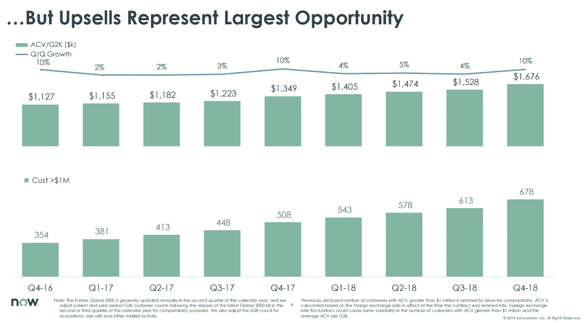
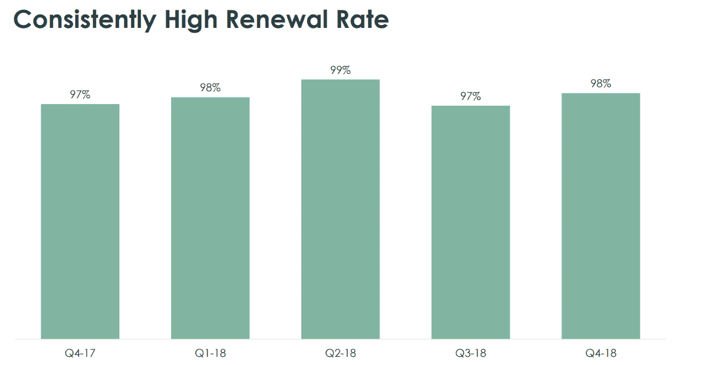
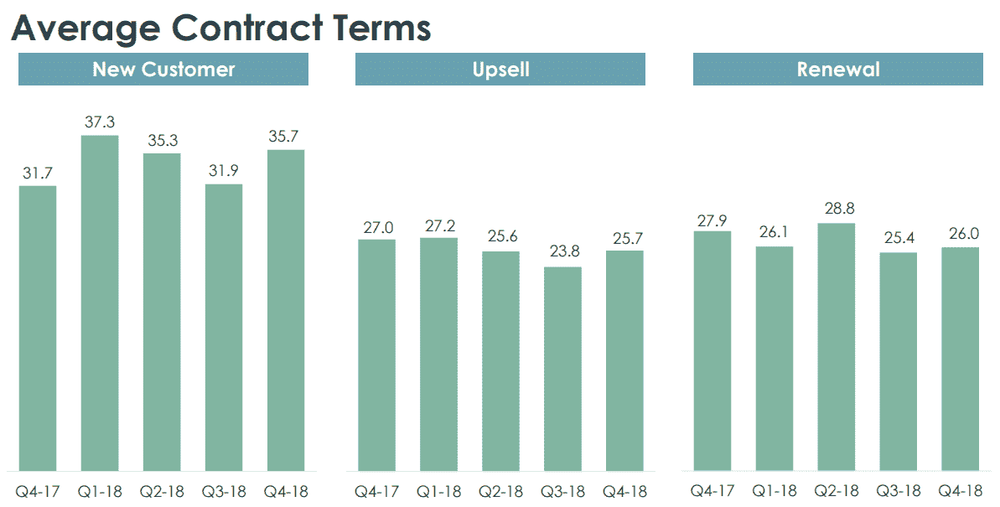
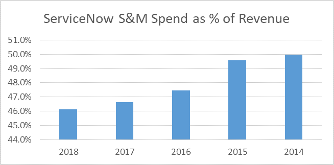
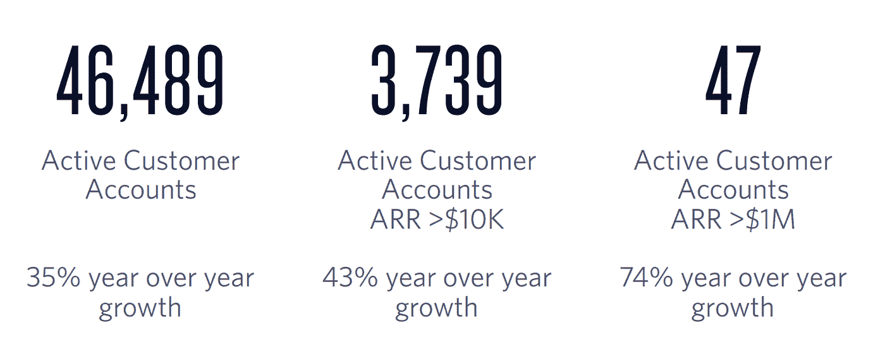
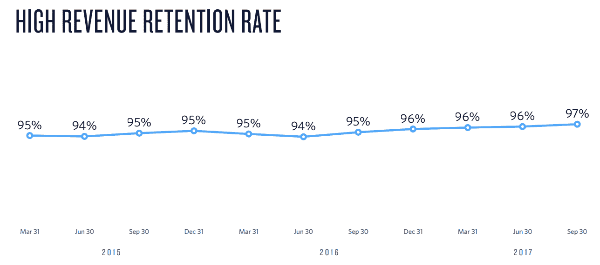
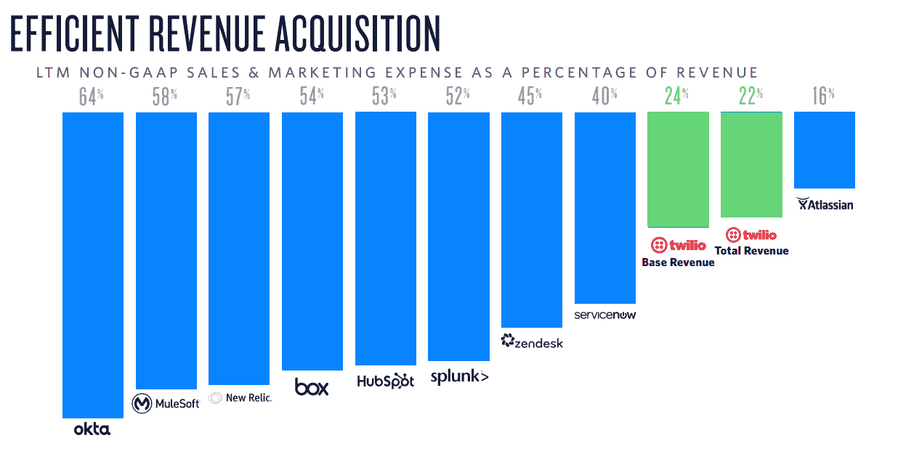
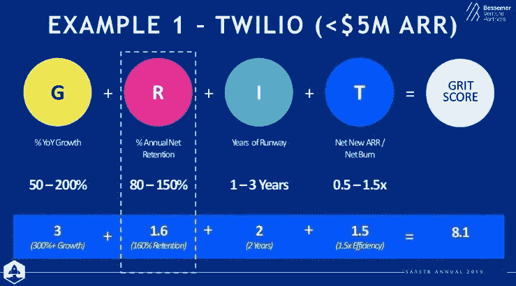

# 企业软件中的一致成本结构、转换成本、分配和估价

> 原文：<https://medium.datadriveninvestor.com/on-aligned-cost-structures-switching-costs-distribution-and-valuations-in-enterprise-software-935ce3a58e69?source=collection_archive---------5----------------------->

最近，我收到了很多关于上市和私有企业软件公司的问题，以及这些估值是否可持续。许多这些问题似乎源于对转换成本的普遍恐惧、对产品优势的误解以及相对于其他股票的高估值倍数。这篇文章将是我试图解开我认为在评估企业软件公司时需要理解的 4 个关键方面。

**一致的成本结构——像魔术一样工作**

一致的成本结构带来了自上而下的软件和自下而上的(“产品导向”)软件公司的概念。对于案例研究，我将使用 ServiceNow 和 Twilio 分别演示这两种类型的产品。

ServiceNow 的原始产品 IT 服务管理是一个记录 IT 事件的系统(从安全事故、客户支持、服务单等的一切。).让我们看一下 ServiceNow 的关键指标，以了解它们如何调整成本结构。

不幸的是，ServiceNow 没有显示完整的平均 ACV，但是考虑到他们正在预订的大型企业和合同，我们可以假设企业软件合同的 ACV 相当高。根据上图，2018 年第 4 季度，Service now 的平均 G2K ACV 为 170 万美元，同比增长 24%。

ServiceNow 的续订率一直保持在 90%的高水平。换句话说，总流失率在 1-3%之间，净留存率可能在 105-110%左右(取决于土地的大小)。

这里我们可以看到 ServiceNow 的平均合同期限接近 3 年。这些是巨大的多年期合同，ServiceNow 正在向大型企业出售，这些企业通常会续约/扩张，强大的保留指标就是证明。

鉴于 ServiceNow 拥有强大的保留能力、多年期大额交易和较高的 ACV，我们预计销售和营销成本占收入的比例会很高。其原因是，由于客户期望的长期和不断增长的 LTV，公司可以在获取客户上花费更多的前期费用。在许多情况下，鉴于这些产品的粘性和这些合同的规模，记录系统的 LTV 可能比分析师想象的还要大。

然而，这里的关键是，即使在 ServiceNow 目前的规模下，由于他们所追求的客户的动态和交易的规模，ServiceNow 将近 50%的收入用于 S&M 仍然是合理的。在稳定状态下，我们可以预计 ServiceNow 仍将占 S&M 支出的很大一部分，因为增量客户保证了大量的前期 CAC。

这是一个一致的成本结构。在一个有意义的规模上，ServiceNow 仍然将其收入的 46%投资到 S&M，因为它有能力与客户达成长期、高 ACV 交易。其他行业的许多研究分析师在评估 SaaS 公司时不愿看到这些数字。与公司的平均 ACV、保留率和合同期限相比，这实际上是完全有意义的。

现在让我们来看看 Twilio，一家拥有以产品为主导的商业模式的公司。Twilio 开发了一套面向中小型企业和大型企业的通信 API 产品。

截至 2017 年第三季度末，Twilio 的营收为 1 亿美元，运营收入为 4 亿美元。用这个数量除以总客户数，我们得到了一个平均 ACV(当然不精确，但我们正在利用现有的数据)。这为我们提供了 8.6 万美元的平均 ACV。正如我们之前看到的，ServiceNow 在 G2K 客户中的 ACV 为 170 万美元

Twilio 还拥有非常高的收入留存率，随着该公司渗透到更多的企业客户，这一比例也在增长。也就是说，回顾过去几年，我们可以看到 Twilio 的保留率为 95%，总流失率为 5%。相比之下，ServiceNow 的总流失率为 1-3%。

净保留率历史上接近 140%，如果不是更高的话。这意味着客户在最初签订合同后会大量扩张。我估计 ServiceNow 有 105-110%的净留存率。

最后，我们可以看看 Twilio 的 S&M 占收入的百分比。Twilio 在 S&M 上的支出几乎是 ServiceNow 的一半。换句话说，Twilio 在 CAC 上的支出占收入的百分比要低得多。

退一步讲，一种模式比另一种模式好吗？不完全是。他们只是不同而已。ServiceNow 销售大量的多年期合同，他们预计这些合同的流失率很低，并有可能继续使用该产品几十年。平均 ACV 比 Twilio 高得多。因此，ServiceNow 也可以在 CAC 上投入更多资金来获得这些客户，因为他们具有长期的可见性。

另一方面，Twilio 的初始 ACV 更小，客户流失率更高，绝对 ltv 更小。出于这个原因，Twilio 在获取客户的前期 CAC 上花费更少，并依靠产品导向的病毒式采用来推动增长。此外，Twilio 销售团队能够获得大型组织内客户的详细使用统计数据，这些客户有效地利用产品和资本，向大型企业软件合同追加销售这些客户；增加 ACV、ltv，并可能降低流失率。

这两家公司的表现都非常好，在过去的 2-3 年里迅速超过了纳斯达克。它们都有非常不同的商业模式，但在调整成本结构和收入机会方面做得很好。他们正因为这种结盟而得到市场的回报。

**“现代”转换成本的误解**

转换成本是一件美妙的事情。微软可能是这方面的最好例子，因为用户可以很容易地完成基本任务，所以 PC 的 Windows 操作系统得到了最初的采用。这导致更多的第三方开发人员为 Windows 开发应用程序，进而带来更多的用户并进一步改善操作系统体验。这种网络效应使得 Windows 能够拥有长期可持续的竞争优势，带来数十亿美元的自由现金流，公司可以用这些现金流再投资于业务增长和股东回报。

“现代”企业软件中传统转换成本的主要例子是记录系统。Salesforce 的客户关系管理(CRM)平台就是一个很好的例子。客户将联系数据、电子邮件、任务、笔记等全部存储在 CRM 产品中。这些数据是“真实的记录”,数据受到精心保护，以确保整个公司与外部联系人的所有互动都被记录在案。因为该系统包含所有这些数据，所以第三方开发者和其他软件产品创建 API 或易于使用的管道来调用 CRM 中的数据，并将其用于分析、销售工具、费用管理等。其他公司基本上只有让 Salesforce 的客户能够轻松利用产品中存储的数据，才能提高产品的采用率。这是一个非常强大的位置，因为转换成本随着在 CRM 数据上使用的每个新产品而增加。理解这一概念很重要，因为它将与下面关于一致成本结构的讨论联系在一起。

以产品为导向的创业浪潮正在到来。像 Dropbox、Docusign、Smartsheet、Elastic、MongoDB、Slack、Zoom 等公司。这些公司的股价都是或预计是 LTM 收入的 10 倍到 30 倍。在评估转换成本时，从许多方面来看，这些公司似乎没有传统意义上的转换成本。比如视频会议，很多人认为切换成本低。您可以将 GoToMeeting 换成 Google Hangouts，将 Microsoft Skype 换成 Zoom。事实上，我们可能在不同的会议中使用过以上所有的方法。传统意义上考虑转换成本的问题是，这没有考虑到不断变化的范式。

在以产品为导向的公司中，通常小团队、个人或业务单位都可以从他们整个公司的选择中单独购买产品。这是因为各个团队越来越多地获得更多的预算来使用生产力工具、开发工具或他们需要的其他软件。对此的流行语是“IT 消费化”，每个人都可以带自己的软件去工作。这并非在所有情况下都是正确的，但通常是预算和使用趋势的整体转变。在这种新模式下，视频会议等商品只需正常工作即可。他们与众不同的方式总是有效的(或者比其他产品更有效)，易于使用，价格比他们提供的投资回报率更低。因此，转换成本实际上不同于这些类型的软件。用户选择购买该软件是因为与其他产品相比，他们更喜欢使用该产品。如果不直观的话，这个转换成本实际上是相当大的。一旦工具在工作流程中根深蒂固，就很难被淘汰。这并不是因为替换它的技术挑战。如果它能很好地完成任务并使其易于使用，那么选择使用它的消费者就没有理由停止使用它。新的竞争对手要么必须以低得多的价格(同时仍然具有相同的可用性指标)，要么必须比现有产品好 10 倍。

我最喜欢的例子是神童列表。Wunderlist 是一款简单的待办事项列表应用，现归微软所有。我使用免费增值版(但肯定会支付少量的月订阅费)，并且知道有大量的生产力工具将它与看板、网格和其他功能结合在一起。话虽如此，神童名单只是工作。所以我没必要换掉它。产品主导的公司也是这样。它们使采用变得容易，这也可能使更换变得容易，但转换成本实际上更高，因为用户选择继续使用该产品。

再比如 Excel vs Google Docs。谷歌文档更便宜，对于简单的任务也同样适用。然而，对于更困难的任务或建模繁重的任务，谷歌没有像 Excel 那样简单的功能。因此，转换成本实际上相当大。现在，这可能是典型的破坏，随着时间的推移，功能越来越好，文档可以进入高端市场，但同时 Excel 也不会太贵，因此这是一种权衡。所以作为用户，我主动选择 Excel 而不是 Docs，因此存在转换成本。

**分配事宜**

在企业软件中，发行版比产品更能区分……实际上，我只是想做一个挑衅性的声明，它们基本上是携手合作的，但是发行版真的很重要。

销售队伍是有史以来最伟大的销售范例之一。当 Salesforce 首次进入市场时，他们有一款彻底改变了企业软件领域的产品，他们本质上提供了一种通过订阅费访问的托管服务，而不是具有前期许可证和硬件成本的内部服务。在某些情况下，用户界面和体验被描述为名义上优于 Oracle/Siebel System 的产品，但部署模式是革命性的。然而，在很大程度上，产品本身并不销售，即使是以产品为主导的软件公司也仍然需要解决分销问题(即免费增值服务、用户聚会、产品宣传等)。).

Salesforce 一开始采取了一些激进的大猩猩营销策略。他们举办了一个发布会，在那里他们创建了一个企业软件“地狱”来展示当前的软件体验有多糟糕。他们过去常常在城市巡回展示 Salesforce 的产品，最终把它变成了 Dreamforce 年度会议。所有这些炫耀性营销的原因是建立一个品牌，作为颠覆传统软件体验和拯救各地用户的失败者。这是他们分销渠道的开端。

快进到今天，Salesforce 的产品可以说不是最好的 CRM。它的发布周期大约是每季度一次，而许多竞争对手的发布周期是每周一次。然而，它现在有一个惊人的分配管道。

确实有围绕帮助客户建立他们自己的定制销售队伍而建立的咨询业务。世界各地的系统集成商帮助大型组织实施 Salesforce 的 CRM，以获得专业服务工作。Salesforce 利用这一庞大的渠道合作伙伴生态系统来收购新产品，最近收购了 Mulesoft，并通过其已建立的直销队伍和渠道合作伙伴将 Mulesoft 的集成平台推向其现有客户。当其他人在为你争取客户时，这是一个健康的分销渠道。因此，Salesforce 能够继续快速增长，即使年收入超过 100 亿美元。

另一个例子是亚特兰蒂斯。与 Salesforce 不同，Atlassian 没有太多的直接销售力量，但它有一群热情的用户，帮助传播口碑采用。该公司已经实现了各种其他软件产品的大量集成，以将 Atlassian 产品植入客户的工作流程中。最重要的是，它使一群系统集成商能够开始就利用 Atlassian 套件的最佳方式提供建议。用户会议和聚会教育未来的用户，创造飞轮效应，持续推动 Atlassian 的客户增长。一旦这个分销渠道建立起来，Atlassian 就收购了 Bitbucket 和 Trello 等产品，通过它们已建立的分销渠道进行流动，并提供更多的交叉销售/追加销售。与 Salesforce 相比，这是一种不同的建立分销渠道的方式，但同样有效。

所有这些都是分销如此重要的原因。有效的分销渠道很难建立，需要时间和实验来实施，类似于产品/市场匹配。然而，幸运的是，有许多成功公司的案例研究，它们利用不同的方法达到同一个目标。

有时候，保护分发的最佳方式实际上并不是最具可伸缩性的。在许多情况下，特别是当一家公司在一个新的领域进行创新或开发一种需要与其他系统进行大量集成的产品时，专业服务可以成为启动分销渠道的一种方式。服务可以帮助软件公司建立滩头客户，然后这些客户成为未来客户的推荐人。专业服务还可以帮助建立长期客户(尽管会有短期现金消耗),产生现金流以帮助未来的持续增长。随着公司规模的扩大，该服务组件可以满足顾问和渠道合作伙伴的需求，他们的员工“在海滩上”，但可以通过实际帮助客户实施产品来提高他们的利用率和利润。保罗·格拉厄姆有句名言[做不可扩展的事情](http://paulgraham.com/ds.html)。这适用于企业软件公司生命周期的每个成长阶段。关于专业服务的潜在好处，我强烈推荐阅读 a16z 的[马丁·卡萨多](https://techcrunch.com/2018/03/11/the-case-for-boosting-enterprise-software-startups-with-services/)的这篇文章。

**估值的耐人寻味之处**

估价是一门艺术，有时会被混淆为一门科学。公司的发展阶段越早，相对于投资金额和 TAM 的规模，估值就越基于所有权模型。随着公司的成长，估值越来越基于可比公司，无论是通过先例收购还是市场交易倍数。然而，所有这些都是艺术而不是科学。

规模企业的估值是其未来现金流的现值。在某些情况下，这并不是一件显而易见的事情。Instagram 被脸书以 1B 的价格收购，却没有任何收入。然而，目前投资银行估计 Instagram 价值 1500 亿美元，已经产生了大量的自由现金流。谷歌以 6.6 亿美元收购 DeepMind 也是如此。同样，我会假设该公司在收购时收入为零，也许现在仍然如此。然而，DeepMind 已经帮助优化了谷歌的数据中心支出和能源支出。从长远来看，为谷歌节省的资金可能远远超过 DeepMind 的收购价格和持续运营成本。

在企业软件中，估值通常被称为收入倍数。据说这些公司的估值是 NTM 收入的 15 倍或 NTM 收入的 10 倍。这些也是最终自由现金流产生的代表。然而，它们是必要的，因为在这些公司的早期建立贴现现金流分析会有太多的假设，以至于分析实际上是无用的。

那么估值常用的代理有哪些呢？它们包括收入增长、毛利润、LTV/CAC 比率、S&M 效率、流失率、追加销售、跑道、TAM、市场份额等。具有完全相同指标的完全相同的业务，如果有 2 年的跑道，将比 1 年估值更高，因为更长的跑道允许更多的增长时间，并最终在稳定状态下产生更高的自由现金流。例如，当该公司拥有 2M ARR 美元时，为 ServiceNow 支付 50 倍的 NTM ARR 实际上会被证明是一个便宜的估值，因为该公司最终在一次大规模 TAM 中获得了领先的市场份额。然而，投资者必须平衡风险/回报，支付如此高的倍数的风险是，增长赶不上分配的现金跑道的价值，公司无法获得未来的融资来支付未来的增长。Bessemer Venture Partners 最近在其 [2019 年云状态](https://www.bvp.com/state-of-the-cloud-2019)报告中发布了一个评估 SaaS 公司的伟大框架(如下图)。

鉴于估值取决于未来自由现金流的产生，这就是商业模式、竞争优势、网络效应、转换成本、分销发挥作用的地方。与其他公司相比，在大型 TAM 中找到了更高资本效率的可重复上市的公司将被估价为更高的倍数或绝对估值，因为在稳定状态下，随着 TAM 市场份额的增长，公司可以创造更多的自由现金流。

关于估值的更多资源，我强烈推荐阅读迈克尔·莫布森的任何东西，特别是这篇文章:[理解倍数](https://www.forbes.com/sites/kevinharris/2018/11/05/making-sense-of-multiples-mauboussin-on-evebitda/#4468edd7969c)或者比尔·格利在他的 Above the Crowd 博客上的任何东西，特别是这篇文章:[所有的收入并不相等](http://abovethecrowd.com/2011/05/24/all-revenue-is-not-created-equal-the-keys-to-the-10x-revenue-club/)。

抱歉这里的长度！只是有很多想法，我一直想写一段时间，所以我想我应该把它们都放在一个帖子里。非常欢迎反馈！请随意分享我在上面写的想法、评论和观点，这样我们都能学到更多。