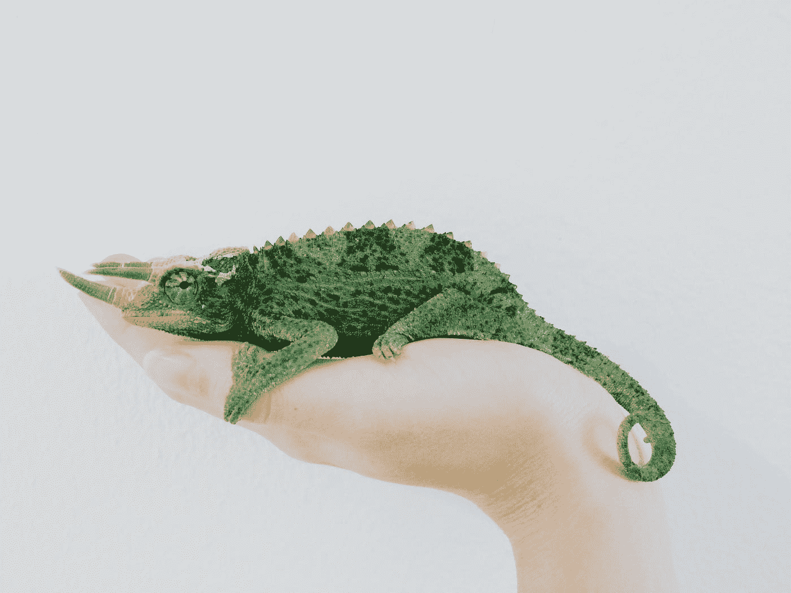
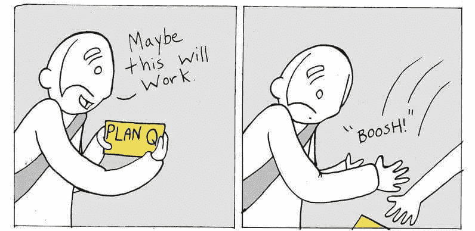
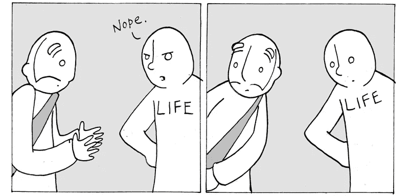

# 论“永远”是变色龙

> 原文：<https://medium.datadriveninvestor.com/on-always-being-a-chameleon-95dc77ce78bc?source=collection_archive---------14----------------------->

## 也就是说，在新旧环境中适应和调整。

这篇报道本应在几周前发表，但却没有。

现在想想，事情的结果有点可笑。

有些人可能会觉得这很讽刺，但我认为这非常合适。如果你还是不知道我在说什么，继续读下去，你马上就会明白了。

几天前，我参加了当地的一个职业咨询研讨会，会上谈论了很多关于个人选择、技能和市场趋势的话题。

在我们讨论可能遇到的障碍时，我们的讲师在黑板上写下了一个简单的等式:

**条件+反应=结果**

她解释说，无论我们在生活中选择做什么，**条件通常是固定的。也许有一天他们会改变，但是改变一种状况需要时间和集体的努力。**

> “那么，把我们所有的精力和时间都集中在试图改变现状上，岂不是很愚蠢？我们对此的反应呢？”，教官问。

我们选择的回应方式总是更灵活。然后我们开始多样化，保持选项开放，手头有选择和替代方案。

让我给你举个例子:

> 我们正在寻找工作，我们遇到了一个过度饱和的市场；这是一个条件。你我几乎无法单独改变这一点。
> 
> 我们能做些什么呢？保持敏捷并做出相应的反应。
> 
> 怎么会？通过保持专注，保持在潮流的顶端，并始终寻找获得成功所需的竞争优势的方法。

**对环境中的行为做出反应** **，** **我们学习进化**，同时也观察我们周围的生活，因为它正沿着它的许多部分前进。

# 我们怎么会经常这样做呢？

嗯，这真的很简单—

就像下面这个小家伙一样！

Photograph taken by [Amy Humphries](https://unsplash.com/@amyjoyhumphries?utm_source=medium&utm_medium=referral) on [Unsplash](https://unsplash.com?utm_source=medium&utm_medium=referral)

是的，那的确是一只变色龙。一只美丽的绿色小变色龙坐在一个女人的手掌上。

如你所知，变色龙是一种中等大小的爬行动物，以其改变皮肤颜色以适应周围环境的能力而闻名。

他们适应和调整所有类型的情况；这就是他们生存的方式。

所以，适应能力强是一件好事，主要是因为—

> 生活的 10%是发生在你身上的事情，而生活的 90%是你选择如何应对。

用*人类*的话来说，它是**认知我们的环境，时刻意识到它，并最好地判断出我们对它的反应的能力。**

许多人认为这是一种非常有利的品质，尤其是在一个惰性会让你远远落后甚至杀死你的世界里。

我们大部分时间都在思考未来。选择和不确定性将我们引向那里。这就是为什么我们在头脑中计划和形成对未来的想法。

这是健康的。这是我们应该做的；制定计划。

否则我们不可能成为今天的我们。

然而—

> 几乎总是，聪明的工作胜过努力的工作。

这意味着，**能够对生活的突发奇想做出相应的反应可以派上用场**。尤其是当你的整个世界看起来都要崩溃的时候。这时候你需要保持冷静，保持乐观；那是你适应的时候—

就像一只*变色龙*。

## 为了更好地说明我的观点，这里有一个关于适应性的小草图。

起初，你认为你有一个坚实的计划，最终可能会工作，但是—

你发现自己一无所有。在那一刻你会变成什么样，嗯？

但是当然，你*适应*。你尝试一个又一个计划，直到成功。

非常感谢你阅读我的故事。

*如果你喜欢这篇文章，请点击并按住“鼓掌”按钮——这会让我非常高兴，也有助于其他人阅读。*

另外，如果你想在下面留下评论，我会非常感激。

*下次见，
平安！*