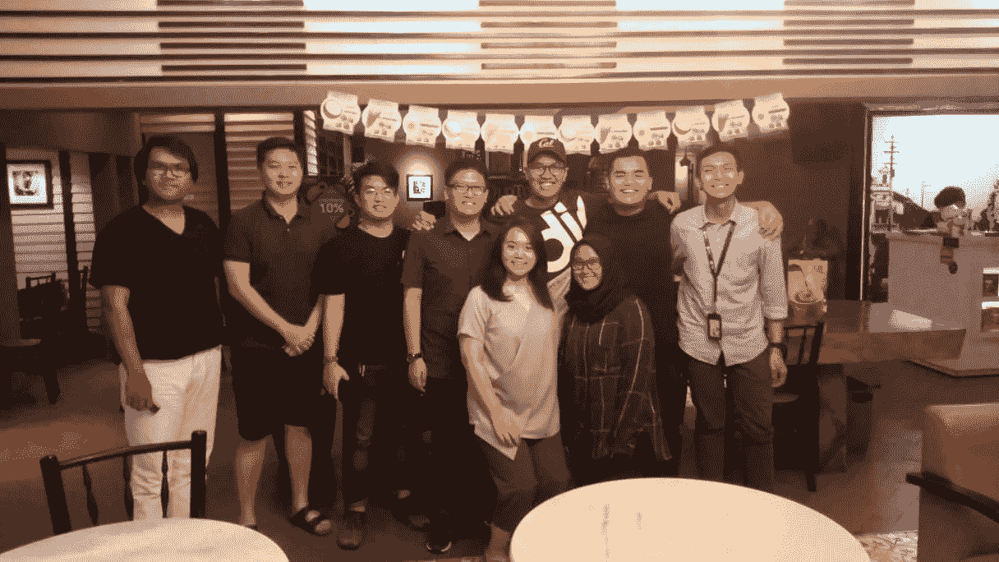
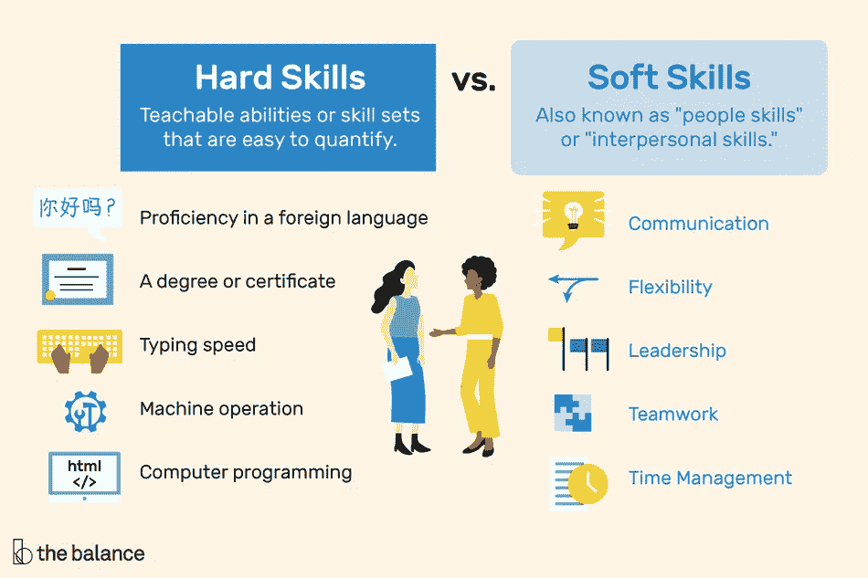

# 阐明你的愿景(第一部分)

> 原文：<https://medium.datadriveninvestor.com/on-articulating-your-vision-part-i-778c6318c635?source=collection_archive---------10----------------------->

[Anak Muda Mengajak](https://www.instagram.com/anakmudamengajak/) Monthly Talk: Career Planning and Strategic Vision with Tidar Rachmadi — Co-founder of [SabangMerauke](https://www.instagram.com/sabangmerauke/) — at Oldtown White Coffee Hang Lekir, Jakarta.

# 哦，年轻人

> 有些人 25 岁就死了，直到 75 岁才被埋葬——本杰明·富兰克林

年龄是一种特权(不！我不是在谈论年龄歧视)在某种意义上，年轻的人总是有更多的时间。根据定义，**年轻人有特权经历很多失败，并抓住尽可能多的机会探索可能性。**

原因之一——这与[乔布斯的演讲](https://www.youtube.com/watch?v=D1R-jKKp3NA)产生了共鸣——你所经历的失败和可能性都是点，当你回首往事时，你会将它们联系起来，这将是有意义的。会的。

但这并不意味着一个人应该盲目地抓住所有的机会，拥抱失败，就像没有明天一样。人们应该问两个具体的问题:

1.  从现在开始的未来 5 年、10 年、25 年，我要做什么？
2.  而且，为什么我这么倾向于这样做呢？是因为我被什么东西激怒了还是我就是爱它？

 [## 风险投资家在给创业公司播种时会考虑什么标准？-数据驱动型投资者

### 2017 年，风险投资资金攀升至十年来的最高水平。你的创业公司目前吸引风险投资的机会是…

www.datadriveninvestor.com](https://www.datadriveninvestor.com/2018/04/20/what-criteria-do-venture-capitalists-consider-when-seeding-a-startup/) 

# 接下来的 X 年我要做什么？

先从自我认识说起。我们每个人都必须能够客观地列出我们的技能，从软技能到硬技能。

硬技能是易于量化的可教能力或技能集，如打字速度、机器操作、外语熟练程度。而软技能恰恰相反，如领导能力、激励和解决问题的能力。

Image by Melissa Ling. © The Balance 2018

紧接着，我们开始想象我们在遥远的未来的理想生活。在你的生活中，你*真正想做什么？你的日常生活是怎样的？你会有什么反应？你的想法是什么？这些是你必须回答(至少尝试)并写下来的问题。*

在理解 VUCA(波动性、不确定性、复杂性和模糊性)之前，想象并拥有一定程度的自我理解是一种阐明内心状态的内部练习。

VUCA 是一个概念，以扩大我们对外部问题的认识，因为世界变化如此之快，以至于被称为“破坏时代”旧的、传统的公司正在被新的、非传统的公司所取代，这些公司都是由科技发展而来的。例如，出租车公司被迫要么与拼车应用整合，要么就死掉。

# 阐明愿景

你的自我理解是对的。

你的想象是对的。

你得到了你的 VUCA 权利，一切都被记录下来。现在，你的草案中最基本的原则——是因为爱还是因为恨？两个都很好。因为爱和恨，一个人可以那样生活。

爱仅仅是因为，是的，爱。憎恨仅仅是因为你在某件事情上发现了你最讨厌的地方，并且你想改正它。

Tidar 是 SabangMerauke 的联合创始人，因为他想解决印度尼西亚的不容忍问题，他根据自己过去的经验阐述了这一点。

我创建媒体公司 Widya，也是因为我讨厌印尼当前的言论标准。

因此，如果你基于爱或恨来阐述你的观点，这是没有问题的。重点是:**你必须对自己诚实**。

# 简化

1.  年轻是一种特权，因为一个人可以经历更多的失败，并从每次失败中总结经验。
2.  写下你的技能——硬技能和软技能，想象你未来 X 年的生活，了解 VUCA，并起草这些要素。
3.  当你完成起草工作时，试着揭穿你的概念。你的基本原则是基于爱还是基于恨？无论哪种方式，它都很好，因为它是你的燃料。
4.  最后向全世界公布。

参考

1.  蒂达尔·拉赫马迪([领英](https://www.linkedin.com/in/tidarrachmadi/))。
2.  [https://www . the balances careers . com/hard-skills-vs . soft-skills-2063780](https://www.thebalancecareers.com/hard-skills-vs-soft-skills-2063780)
3.  https://high existence . com/what-if-money-are-no-object-Alan-watts-on-the-meaning-of-your-life/