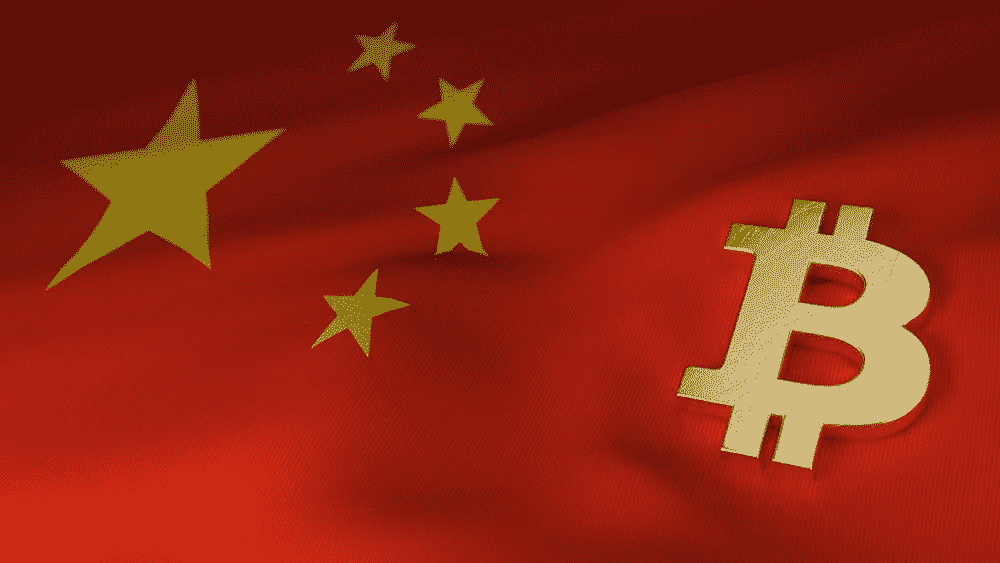
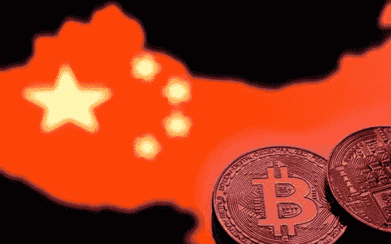
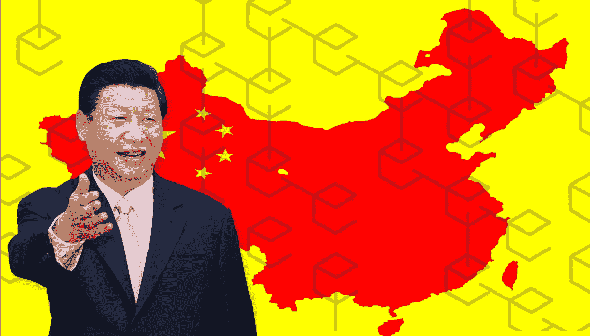
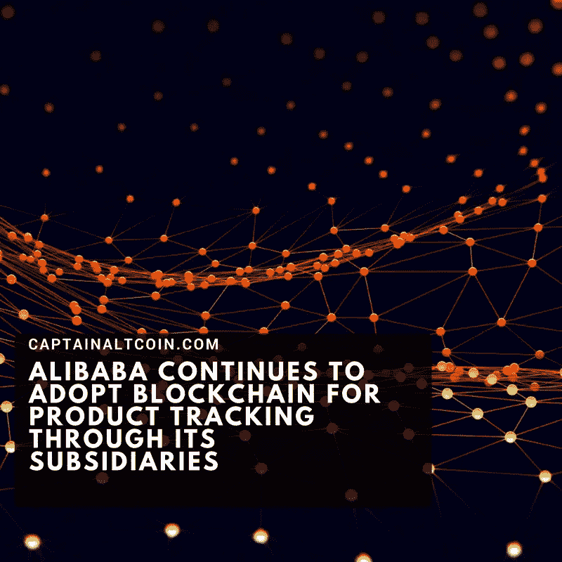

# 区块链在中国

> 原文：<https://medium.datadriveninvestor.com/on-block-chain-safari-in-china-e3e9002df5da?source=collection_archive---------22----------------------->

[Coinivore](https://coinivore.com/2017/09/21/chinese-government-launches-blockchain-research-lab-prevents-exchange-execs-leaving-country/)

我在中国呆了六周，采访了区块链问题专家，了解了中国的发展，以及中国与西方的不同之处。事实证明，对区块链未来的不确定性和对其金融比特币适应性的冷嘲热讽——从投机炒作到缓慢的交易速度——是全球性的，可能是理所应当的。

然而，尤其是在中国，区块链已经成长为一个成熟的产业。像交易缓慢这样的缺陷被认为是一种新的商业形式的暂时成长的烦恼。除此之外，很多人似乎相信，区块链最终将在许多其他行业引发重大变革和颠覆。

[Hacker Noon](https://hackernoon.com/the-future-of-chinas-blockchain-industry-7a1c37abcef)

在西方和中国，区块链的基本定义没有什么不同。它是一个分散的点对点系统，以永久可验证的方式记录双方之间的交易。

各种协议和约定都变得完全可见和透明。系统控制不在一个中央政党手中，例如政府或银行。它通过将控制权分散到参与区块链的所有计算机的整个网络上来实现。

这样，一个中央控制者的操纵和阴谋(主要的西方术语)和错误(主要的中国术语)变得不可能。这样的控制器是不存在的。控制在整个网络中。这也带来了另一个优势:黑客攻击如此广泛的计算机网络几乎是不可能的。

区块链的潜在破坏是巨大的——这一点西方和中国都同意。例如，我们可以把我们的金融交易安全地掌握在自己手中。不再依赖银行来保证过程的安全性。分布式对等控制系统会处理它。区块链的另一个主要应用:它将使所有供应链超级透明。中国经历了无数的食品丑闻——从受污染的婴儿奶粉到有毒药品。在自动区块链上，生产过程的每一步以及后续的物流程序都将得到可靠的管理，使每一步对所有人都是透明的。这将防止未来的骗局。区块链的其他层将显示每个人的慈善欧元或美元或日元是如何花费的。或者银行将我们的储蓄投资于哪些行业。

[TNW](https://thenextweb.com/hardfork/2018/05/30/president-of-china-endorses-blockchain-technology/)

也就是说，中国和西方之间存在巨大差异。中国政府已经选择区块链作为国家希望尽快引领世界的产业之一。这意味着许多初创企业得到了赞助和帮助，至少不是通过在中国主要城市的大型高科技园区为他们提供免费位置。此外，区块链的初创企业在监管方面有相当大的自由度。“百花齐放”，毛的老口号，在这里有了新的含义。

结果是一万多家中国区块链公司组成了一支大军。但要做好准备，我们说的是中国:尽管该行业相对自由，但当事情失控时***政府就会采取严厉措施。例如，当区块链的金融应用(众所周知的比特币)导致过度投机时，中国政府迅速采取行动，让区块链的整个分支机构实际上变得多余。人民必须得到保护，包括不受不负责任的投机者的伤害。没有太多的抗议，区块链工业接受和适应。***

******

***[Captain Altcoin](https://captainaltcoin.com/alibaba-continues-to-adopt-blockchain-for-product-tracking-through-its-subsidiaries/)***

***这意味着它正专注于区块链的其他应用领域，尤其是供应链改进的万花筒。在阿里巴巴的销售平台上，有许多假冒商品出售。这家科技巨头现在使用区块链技术来揭示某个路易威登包在哪里生产，以及它在登陆阿里巴巴空间之前是如何转手的。***

***在西方，对区块链的热情部分是因为它承诺从根本上把人们从政府和银行对我们生活的控制中解放出来。日本区块链创始人中本聪(没有人知道他/她是谁，尽管区块链完全透明)在 2008 年底金融危机的那一年因他的区块链想法和倡议而出名，这并非巧合。***

***随着近年来的投机炒作，意识形态激进主义已经减少。但是在西方，区块链将人民从银行和政府中解放出来的激动人心的承诺仍然受到欢迎——一点也没有受到硅谷后嬉皮士企业家的欢迎。(正如我的一位受访者所言，华尔街的反应更“保守”或“现实”，这取决于视角。)尽管中国政府对这种超级自由主义的理想主义没有任何同情。它将永远不会允许任何区块链的活动，其中每一个参与者背后的电脑无法确定无疑。这种数字身份证下一步将如何组织，还有待观察。但它会被组织起来:这是肯定的。这是政府的要求。这可能会伤害区块链的西方自由主义思想家——但这几乎与中国政府无关。中国区块链产业肯定会毫不费力地再次适应。***

***西方关于区块链与政治或区块链与银行之间适当距离的原则性意识形态对话，在西方可能会被视为一种可敬而重要的对话。中国就没这么多了。这让他们省去了许多争夺道德制高点的争吵——也让他们在务实的力量和统一的弹性方面领先一步。***

***中国在许多其他领域也向世界展示了竞争优势。***

******

*****关于作者:**
Carl Rohde 博士教授是一位关于“未来预测&创新”的国际主题演讲人，具有学术深度和实践现实性。在过去的十年里，他与 50 所大学和 10，000 多名学生合作。目标:让所有人都参与到更多的趋势和创新中。罗德在阿姆斯特丹、巴塞罗那和上海都有研究职位。卡尔·罗德还领导着 www.scienceofthetime.com T4 公司，这是一个全球市场和趋势研究人员的虚拟网络。***

***作为一个教育知识机构(大学、理工学院或其他),您是否有兴趣参与国际酷城搜索[请点击此处](https://scienceofthetime.com/service-title-2/)。***

***在 Twitter 上关注[Carl Rohde](https://twitter.com/CarlRohde)，在 Medium 上关注[。](https://medium.com/@carlrohde)***