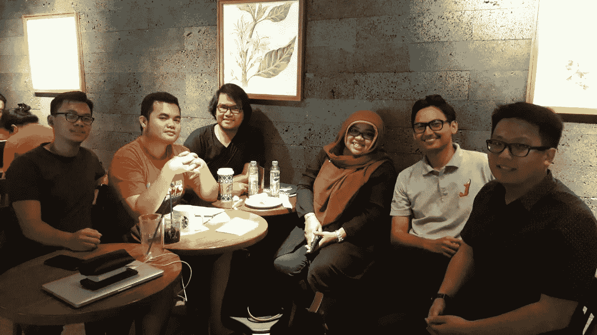

# 建立你的社会资本:个人品牌(上)

> 原文：<https://medium.datadriveninvestor.com/on-building-your-social-capital-personal-branding-part-i-a943622385b9?source=collection_archive---------29----------------------->

[Anak Muda Mengajak](https://www.instagram.com/anakmudamengajak/) Monthly Talk: Personal Branding with Dwi Kartika Sari (Deedee) at Starbucks Reserve Pakubuwono, Jakarta. **I’m the one who wore the read t-shirt by the way >.<**

# 从“我”开始

简单的问题:

1.  你如何描述自己？
2.  当人们看到或想到你时，你希望他们说什么？
3.  他们到底说了你什么？

这三个问题意味着你对自己的个人看法，你对自己的理想表现和你所处的现实。这里的交易，**它必须繁殖相同的答案**。

根据定义，个人品牌包括对你是谁的理想评估，你想被重视和联系的东西是什么，并要求你自我肯定。

> *最终，人们会在见到你之前就认识你。个人品牌* ***在你面前说话！***

关键的想法是你计划你将成为什么样的人，每次你在那里的时候，你的行为、反应和思考都应该与你的计划保持一致。**简直是在推销自己**。

# 第一印象

给自己打上同样的烙印意味着你在衡量自己。因此，这会缩小人们的视野——尤其是当他们第一次见到你本人的时候。这是一种保护，一种向评判你的人重新确认你是谁的行为。

> *记住！人对别人的评价是 0.1 秒。一眨眼的功夫。(* [*Inc，2016*](https://www.inc.com/jessica-stillman/people-judge-your-character-in-01-seconds-according-to-science.html)*；* [*新科学家，2016*](https://www.newscientist.com/article/mg23130930-500-we-accurately-weigh-up-a-persons-character-in-01-seconds) *)*

这很重要，因为个人品牌意义重大，远远超出你的想象。

听我说，如果人们认为你有能力，他们会给你什么？如果人们认为你是值得信赖的，如果人们认为你是能解决问题的人，如果人们认为你是有价值的，认为你是他们组织中的关键人物，他们会给你什么？很明显:机会！

# 基本上，你是一家公司

你规划了你的品牌，你创造了一种方法来实现它，你在生活的每一个层面上做出决定，基本上你是首席执行官、首席财务官、经理、员工，以及公司内的一切。**这就是为什么难**的原因。

这就是为什么你被迫拥抱你自己——你自己的独特性、能力、倾向。然后，基于你的自我意识，你为你的听众创造价值，并与他们保持一致，因为保持一致会让你**擅长于此。**还有一点要注意，做好自己的事**。**

> 这个想法是“我会通过我的价值观让你爱上我——我能拿出来的东西。”

# 我们会让它变得切实可行

*首先*，建立个人品牌需要你有一个生态系统——内容生态系统。你知道 LinkedIn、Instagram、脸书和 Medium(显然因为你在这里，咄！)和其他一些社交媒体，比如 YouTube？

如果你有，并且你有一个帐户，那么你现在能够放一些内容。**放。一些事情。向上。**如果你有一个很棒的想法，一条很棒的信息，或者确实对人们有用的东西，那么就制作一个关于它的视频，当你在 YouTube 上上传你的视频时，确保在描述中写下你的媒体账户或 LinkedIn 或 Instagram。

介质可以用作数据库。因此，**你把 YouTube 作为你思想的视频版本的平台，把媒体作为人们阅读文章版本的平台**。这是简单而有效的。你正在创造一个生态系统(YouTube 和 Medium ),仅仅通过使用一个伟大的思想。**你的创作存在于两个不同的平台上，它成倍增长！**

*其次*，对你消费过的任何内容做一个在线回顾。古德里德和 IMDb 就是一个很好的例子。当你看了一部电影后，立刻给它写一篇评论，或者至少给它打分！当你看完一本书时也是一样。这提升了你在线形象，增加了你评估内容的能力，教导你的大脑“这是好内容，这不是”嘿，我知道这很简单，但这是必须的！

*第三个*，老一套的建议……**自我肯定**。还记得这篇文章的第一部分吗？

> *个人品牌包括(1)对你是谁的理想评估，(2)你想与之相关联的事物是什么！)和(3)* ***要求你自我肯定*** *。*

是的。建立你的个人品牌是一项持续的工作。你制作的每一个内容，每一个动作，每一个想法等等，都必须与你最初对自己的评价保持一致。

# 简化了的

*   你的个人品牌必须从一开始就计划好，你必须一遍又一遍地做。成为理想的你是一个持续的过程。
*   个人品牌会带来很多机会，因为人们会在瞬间理解你的价值，因为你已经和“值得信赖”联系在一起了
*   最终，你必须建立一个内容生态系统，让人们真正看到你的价值，并不断向你的大脑提供发展所需的东西。

参考文献

1.  [https://www . new scientist . com/article/mg 23130930-500-we-accurally-weigh-up-a-persons-character-in-01-seconds](https://www.newscientist.com/article/mg23130930-500-we-accurately-weigh-up-a-persons-character-in-01-seconds)
2.  [https://www . Inc . com/Jessica-stillman/people-judge-your-character-in-01-seconds-by-science . html](https://www.inc.com/jessica-stillman/people-judge-your-character-in-01-seconds-according-to-science.html)
3.  [https://www . psychological science . org/observer/how-my-seconds-to-a-first-impression](https://www.psychologicalscience.org/observer/how-many-seconds-to-a-first-impression)
4.  阿纳克·大木·孟贾克月谈(IG: [阿纳克·大木·孟贾克月谈](https://instagram.com/anakmudamengajak))与 Dwi Kartika Sari ( [LinkedIn](https://www.linkedin.com/in/dwi-kartika-sari-deedee-41040677/) )。