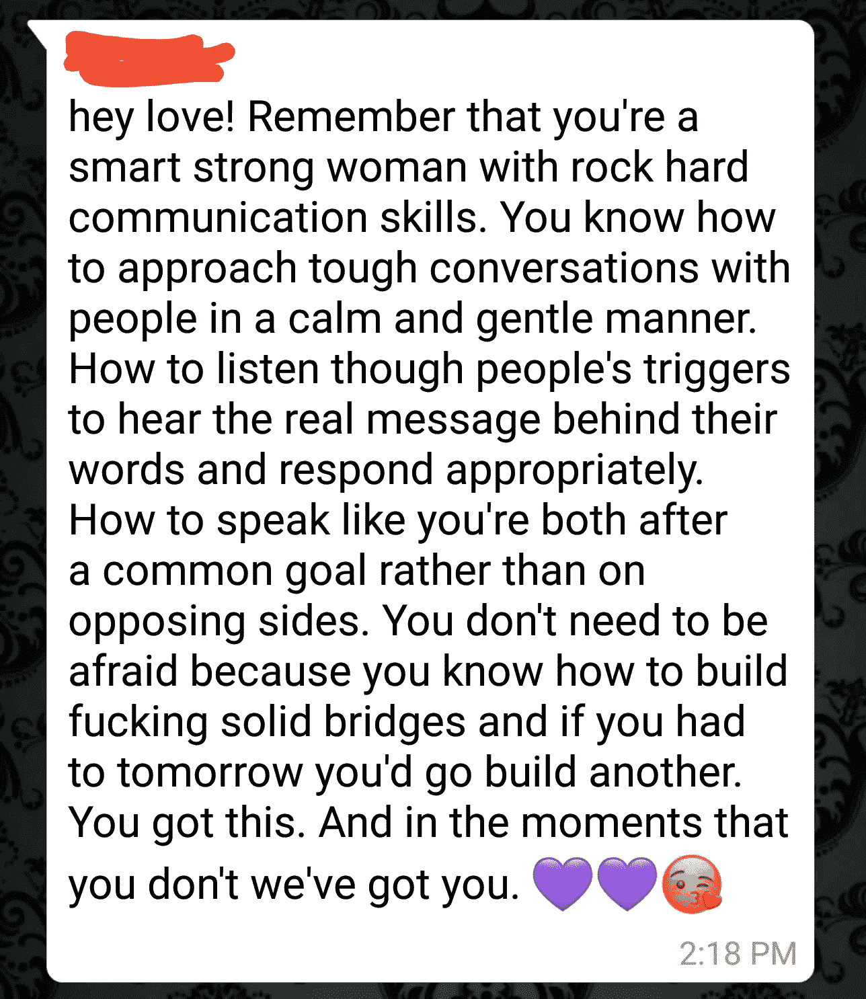

# 嘿机遇…我需要一分钟

> 原文：<https://medium.datadriveninvestor.com/on-seizing-an-opportunity-and-its-unexpected-catalyst-ea6df0fc5640?source=collection_archive---------4----------------------->

Photo by [Diego PH](https://unsplash.com/@jdiegoph?utm_source=medium&utm_medium=referral) on [Unsplash](https://unsplash.com?utm_source=medium&utm_medium=referral)

生活不是偶然的。这是一系列的选择，接着是一系列的结果，然后呈现更多的选择。我们每天都有机会保持或改变航向。人们常说这样的话:在生活中，你只有一次机会。我就是不买。新的道路无处不在，我们的任务是辨别机遇和干扰。一件好事和一件坏事之间(也许从经验上看不是坏事，但对*美国*来说是坏事)。

**但是当我们不得不在一件好事和一件真正的好事之间做出选择的时候呢？**

当我们必须在以下两者之间做出选择时会发生什么？

1.  舒适，熟悉，我们喜欢的东西或者
2.  将从根本上改善我们生活的新机会

好吧，废话。我们选择选项 2。似乎比现状更好。这是显而易见的。合乎逻辑的做法。至少在精神上。

 [## 幸福的算法？数据驱动的投资者

### 从一开始，我们就认为技术正在使我们的生活变得更好、更快、更容易和更实用。社交媒体…

www.datadriveninvestor.com](https://www.datadriveninvestor.com/2019/03/08/an-algorithm-for-happiness/) 

看，这就是生活变得有趣的地方。我们大部分的决定都是情绪化的，而不是逻辑化的。我们(在情感上)做出一个决定，然后试图用逻辑解释我们为什么做出那个决定。我们几乎总是会想出一个看似合理的理由，即使它并不诚实。

那么，当我们做了一个*逻辑上*即与我们的情感相反的决定时，我们该怎么办呢？当我们决定追求更好的东西时，即使在情感上，我们仍然爱着和想要次等的东西。斗争不在于论证，而在于实施。越过终点线并真正抓住更好的机会所需的精神体操变得筋疲力尽，导致我们拖着我们的感情——踢腿和尖叫——走向更绿的牧场。*丑陋的发脾气，1 之党*。

我最近不得不做出一个非常具有挑战性的选择，然后采取一些具有挑战性的行动。在考虑迈出这一步时，我从广为人知的事实中汲取了建议。

建议如下:

*   勇敢一点
*   写下你为什么这样做的清单，并重复给自己听
*   深呼吸
*   沉思/祈祷
*   有一个好的退出策略
*   想想你的未来

我发现这些传统知识对确认我的选择帮助不大，但对激励我去做这件事帮助不大。放下旧的，抓住新的。

就在我要行动之前，我没有做以上任何一件事。你知道我做了什么吗？我向我最亲近的人伸出手，传达着这样的信息:“我很害怕，请给我一些鼓励吧。”给你一个建议:当你需要别人在你面前露脸的时候，坦诚地交流你的感受和需求是最重要的。

我的主要鼓励官之一(对我的核心圈子里的人的非正式称呼😉)用世界大赛级别的留言回应。我已经把它完整地包含在下面了。

这条信息给了我采取实际行动所需的动力，让我看清了是什么真正促使我们迈出了可怕的第一步。

## 1.我们需要被提醒我们是谁

当我们要迈出一大步时，我们的恐惧让我们视野狭窄，我们看不到成功最重要的资产:我们自己。这个人提醒我，我很聪明，我很强壮，我知道如何搭建桥梁，我有处理艰难对话的能力。

## 2.我们需要被提醒我们有代理

当感受到威胁时，身体会以三种方式做出反应:战斗、逃跑或冻结。害怕开始新的事物会使人麻痹，并产生冻结反应。就好像一条蛇咬了我们，毒液在我们体内发挥着使人无法动弹的魔力。我们需要被提醒我们有代理。无论对方如何反应， ***我*** 选择我如何回应。如果对方被触动了，我会选择无视他们的真实感受，做出适当的回应。我可以有目的地主动，而不是被动。

## 3.我们需要被提醒，我们的恐惧不是我们的对手

迈出这一步时，恐惧是很自然的。但是在我们与恐惧的战斗中，我们需要听到恐惧是没有机会的。我们太有资格了。我们是选秀状元。注意，我的朋友没有告诉我不要害怕。相反，这更像是*我知道你害怕，但你不需要害怕。你一次又一次地做这种事。你完全有资格*。当谈到我们的恐惧时，我们常常觉得自己像大卫在与歌利亚战斗。我们需要人们提醒我们，事实上，我们是歌利亚。

## 4.我们需要被提醒，我们有一个安全网

当人们说“一切都会好起来的”之类的话时，我总是很恼火有时候不是。有时候事情并不总是“顺利”。有时生活会崩溃，我会随遇而安。假设一切都会好起来是不现实的，风险保证了成功。这是一种盲目乐观的态度。正如我的朋友所说，我们真正需要的是那些说“你能行”的人。在你不知道的时候，我们给了你。如果一团糟，你还有地方可以回家。这个风险并不是很大，因为不管怎样，你总会得到你所需要的——我们。就在那里，会给你翅膀。

那么，在向更好的机会飞跃时，需要什么呢？勇气是伟大的。深呼吸很棒。策略很棒。但是我们真正需要的是一个为我们保留空间的支持网络。当我们忘记了无论结果如何谁都会在我们身边时，我们需要有人提醒我们是谁。