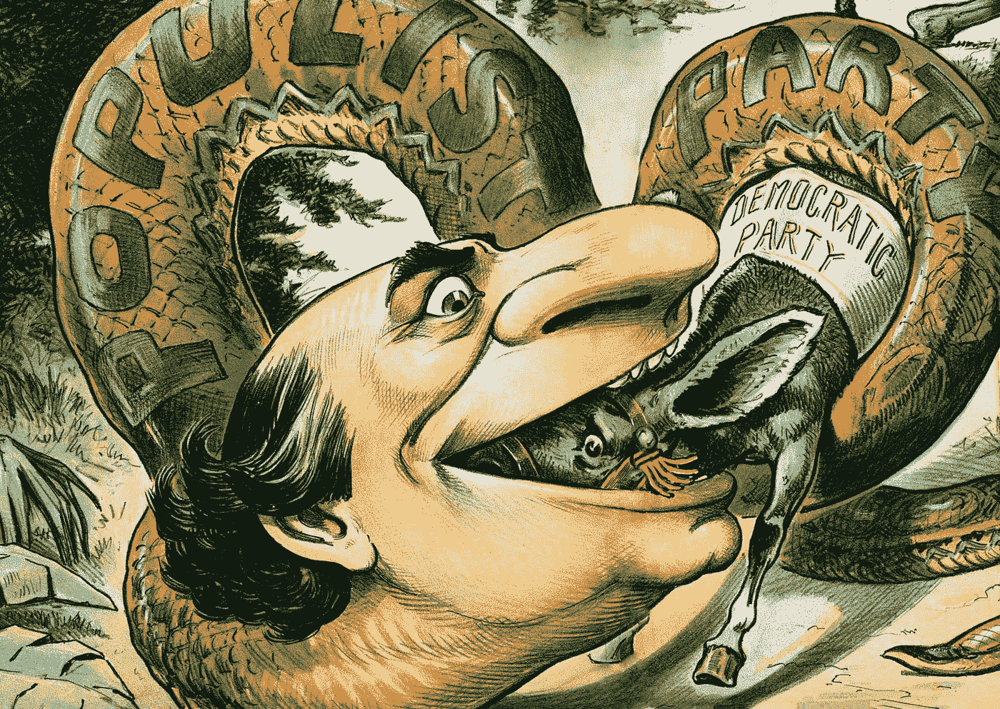

# 论社会

> 原文：<https://medium.datadriveninvestor.com/on-society-648403a218f?source=collection_archive---------2----------------------->

US “Judge” magazine, 1896.

想象一下，有这样一个乌托邦社会，没有人从事任何形式的抢劫或偷窃。如果有一天出现了一个人偷东西的例外情况，人们可以很容易地把这种情况归咎于这个人的个人特点，并把所有的责任都推到他们身上。务实的解决方案还不如监禁个人，把他们从我们的乌托邦中隔离出来，让它回到零偷窃的状态。**问题出在个人身上**，显然去掉个人就能轻松解决问题。

现在想象一个更现实的社会，比如说 5%的人沉溺于偷窃。这个社会仍然基本上没有这种犯罪，但是作为构成这个社会的个人数量的直接结果，百分之五将意味着一个远远大于一个离群个体的数字。从统计数据来看，导致这种情况的这种独特而罕见的个人特征是极不可能存在的，因为即使这是个性差异的结果，它也是影响 5%人口的一个因素，因此更符合逻辑地归因于整个社会，而不是不同的个人。考虑到背景和环境在每个人的决策中的重要作用，仅仅考虑个人是很难将这些“偷窃的人”与其他人区分开来的。指责个人是不切实际的，因为很明显，问题确实在于集体。

对于许多不同的和“不受欢迎的”社会现象，可以很容易地作出同样的论证，决定因素仅仅是该现象在集体成员中的统计显著性。贫困、吸毒成瘾、失业和犯罪、贿赂、腐败、有偏见的新闻报道或错误的科学研究、咄咄逼人的广告和以安全为名侵犯个人隐私，所有这些都比个人失调更普遍，实际上只能归咎于社会本身。

然而，在许多情况下，我们仍然倾向于只通过个人道德或社会失败的镜头来看待这些问题，并照此对待它们，好像我们社会的现实确实是我们第一个例子的不切实际的乌托邦案例。更进步的社会可能已经开始用更实际的方法来解决这些问题，例如，在世界上的许多地方，失业不再被理解为一种个人不适应，而是一种社会经济现象。然而，我们仍然喜欢向毒品和政治腐败宣战，沉迷于辱骂和对有偏见的新闻报道皱眉头，同时对造成这种现象的制度视而不见。

这种短视的原因是相当明显的:一个单独的个人或一个特定的群体是人们对这些不良现象可能产生的负面情绪反应的有形的外部目标。面对高犯罪率，最简单也可能是最没有成效的应对措施当然是扩大警力和权力。承担集体责任的想法也在主观上意味着对不涉及“我”的问题承担个人责任，这自然会导致一种情绪化的防护，阻碍在非个人和客观的光线下进行必要的逻辑思考。

这种不恰当的个人化解释源于对社会构成要素的忽视:社会并不是一大群生活在地理上邻近的独立个体，而是规则和机制将这些个体(他们最有可能在彼此的地理上邻近，这仅仅是我们现在迅速消除的交流限制的直接结果，因此绝不是社会概念的一个重要方面)结合起来，形成一个更大的集体，具有更高水平的内部协同作用。因此，当一个特定的问题被说成是整个社会的问题而不是个人的问题时，这仅仅意味着该机制的某个方面，如果你愿意，可以说是游戏，没有得到很好的理解，并导致了意想不到的和不受欢迎的结果。

这种知识的缺乏本身当然可能是对参与者(即社会成员)的决策过程缺乏充分理解的结果。例如，我们现在知道，即使在统计学上，这些玩家也没有做出理性的决定，因为他们在感知收益面前表现得更保守，在感知损失面前表现得更冒险，即使在数学上相同的情况下。对人类决策这一核心方面的误解在 2008 年金融危机中扮演了重要角色，尽管那场危机的可怕后果仍影响着全球更易受影响的经济体，但我们尚未改变基于这一错误假设设计的经济游戏规则。

这个经济游戏是少数几个实际上(大部分)是基于相关集体的系统视角而非个人预期设计的游戏之一。这些机制和规则往往因为其设计框架的内在缺陷而失败。我们的法律(大部分)是作为指导方针来勾勒模范公民的轮廓，而不是建立一种实际上鼓励个人行为的机制。犯罪大多被视为个人道德缺陷的结果，而不是导致犯罪的制度的症状。通常伴随不良行为的惩罚当然会抑制这种行为的收益，因此确实会影响游戏，但是当收益似乎足够高时，就简单地将目标改为“尽量不要被抓住”，或者在奖励高得多的情况下，“让我们欺骗负责执法的系统”，这总是不可避免地导致法律系统本身的深度腐败。更糟糕的是，尽管如此，我们仍然认为这种情况是个人道德弱点的结果，并在“道德英雄”手中寻求解决办法，而实际上我们对实际问题视而不见，甚至拒绝试图理解它，更不用说解决它了。

至于另一个例子，人们可以更深入地了解大多数现代民主是如何维持的。民主要真实，关键当然是保证治理代表集体和公共利益。由于治理总是包括获得大量的社会权力，这对于作为代表的个人来说总是非常有益的，他们通过牺牲公共福利来换取私人利益，而这种行为与他们自己的使命相反，私人利益最有可能是他们自己和/或某些特定群体(如企业)的利益。我们对付这种情况的主要机制是公众对此类事务保持警惕。然而，除了其他缺点之外，这种机制仅仅改变了游戏，让公众认为它是真正的代表，而不是真正的代表。在这种情况下，该游戏的一个最佳解决方案是政府投入其可支配的大部分资源，致力于以尽可能小的差距维持公众形象的目标，即只有最少的足够百分比的人口对该公众形象有最少的足够信任。反过来，这些充足的边际确实取决于政府在多大程度上依赖公众形象来维持其职能，因此，举例来说，对税收和/或持续公众投票依赖程度较高的政府往往比那些依赖军事力量或自然资源的政府保持更民主的形象。

所有这一切仅仅意味着，我们为维护民主而制定的政治游戏并没有自然地导致高效和仁慈的领导，相反，它逐渐收敛于民粹主义者以勉强可信和可接受的方式描绘公众形象。这不是个人道德的问题，因为即使是想利用领导地位为社会谋福利的人也需要付出同样的代价。同样值得注意的是，面对感知到的损失，由于上述公众风险接受度的提高，信任度下降，以包括原本被认为不可能成为严肃决策者和领导者的个人。在这种情况下，随着维持可信的公众形象的成本降低，如果传播损失和危险感的成本不太高，以过度夸张的方式批评现状以支持不正常的个人或群体的策略变得非常有效，因为它以更低的成本产生更好的结果。因此，毫不奇怪，在一个容易受到这种散布恐惧策略影响的社会政治环境中，有争议和古怪的民粹主义者的崛起几乎成为普遍现象。

虽然这种对社会/政治/经济现象的研究方法确实会导致更深刻的理解，但由此产生的解决方案也会变得更加复杂，有时甚至完全违背直觉。例如，解决成瘾问题的最有效方法之一是首先使吸毒合法化，或者甚至通过公共渠道以更低的价格和更高的质量提供毒品。这似乎非常违背直觉，因为它简化了似乎是根本原因的产品的获取，然而在实践中，它提供了控制物质使用的措施，并增加了防止其扩散为异常和危险状态(如成瘾)的机会。这种激进的方法不仅在理论上听起来很优雅，而且在近二十年前，它已经被有效地用于抗击葡萄牙的阿片类药物危机，并取得了令人瞩目的成功。

值得注意的是，在葡萄牙实施该解决方案还伴随着一种文化转变:最初提及有成瘾问题的人时使用“瘾君子”等负面术语，强调这种情况是由于个人的失败和缺点造成的，但随着这种文化转变，机制发生了转变，这些术语被替换为中性术语，仅仅反映了个人遭遇的不良情况，这完美地体现了观点和社会机制的变化(一些作者甚至认为机制变化是文化转变的自然结果)。认识到这一点很重要，尽管这一观点通常被认为是自由主义的观点和想法(事实上在更自由的政治家中更被接受)，但实际上远非如此。这只是一个统计学上的观察，当一种现象影响到统计上显著数量的个体时(即使这个数字与人口本身的规模相比看起来非常小)，它越来越不可能归因于个体的例外和缺点。这需要将个人归纳为可量化的行为模式和特征，这些行为模式和特征在统计上如此普遍，以至于与它们的差异在统计上确实微不足道，而这一概念与倾向于光谱左端的社会政治观点和思想的本质形成了直接对比(这反过来突出了人们在运用所提出的社会观点时应该表现出的保留)。

换句话说，这是纯粹非个人逻辑的实际需要，而不是个人和情感上的同情，为了对我们社会中存在的问题建立有效的理解，甚至可能找到解决这些问题的办法，我们必须停止躲在个人伦理和理想主义后面，把批判的目光转向整个社会及其机制，很可能，错误不在于个人，而在于机制。