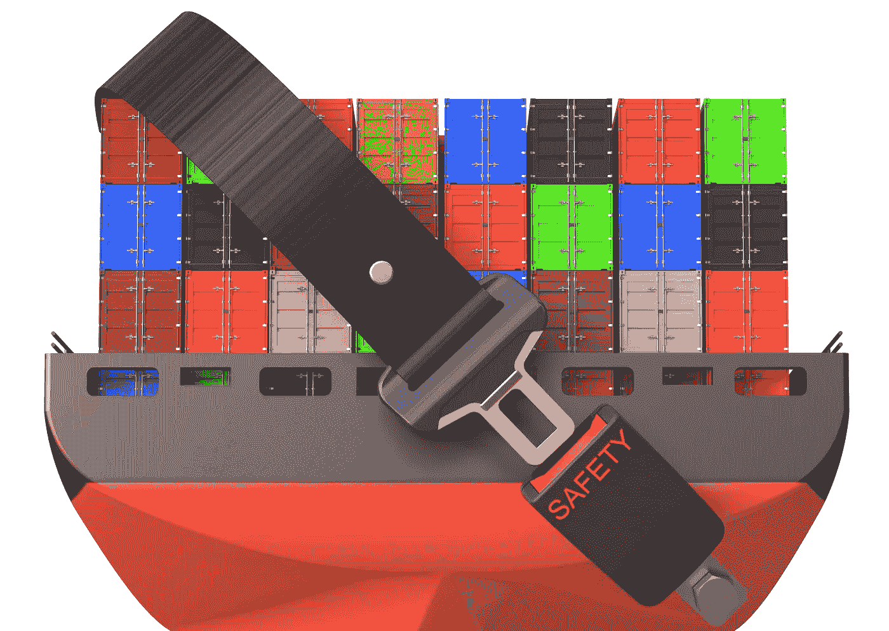
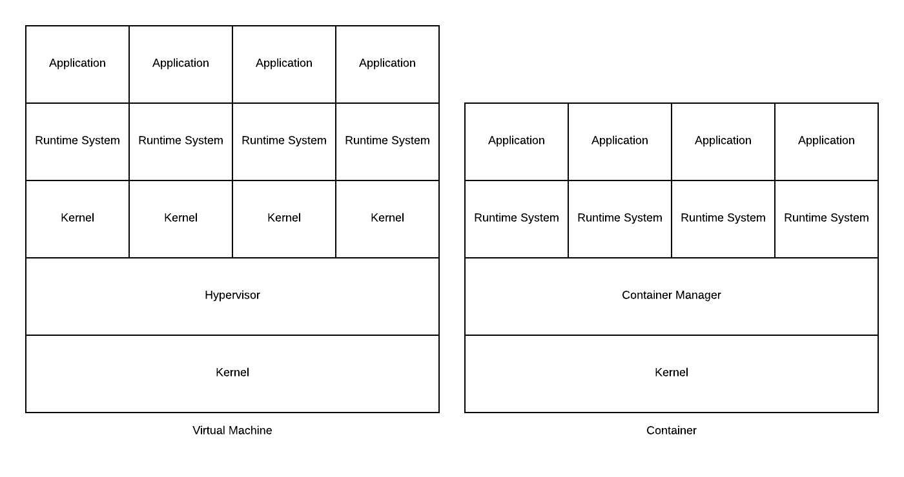

# 陌生的潮汐:API 和容器安全性第 3 部分

> 原文：<https://medium.datadriveninvestor.com/on-stranger-tides-api-and-container-security-part-3-265071f42a7f?source=collection_archive---------3----------------------->

# 解密 Docker 和 Kubernetes 安全性

# 什么是 Docker

Docker 是一个工具，旨在通过使用容器来简化应用程序的创建、部署和运行。容器允许开发人员将应用程序及其所有必要的部分(如库和其他依赖项)打包，并将其作为一个可以在任何操作系统平台上运行的包发送出去。

虽然这听起来就像运行在 [Parallels](http://www.parallels.com/) 、 [VMWare](http://www.vmware.com/) 、 [Hyper-V](https://www.microsoft.com/en-us/evalcenter/evaluate-hyper-v-server-2019) 等平台上的虚拟机，但它与运行它的主机操作系统的交互方式却非常不同。在虚拟机中，每个来宾主机运行自己的操作系统，使用自己的内核，这与容器相反，容器使用在主机操作系统中运行的内核。这要求开发人员只将主机尚未运行的任何内容打包到容器中，从而显著提升虚拟机的性能。它还消除了虚拟机管理程序为来宾操作系统中运行的不同设备创建的虚拟设备驱动程序。

 [## 人们对隐私的不理解是什么？-数据驱动型投资者

### 你知道那种感觉。无论是访问应用程序、订阅还是你最喜欢的运动鞋。你按下…

www.datadriveninvestor.com](https://www.datadriveninvestor.com/2019/04/11/privacy-and-convenience/) 

这是我创建的一个图表，展示了虚拟机和容器之间的差异。

# 什么是 Kubernetes

Kubernetes 管理容器，促进配置和自动化。虽然容器是捆绑和运行应用程序的好方法，但随着容器化的工作负载和服务从几个增加到几十个甚至几百个，您需要一个能够灵活处理管理和扩展的管理系统。Kubernetes 解决了停机问题、故障转移、部署模式、服务发现和负载平衡、存储协调、自动推出和回滚、自动装箱、自我修复、秘密和配置管理等问题。

重要的是要记住，Kubernetes 不是单片的，这意味着，它在容器级别而不是硬件级别运行，因此它不是传统的平台即服务(PaaS)。

# 针对集装箱的敌对目标

当对手瞄准容器时，她的最终目标是突破容器环境，以超级用户权限(root)在主机操作系统上执行代码。

此外，一旦对手从容器转移到主机操作系统，他们将希望转向网络中的其他容器主机。影响容器的常见攻击媒介包括:

*   内核漏洞
*   集装箱突破
*   拒绝服务(DoS)攻击
*   中毒的图像

由于容器的设计方式，以前有过利用主机级漏洞的例子，比如允许研究人员突破容器的 [RunC](https://www.openwall.com/lists/oss-security/2019/02/11/2) 。

这个特定的 RunC 漏洞允许恶意容器(只需极少的用户交互)覆盖主机 RunC 二进制文件，从而在主机上获得根级别的代码执行权限。用户交互的级别是能够在以下任一环境中以 root 用户身份在容器内运行任何命令(无论是否受攻击者控制):

*   使用攻击者控制的映像创建新容器；和
*   将(docker exec)附加到攻击者以前拥有写访问权限的现有容器中。

默认的 AppArmor 策略和 Fedora 上的默认 SELinux 策略都无法阻止此漏洞(因为容器进程似乎是作为 container_runtime_t 运行的)。但是，通过正确使用用户名称空间(主机根目录没有映射到容器的用户名称空间)可以阻止它。此处的[提供了针对此特定漏洞的攻击。](https://www.exploit-db.com/exploits/46369)

# 硬化码头集装箱

可以采取一系列强化步骤来使 Docker 容器对攻击更具弹性，这也应该与供应商提供的任何数量的不同安全解决方案相结合，如 [Aqua Security](http://www.aquasec.com/) 、 [SysDig](http://www.sysdig.com/) 、 [Snyk](http://www.snyk.io/) 和 [Neuvector](http://www.neuvector.com/) 。但是，下面是可以采取的强化步骤的一般列表:

*   确保您有一个漏洞和补丁程序管理计划，以解决您的容器环境中的漏洞；
*   执行系统和网络监控和审计日志以及其他容器活动；
*   启用 Docker 内容信任: [Docker 内容信任](https://success.docker.com/article/introduction-to-docker-content-trust)是 Docker 1.8 中并入的新特性。默认情况下是禁用的，但一旦启用，它允许您从 Docker Hub 注册表中验证所有 Docker 图像的完整性、真实性和发布日期；
*   运行 Docker Bench:一旦脚本运行，您会注意到许多关于部署 Docker 容器的配置最佳实践的信息，这些信息可用于进一步保护您的 Docker 服务器和容器；
*   安全机密:机密等敏感信息(如 SSH 密钥、密码、令牌、TLS 证书)需要加密并存储在[机密管理器](https://www.threatstack.com/blog/a-deep-dive-into-secrets-management)(如 Docker Swarm、 [HashiCorp](https://www.hashicorp.com/) 金库)中，而不是在主机级别；
*   访问控制:为 Docker 建立一个完善的[访问管理解决方案](https://www.threatstack.com/blog/best-practices-for-user-access-management)是必须的，这样容器可以用最小的特权和访问来操作，这有助于降低风险。大型组织可以整合基于角色的访问控制( [RBAC](https://www.threatstack.com/blog/3-things-to-know-about-kubernetes-security) )，并使用目录解决方案(如 Active Directory)来管理组织中所有人员的权限；
*   Docker 图像认证:始终使用由 [Docker 的安全扫描服务](https://docs.docker.com/v17.12/docker-cloud/builds/image-scan/)审查和扫描的基础图像，或者使用由 [Docker 内容信任](https://docs.docker.com/engine/security/trust/content_trust/)数字签名的基础图像；
*   为了减少性能影响和拒绝服务攻击，对容器可以消耗的系统资源实施限制是一个好的做法；
*   最低特权用户:在映像上创建一个专用的用户和组，拥有运行应用程序的最低权限，并使用同一个用户来运行这个进程；
*   签名并验证图像以减轻 MITM 攻击:我们非常信任 docker 图像。确保我们提取的图像是由发布者推送的图像，并且没有人对其进行篡改，这一点至关重要；
*   解决开源库漏洞:扫描您的 docker 映像中已知的漏洞，并将其作为持续集成的一部分进行集成。 [Snyk](http://www.snyk.com/) 是一款开源工具，扫描开源应用程序库和 docker 镜像中的安全漏洞；
*   使用 copy 而不是 add:为 ADD 指定的任意 URL 都可能导致 MITM 攻击或恶意数据源。此外，ADD 隐式解包本地存档，这可能是不期望的，并导致路径遍历和 Zip Slip 漏洞；
*   使用 linter:通过使用静态代码分析工具(如 hadolint linter)自动实施 Dockerfile 最佳实践，该工具将检测并警告 Dockerfile 中发现的问题；
*   使用启用 SELinux 的 Docker 容器(— selinux-enabled)。这可以防止容器内的进程覆盖主机 docker-runc 二进制文件；
*   在主机上使用只读文件系统，至少用于存储 docker-runc 二进制文件；和
*   在容器中使用低特权用户，或者使用 uid 0 映射到该用户的新用户名称空间(那么该用户不应该对主机上的 runc 二进制文件具有写访问权限)。

# 分析师洞察力

在第三季度，我将发布关于 API 安全和容器安全解决方案供应商的研究报告，进行产品审查，撰写案例研究和市场报告。我已经报道了一些 API 安全供应商，并在 https://aitegroup.com/users/alissa-knight 发布了关于他们的报告

# 评论

那么你有什么看法？你是否遵循其他 Kubernetes 或 Docker 的强化步骤，或者使用一些你可以谈论的工具或产品？请在下面的部分留下您的评论！

# 喜欢和分享

像往常一样，如果你喜欢这篇文章，请点击“喜欢”来支持我，并与你自己的 feed 分享！这是你支持我和我继续研究的最好方式。如果任何人对这篇文章有任何补充或评论，请在评论区与下面的每个人分享！在 www.alissaknight.com、 [LinkedIn](http://www.linkedn.com/in/alissaknight) 的我的主页上了解更多关于我的信息，在我的 [YouTube 频道](http://www.youtube.com/c/alissaknight)上观看我的视频博客，听我每周的[播客片段](http://alissaknight.libysyn.com/)，或者在 Twitter [@alissaknight 上关注我。](http://www.twitter.com/@alissaknight)

# 关于我

我是 [Aite Group](http://www.aitegroup.com/) 的高级分析师，通过评估行业趋势、创建细分分类、确定市场规模、准备预测和开发行业模型，对影响金融服务、医疗保健和金融科技行业的网络安全问题进行重点研究。我通过公正、客观和准确的研究和内容开发，为这些行业提供网络安全市场的联合和定制市场研究、竞争情报和咨询服务。根据我对当今影响这些行业的当代网络安全问题的研究，我撰写研究报告和白皮书，并提供咨询服务，包括询问、简报、咨询项目、研究结果演示以及预约演讲，我经常在每年的网络安全会议、研讨会和圆桌会议上发表主题演讲。

**参考文献**

Schoenberger，J. (2019 年 1 月 03 日)。Docker 安全提示和最佳实践。检索自[https://www . threatstack . com/blog/docker-security-tips-best-practices](https://www.threatstack.com/blog/docker-security-tips-best-practices)

Tal，l .，Hevroni，O. (2019 年 03 月 06 日)。10 个 Docker 图像安全最佳实践。检索自[https://snyk . io/blog/10-docker-image-security-best-practices/](https://snyk.io/blog/10-docker-image-security-best-practices/)

Docker 图像安全最佳实践:[https://RES . cloud inary . com/snyk/Image/upload/v 1551798390/Docker _ Image _ Security _ Best _ Practices _。pdf](https://res.cloudinary.com/snyk/image/upload/v1551798390/Docker_Image_Security_Best_Practices_.pdf)

Kuberntes Concepts (2019 年 6 月 20 日)。检索自[https://kubernetes . io/docs/concepts/overview/what-is-kubernetes/](https://kubernetes.io/docs/concepts/overview/what-is-kubernetes/)

Docker 是什么(2019 年 6 月 21 日)。从 https://opensource.com/resources/what-docker[取回](https://opensource.com/resources/what-docker)

奥斯纳特河(2018 年 12 月 03 日)。码头安全最佳实践。从[https://blog.aquasec.com/docker-security-best-practices?取回 UTM _ source = trend emon&UTM _ medium = content&UTM _ campaign = flow](https://blog.aquasec.com/docker-security-best-practices?utm_source=trendemon&utm_medium=content&utm_campaign=flow)