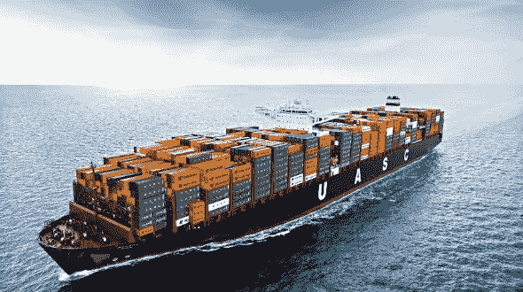

# 陌生的潮汐:API 和容器安全第一部分

> 原文：<https://medium.datadriveninvestor.com/on-stranger-tides-api-and-container-security-part-i-8e9a804eb64f?source=collection_archive---------8----------------------->

这是我发布的一个多部分系列的第 1 部分，讲述了在面向服务的架构(SOA)、应用程序编程接口(API)和容器中如何发生违规，以及如何针对这些违规建立弹性。在第一部分中，我将解释什么是 SOA、API 和容器，然后在第二部分中，我们将揭开 API 违规的神秘面纱，以及如何防范它们，在最后一部分，我们将讨论容器安全性。

**微服务的崛起**

起初，有一些巨石。这些应用程序被设计成一个独立的单层软件应用程序，其中 UI 和数据访问层被合并到一个程序中。

 [## 雅虎财经 API 的 6 个替代方案——数据驱动投资者

### 雅虎财务 API 是新的财务 API 万岁！雅虎财务 API 长期以来一直是许多公司的可靠工具。

www.datadriveninvestor.com](https://www.datadriveninvestor.com/2019/02/25/6-alternatives-to-the-yahoo-finance-api/) 

Monoliths 由两个组件或层组成，从端到端完全独立地执行任务:用户界面，它是用户应用程序的入口点，通常称为 UI 或图形用户界面(GUI );数据层，它是数据存储(或数据库)的包装器，在将数据保存到数据存储之前对其进行净化。

单片是为传统的服务器端系统设计的；基于单个应用程序的整个系统，在设计时考虑了性能和速度。Monoliths 通常运行得更快，因为它们不通过 API 与自身的不同部分通信，非常适合小型、单一功能的应用程序。

例如，一个整体可能是一个执行不同功能的应用程序，从身份验证到对数据库的读写、发布，可能包含权限结构和工作流批准，并且运行在使用相同文件系统的相同服务器上。

人们常常把独石形容为类似于厨房里有太多的厨师，他们的手都放在一个锅里，每个人都试图添加自己的配料，这些配料可能会与其他厨师正在做的菜肴的整体或部分相冲突或破坏它们。

值得注意的是，巨石柱并没有消亡。开发人员是选择将他们的应用程序写成一个整体还是分成多个微服务取决于应用程序，

相反，微服务采用模块化设计，支持应用程序部件的重用，并通过支持部件的修复或替换来促进应用程序不同部件的维护，而无需整个应用程序的整体重建或替换。

微服务的兴起带来了面向服务的架构(SOA)的新概念，其中服务器架构由多个应用程序组成，这些应用程序都代表同一应用程序的各个功能。例如，身份验证、数据库、帖子、权限结构和工作流批准都是独立的应用程序，它们通过各自容器(如 Docker)中的 API 相互通信，并且可以运行在不同的操作系统上。

SOA 非常适合那些需要在以后随着需求/负载的增加而扩展自身不同部分的应用程序。例如，有了 SOA 架构，posts 容器就可以随着需求增加每秒发布的文章数量而自行扩展。此外，SOA 架构允许隔离和解决个别服务问题，否则这些问题可能会导致整个应用程序无法使用，而不仅仅是其中的一部分可以标记为离线进行维护，例如允许现有用户登录的新用户注册。

容器还使多个开发团队能够处理他们代码的不同部分，而不用担心他们的更改会对其他开发人员和他们的应用程序部分产生不利影响。

那是你口袋里的一个容器，还是你只是很高兴见到我？

要理解微服务，你需要理解什么是容器。如果您熟悉虚拟化的概念，您将对容器有所了解。容器是在系统的自包含部分中运行的整个虚拟化服务器，该系统为服务器的随机存取存储器(RAM)、CPU 和磁盘空间划分出自己的需求。然而，与传统虚拟机(如 VMWare 或 HyperV)不同，虚拟机不使用虚拟设备驱动程序通过 hypervisor 访问这些核心组件和卡，如网络接口卡(NIC)或显卡。相反，容器可以直接访问系统的组件。这使得容器更加隔离和独立，并防止了虚拟设备驱动程序崩溃的问题和一些利用 VM 虚拟设备驱动程序的攻击。它还让容器在速度上有了更好的表现，并允许它们占用更少的磁盘空间。

**码头工人的世界**

容器通常使用 Docker 进行部署，随着 Docker 容器的数量随着需求和 API 流量的增加而增加，用户通常转向 Kubernetes (KBS)来获取他们现有的 Docker 映像，并将其置于更多的自治管理基础设施之下。Kubernetes 是一个免费的开源项目，事实上是大型分布式容器管理开发人员的首选。

Docker 是一种特定类型的容器，允许开发人员在整洁打包的虚拟容器化环境中开发和部署应用程序。构建在容器中的应用程序无论在哪里或在什么设备上运行都是一样的，这实际上使它成为了一个可移植的服务器。

Docker 容器可以很容易地添加、删除、停止和重新启动，而不会相互影响或影响运行它的主机。事实上，许多 Docker 容器可以同时在同一台主机上运行，并且通常占用的系统资源要少得多，运行时的性能也比多个来宾虚拟机在装有 VMWare 的同一台主机上运行时好得多。Docker 容器运行一个特定的任务，比如 MySQL 或 NodeJS 应用程序，并且通过网络连接在一起，因此它们可以互相通信。

通常从 Docker Hub(Docker 容器的在线云存储库)下载一个大型社区站点，该站点提供预烘焙的 Docker 容器，并为开发人员可能使用的特定编程语言(如 Ruby)预配置了环境。

如前所述，与虚拟机不同，Docker 容器划分出一定数量的资源、磁盘空间、内存和处理能力。Docker 与系统内核进行本机通信，使用较少的磁盘空间，并作为分层操作系统高效地重用文件。Docker 将保留所需文件的一个副本，并与每个容器共享。

那是什么东西？

Kubernetes 使用被称为节点的概念。每个 Kubernetes 部署通常都运行主节点和工作节点。Worker 节点处理多个“pods ”,这是 Kubernetes 的一种语言，表示作为单个工作单元聚集在一起的一组容器。

部署 Kubernetes 基础设施相对简单。管理员只需告诉 Kubernetes 主节点 pod 定义，指定她想要部署多少个。Kubernetes 然后将 pods 部署到已经在系统中预先配置和定义的工作节点上。如果工作节点变得不可用或性能受到工作节点的影响，Kubernetes 将在一个新的工作节点上启动新的 pods，该节点具有这些 pods 所需的最多可用资源，并自动将它们迁移到新节点。

Kubernetes 最初是谷歌的一个创意，后来谷歌将其捐赠给了云原生计算基金会，作为一个社区开发和维护的开源项目。

简而言之，Kubernetes 支持多个容器的自动化、部署、自动伸缩和操作，并且不仅限于 Docker，还支持其他容器格式。

**库伯内特建筑**

主节点:主节点是 Kubernetes 中“集群”的一部分，它知道所有构建的服务器，并且是 Kubernetes 生态系统的一部分，主节点可以将容器部署到这些服务器上。主节点通知 KBS 管理员想要使用哪种映像(通常从 Docker Hub 下载预烤容器)。然后，管理员创建一个“部署”,指定 CPU、RAM、文件存储和其他关键系统配置参数的数量，并由 KBS 不断运行、监控和维护。如果需要恢复部署，KBS 甚至会自动修复部署。这不是一个“一推就搞定”的系统。KBS 可以根据需求自主决定将部署迁移到哪里。经过配置，KBS 甚至可以跨不同的工作节点执行环境中大量部署的滚动重启。

**分析师展望**

本月我将发布一份新的研究报告，内容涉及 API 安全市场的现状、参与者、问题和解决方案，以及如何使用这种新型工具来解决这个问题。如需了解更多信息，请访问我在艾特集团的研究[微型网站。](https://aitegroup.com/users/alissa-knight)

**评论**

那么你有什么看法？在我对本文中的 API 和容器的解释中，您有什么想改变或阐述的吗？请在下面的部分留下您的评论！

**喜欢&分享**

像往常一样，如果你喜欢这篇文章，请点击“喜欢”来支持我，并与你自己的 feed 分享！这是你支持我和我继续研究的最好方式。如果任何人对这篇文章有任何补充或评论，请在评论区与下面的每个人分享！在我的主页[www.alissaknight.com](http://www.alissaknight.com/)、 [LinkedIn](http://www.linkedn.com/in/alissaknight) 上了解更多关于我的信息，在我的 [YouTube 频道](http://www.youtube.com/c/alissaknight)上观看我的视频博客，收听我每周的[播客片段](http://alissaknight.libysyn.com/)，或者在 Twitter [@alissaknight 上关注我。](http://www.twitter.com/@alissaknight)

关于我

我是 [Aite Group](http://www.aitegroup.com/) 的高级分析师，通过评估行业趋势、创建细分分类、确定市场规模、准备预测和开发行业模型，对影响金融服务、医疗保健和金融科技行业的网络安全问题进行重点研究。我通过公正、客观和准确的研究和内容开发，为这些行业提供网络安全市场的联合和定制市场研究、竞争情报和咨询服务。根据我对当今影响这些行业的当代网络安全问题的研究，我撰写研究报告和白皮书，并提供咨询服务，包括询问、简报、咨询项目、研究结果演示以及预约演讲，我经常在每年的网络安全会议、研讨会和圆桌会议上发表主题演讲。

**参考文献**

Niccolai I. (2018 年 7 月 13 日)*安全分散微服务的方法*检索自[https://medium . com/@ Ivan . niccolai/Securing-decentralized-microservice-43044 df 88 BCA](https://medium.com/@ivan.niccolai/securing-decentralised-microservices-43044df88bca)