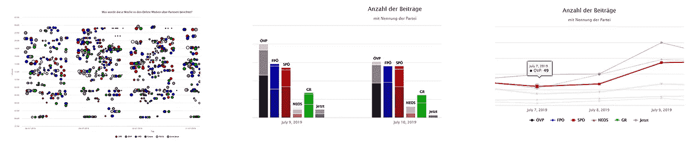
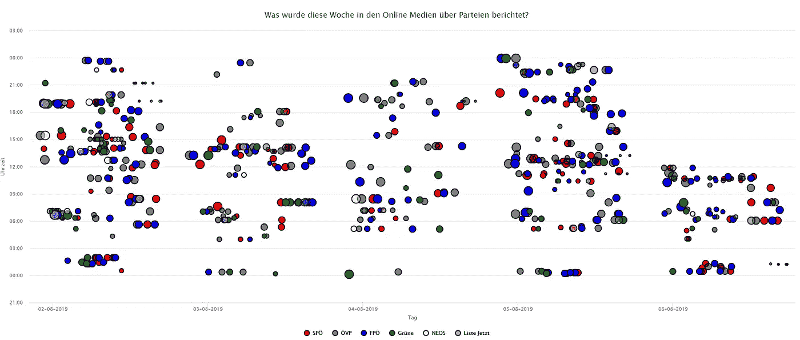
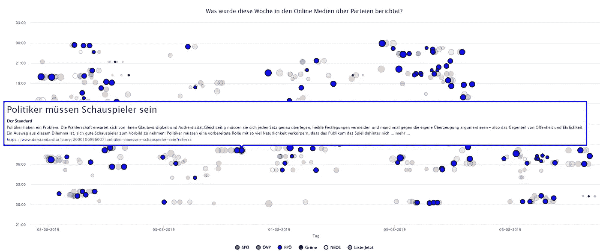
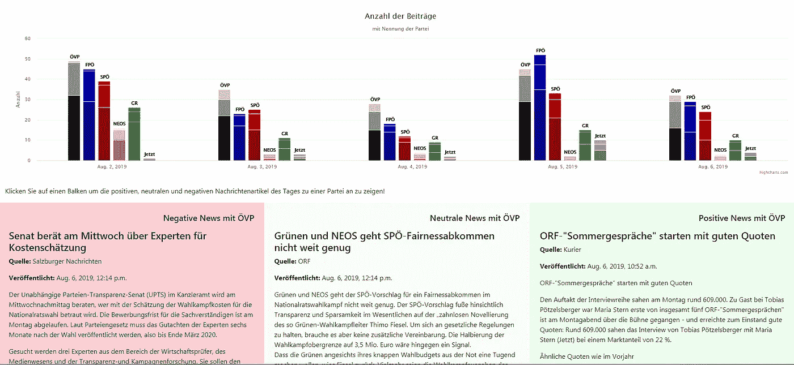
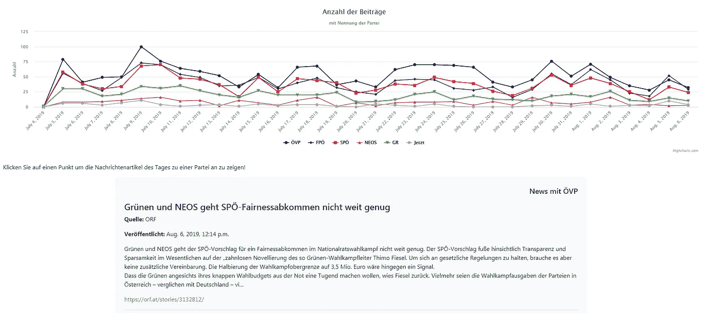

# 论媒体对政党的报道

> 原文：<https://medium.datadriveninvestor.com/on-the-media-coverage-of-political-parties-e1b1933f0810?source=collection_archive---------12----------------------->

为了迎接奥地利即将到来的选举，我启动了一个项目，监测和分析网络新闻中对政党的报道。该项目试图回答这样的问题，“关于不同党派的文章数量如何？”，“哪有感情的文章？”和其他人。

大多数奥地利在线报纸和门户网站的文章都被收集并存储在一个数据库中。现在，该项目包括:

 [## 保护主义、政治和经济动荡|数据驱动的投资者

### 美国股市昨日出现 400 多点的大幅反转，为未来的事情发出了警告信号。市场…

www.datadriveninvestor.com](https://www.datadriveninvestor.com/2018/06/28/protectionism-politics-economic-turmoil/) 

*   新大众报/[https://volksblatt.at/](https://volksblatt.at/)
*   ORF / [http://orf.at](http://orf.at)
*   http://tt.com
*   obersterreichische Nachrichten/[http://Nachrichten . at](http://nachrichten.at)
*   niedersterreichische Nachrichten/[http://noen . at](http://noen.at)
*   福拉尔贝格在线/ [http://vol.at](http://vol.at)
*   oster Reich/[http://oe24 . at](http://oe24.at)
*   萨尔斯伯格纳赫里滕/[http://salzburg.com](http://salzburg.com)
*   kurier/[http://kurier . at](http://kurier.at)
*   http://diepresse.com
*   krone Zeitung/[http://krone . at](http://krone.at)
*   der Standard/[http://der Standard . at](http://derstandard.at)

这个项目的一些图片可以在 http://politradar.stoeckl.ai/找到。第一个回答了关于不同党派的出版物的日期和白天的问题。

Publication on the last 5 days by day and daytime

过去 5 天的气泡图显示了覆盖率，气泡的大小表明了由[WA](http://www.oewa.at/)测量的出版商的媒体覆盖范围。将鼠标悬停在气泡上，您可以查看文章的预告和原始帖子的链接。

Bubbles with a teaser at hover

第二个信息图显示了按文章文本的情感分类的新闻文章。过去 5 天的新闻文章分 3 栏呈现，一栏为正面，一栏为负面，一栏为一方的中性情绪。

News by party and sentiment

最后一个图形是我收集的帖子的存档，包含按党派划分的所有天数。

Counts over time by political party

在进一步的分析中，我将关注以下问题:

*   不同出版商提及政党的频率如何？
*   文章涵盖了哪些主题？
*   不同的出版商对新闻的看法不同吗？

以后还想收集社交媒体上的评论和赞的数据。