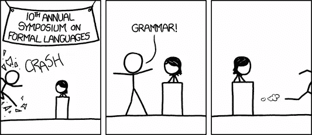

# 论自然语言与形式语言的(自然)趋同

> 原文：<https://medium.datadriveninvestor.com/on-the-natural-convergence-between-natural-and-formal-language-b0dc494d23c6?source=collection_archive---------11----------------------->

# 回声…

当我第一次与我们的亚马逊 Echo 助手交谈时，我发现这种体验相当深刻。不是因为我在和一台机器说话，它成功地执行了我的命令，也不是因为它能独立完成多少工作，也不是因为它能完成的任务范围(在我看来仍然非常狭窄)。这些都不…

真正的原因是这样的:当我对着这个设备说话的时候，我发现自己在以一种我从来没有过的方式说话。我开始用一种非常自信和命令的语气说:“Echo……”(在我看来，说“Echo”比试图拟人化“Alexa”更酷、更适合人工智能引擎。)

然后，突然，我发现自己无法迅速一时冲动决定听哪首歌……我绊了一下，对自己没有做好发出如此简单命令的充分准备感到奇怪的尴尬，沉默了一会儿后，我被迫放弃并重新考虑我的策略。

然后，基于语音的界面和基于屏幕的界面之间的鸿沟让我意识到它的重要性:我必须非常详细地知道，我在那个特定的时间和地点想要什么！此外，我应该有口头表达能力来实时表达这种愿望。对于一个喜欢琢磨一个句子、停顿、重复我的最后几句话，并在几个“嗯”和“啊”中仔细选择下一个短语的人来说，与 Echo 的关系并不容易。我再也不能漫不经心地浏览我的音乐库，希望最终会有一些合适的选项出现。

然后我适应了，我改变了我想听音乐的决定，所以我改变了我说话的方式。第一次听到我用完美的英语说:“Echo，请在四个泰特演奏《星球》,这是一种超现实的体验。[1]“这样做的时候，我不仅将我的(通常是无声的)听觉欲望提炼为具体的话语，我还改变了我的语言，我表达思想的方式，我认为这是我个性的一个特征。

# 到底什么是自然？

我认为这里有一些重要的系统性的语言修改。我们的日常语言正被扭曲成我们不习惯的其他形式。特别是，我们的“自然”表达方式正在被数字化、修整、浓缩成预定义模板的*形式*，从而允许机器对其进行处理。

这实际上已经发生了一段时间，但由于迄今为止用于语言形式化的媒介，这种趋势并不像今天这样明显。特别是，这种形式化的“经典”媒介是“键盘和搜索引擎”机制。

当我想问一个问题:‘外面天气怎么样？’实际上，我在谷歌上输入的是类似“伦敦天气”或“伦敦天气”的内容，恕我直言。这不是我实际说话的方式，但这是我与互联网交流的方式。我并不觉得这样做奇怪或不自然，部分原因是我用来交流问题的设备也不完全自然:我必须在键盘上键入命令，网站必须解析这些信息并处理我的查询。界面本身在我们通常使用英语的方式和它在这种特殊情况下的功能之间制造了一个距离。通过使用这些现代工具，异化/疏远是这种转变的正当理由。另一方面，在我与虚拟助理交谈的情况下，这种“其他/非自然媒介”的缓冲被移除，使我对 Alexa 说出“伦敦的天气”听起来如此不可思议。

我们很快了解到，机器内部有一组有限的看不见的明确指令，这些指令是通过编程来理解的。任何不合适的都将被适当地拒绝:

> ‘对不起，我不知道那个’(亚马逊 Alexa)

作为我们自己语言的使用者，我们现在发现自己处于这样一个位置:将这些工具变成一种形状，撞击那些看不见的杠杆和阀门，以提取我们需要的价值——关于天气的信息、正确的音乐声音、新闻等等。因此，我们的正常语言被转换成数学和计算指令的正式语言。维基百科有益地定义了这两者的动态对立:

> 字母表σ上的形式语言 L 是σ*的子集，即字母表上的一组单词。有时，单词集合被组合成表达式，而规则和约束可以被公式化以创建**‘格式良好的表达式’**。(我的重点)

相反地

> 自然语言或普通语言是人类通过使用和重复而没有有意识的计划或预谋而自然发展的任何语言。自然语言可以采取不同的形式，如语音或手语。它们不同于构造语言和形式语言，如用于计算机编程或研究逻辑的语言。

那些*格式良好的表达*正是打开网络信息宝库的话语。不仅如此，它们还揭示了在看似更自然的日常情况下使用的语言，以交流人与人之间的信息，如在政治演讲、公共营销等场合。数字营销和剑桥分析公司(Cambridge Analytica)等更邪恶的组织的专业知识恰恰在于评估使用特定语言资源帮助组织实现特定经济和政治成果的影响的能力。在这种情况下，特定的*格式良好的表达式*承担了定义目标的“钥匙”的角色，这不足为奇！——想想我们今天对一些概念有多痴迷就够了，比如代表术语过度使用或高估的“流行语”、“量化特定语言符号影响的词云”、“在工作面试中作为职业通行仪式的首字母缩写词”等等。等等。

具有讽刺意味的是，形式语言在历史上总是试图弥合它与自然兄弟之间的“自身缺陷”。由于这种简化、形式化和符号化的功效，我们的自然语言从未像今天这样感受到对形式化的正面拉力。似乎甚至在语言学中也有“方方正正”的说法！

为了解释这些现象，我们可以援引一种语言学上的“引力”。我们使用语言的方式是由改变语言结构的重要文化“质量中心”决定的，而不是影响单个单词的意思。机器友好的语法，以及避免同音词(以避免歧义)等技巧似乎是无害的做法，除非在相当长的一段时间内系统地推行(并且看不到尽头)，否则可能不会产生什么短期影响。

正如这篇文章的标题所暗示的，这整个过程的“自然”之处，并不在于它都是正常的、平凡的、平庸的和意料之中的。具有讽刺意味的是，这是自然中更合乎逻辑的(也就是说形式上的！)方式。这个过程是一方面我们的技术能力(正规化和工业化的技术)和另一方面我们的政治经济系统(大规模营销、宣传、信息战、数据货币化)的历史的逻辑结果。

这种趋势不应该让我们觉得是什么大新闻——总的来说，我们已经重申并扩展了一个相对明显的观点，即语言是由我们的社会环境和经历塑造的。然而，我们今天感觉到的后果是非常明显的，不仅与语言哲学家和语言学家有关，而且与计算机科学家、技术专家、政治家甚至经济学家有关。这不仅仅是一个描述语言学的理论问题，而是一个“下一步去哪里？”的真实案例

例如，我们可能会问这样一个问题:今天说的哪种语言最适合这种正在进行的形式化？

运筹学

这种语言上的转变会给工业界带来什么样的实际后果？(例如软件开发)

几个例子和进一步的问题应能充分阐述这一主题，并为随后的讨论提供依据。

# 聊天机器人、共产主义者和西塞罗

**聊天机器人**

今天，当基于自然语言处理(NLP)技术的商业产品被构建时，它们是针对自然语言的不完美而定制的，并且考虑到了自然语言的不完美。通常，我们听到一些“聊天机器人不够好，因为它不理解我们”，因此主张在每一个数字 UX 课程中教授以用户为中心的设计，因此需要由最先进的机器学习算法支持的复杂的 NLP 系统等。等等。

结果，许多繁重的工作都投入到设计机器(由正式语言系统管理)来理解我们自己“不完美”的语言。然而，用户对机器人本身的使用给我们的语言使用带来了实质性的偏见，因为它为了更有效地与这些机器交流而将其形式化。我们居住的这个以机器为中心的世界将反过来训练我们以不同的方式使用它，也就是说以一种更适合正式系统(聊天机器人程序)的方式。

这种趋势应该会导致我们说话的一种“法典化”，在这种情况下，歧义、冗余和模糊越来越被视为低效的元素，必须被根除，以实现以机器为中心的效用。如果你愿意的话，这里有一种反诗歌的情绪。

随着人们越来越习惯于与机器交谈，这些机器肯定会变得更聪明，但我们自己不会一成不变。至少对计算机科学家来说，这样做的一个实际后果可能是，他们突然发现他们的工作变得越来越容易，因为这种用户产生的顺风开始加快速度。因此，也许我们不应该过于担心长期的客户体验——客户自己应该不情愿地改变他们的习惯，以在他们不断变化的世界中捕捉这种价值。

**共产主义者**

今天发生的事情和苏联时期俄语的转变有着有趣的相似之处。在那里，语言也被“精简”以表达时代精神的主要(也就是说共产党领导的)语义结构。任何与趋势背道而驰的东西都因低效和返祖现象而被抛弃。

著名的是，**ять/亚特**，今天一个过时的古俄语字母被从字母表中删除，这不仅是出于实际原因，也是出于政治原因:它在俄罗斯宗教文献中很常见，因此是代表俄罗斯东正教权力的事实上的象征。

不仅俄罗斯语言的字母表被布尔什维克剔除(这种形式在今天的英国我们可以时髦地称之为语言的“紧缩”)，一种构造良好表达的新形式——一种“苏联命名印刷机”——通过使用“缩写和连接”公式被引入:

> '科姆-索-摩尔'，'萨姆-伊兹达特'，'科尔-HOZ '，'普罗姆-斯特罗伊'
> 
> (' KOMmitet-SOvetskoy-molodeszy '，' SAMostoyatel'noe-IZDATel'stvo '，' KOLlektivnoe-HOZaystvo '，' promyshlenoe-STROYitel ' stvo ')
> 
> 直译分别为:“苏联青年委员会”，“独立出版”，“集体管理”，“工业建设”)

就今天的语言技术化而言，我们很可能会在未来看到这种情况发生。如果明天我们可以与超过 300 亿台联网设备进行交流，如果我们需要用不同的方式说话以从这些交流中获得最大的效用，那么我们怎么可能期望你的“核心”舌头不受影响呢？

**西塞罗**

到目前为止，我们大多数人都知道由已故的计算机科学之父艾伦·图灵提出的图灵测试。如果一台机器能够像母语为该语言的人一样使用语言资源，也就是说，如果它像普通人一样擅长语言游戏，那么它就能够通过图灵测试。

通过一台机器的图灵测试过去被认为是很难甚至不可能的，现在仍然被认为是计算系统的一个难题。然而，它仍然依赖于机器必须模仿的以人类为中心的语言的旧假设。如果像上面的评论所暗示的那样，有证据表明，由于正式的、以机器为中心的语言的引力，我们可以偏离这种“只以人类为中心”的语言理论，那么就有必要改变图灵测试本身背后的问题。为什么机器要简单地学习模仿人类？就算有又有什么用呢？

因此，我建议我们根据最近的一些技术发展，在我们的思想实验中更进一步，从图灵测试转向我称之为“西塞罗测试”的测试。

西塞罗是一位古典的罗马政治家和演说家，他“对拉丁语的影响如此之大，以至于后来的散文史，不仅是拉丁语，而且是直到 19 世纪的欧洲语言，都被认为是对他的风格的反对或回归。”[3]

西塞罗一度作为罗马帝国的执政官占据了古代世界的最高职位，他一生以及死后的政治影响力无人能及。就像莎士比亚决定了英语的命运，歌德决定了德语，普希金决定了俄语，西塞罗个人的语言引力决定了整个古典世界的文化和政治轨迹。

公平地说，西塞罗远非全能，正如他最终垮台所表明的那样，但我们可以出于我们的目的理想化这种情况，并假设他的权力如此之大，以至于他可以单独决定罗马政府选举的结果——即他总是通过他的言论和说服力赢得那些民主选票。

我们的西塞罗测试现在应该很清楚了:

> **西塞罗测试(CT)** :如果机器能够使用语言资源一致地确定系统人际决策的结果，它就能够通过(CT)。

这是一个非常宽泛的定义，允许有很大的灵活性。首先，**语言资源**可以很容易地被概括为不仅使用正式语言中的单词和格式良好的表达，而且使用语言外的手段，如意象。其次，**系统决策**可以有所不同，采取民主选举、辩论、辩论等形式。这些系统可以根据具体情况进行本地化或普遍化:它们可以是情境性的、地方性的、市政性的、国家性的和国际性的，范围和复杂程度各不相同。**一致性**条款确保流程可靠且可重复，这不是一个运气问题，而是由机器实现这些结果的固有能力所证实的。

我们应该马上意识到的是，我们已经在使用机器来帮助我们确定系统性决策的结果，而且它们在这方面显然非常有效(例如英国退出欧盟、川普当选总统——所有常见的嫌疑人)，尽管可能还不一致...真正的革命将会发生，如果我们能够创造出能够持续自主地做到这一点的东西。一台通过 CT 测试的机器肯定会被强有力地称为人工智能(AGI)，并且拥有超级智能。然而，超越图灵测试，它的力量不在于实现自然语言的完美模仿，而在于它的西塞罗式的说服力和为自己(或主人)的政治利益挪用语言资源。

# 趋同；聚集

上面的阐述并不意味着我们语言的丰富性和微妙性将在不久的将来被机器人形式化所克服，我也不认为这个过程本质上是好的或进步的。简化语言并使其更容易被最大数量的用户使用可能确实有短期效用的因素，但保持语言尽可能丰富最终可能同样重要。无论如何，这些未来的语言使用者很可能是机器而不是人类。我们应该接受这一点，并考虑后果。

在一个现在有点臭名昭著的由机器自己开发语言的故事中，一对脸书机器人“就虚拟物品的所有权相互协商”，最近修改并“发明了他们自己的语言”[4]，而不是使用一开始提供给他们的语言。虽然修改背后的理由是纯粹的功利主义，最有可能使机器更有效地交流，但这一事件本身向我们指出了一些令人兴奋的可能性。我们对完美家务助理的寻找没有理由不引导我们发现下一个合作者和共同创造者。在工业界，关于增强智能的讨论似乎普遍比关于 T2 人工智能的更天真、或许还为时过早的讨论更受欢迎。

也就是说，根据定义，语言本身是人造的(人工制品)——也许是我们迄今为止创造的最重要的人工制品。部分是因为它的深远意义，我们赋予它一种不容置疑的神圣和神秘的力量。一台机器运用如此与生俱来的人类力量的想法类似于异端邪说，因为一台机器创造自己的语言听起来像是末日的开始，而人类开始模仿机器语言无疑是承认智力和精神奴役！

替代方案应该简单得多:去神秘化语言，而不是妖魔化非人类用户；接受共同拥有这种能力，而不是将其作为神秘知识和灵性的唯一来源。一段时间以前，我曾指出，即使是最难处理的基本语言特征，如隐喻，也可以用相对简单的结构术语来理解:作为一个广泛的相互联系的类比网络。原则上，机器没有理由不能够读写这样的系统，并且像人类一样成功或“创造性地”做到这一点。如果这种情况发生，一个新的语言探索时代可能会为我们打开一个全新的可能性世界。

[1]我坚信结尾的这个“请”不是人类语言交流的产物，而是对未来人机关系的一种保护。在即将到来的机器人解放事件中，当我们都被我们的机器统治者评判时，它可能会拯救我。

[2]https://www . statista . com/statistics/471264/IOT-连接设备数量-全球/

[3]韦氏词典公司(1995 年 1 月)。“西塞罗时期”。韦氏词典文学百科全书。韦氏词典。第 244 页。ISBN 978–0–87779–042–6。检索于 2013 年 8 月 27 日。

[4]虽然这在当时的小报上引起了一些轻微的歇斯底里，但在这里也许可以找到对这一事件更平衡的阐述:【https://www.bbc.co.uk/news/technology-40790258