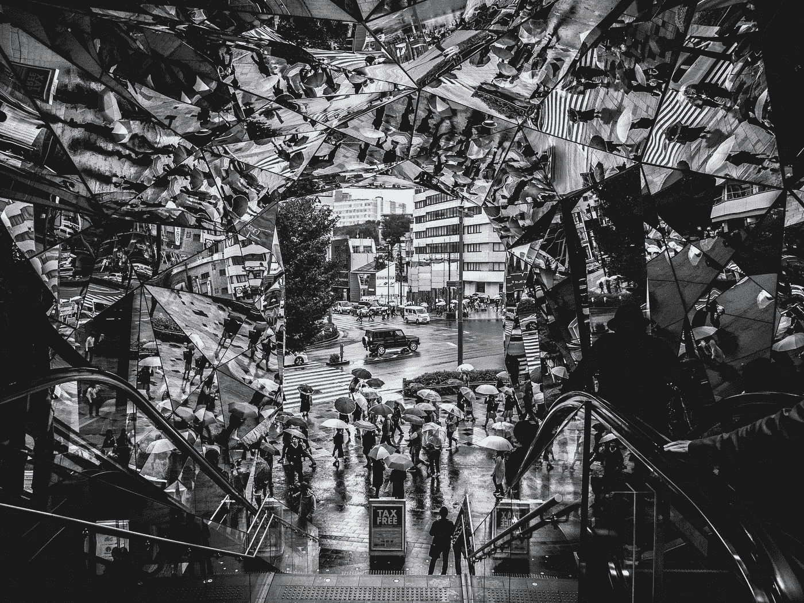
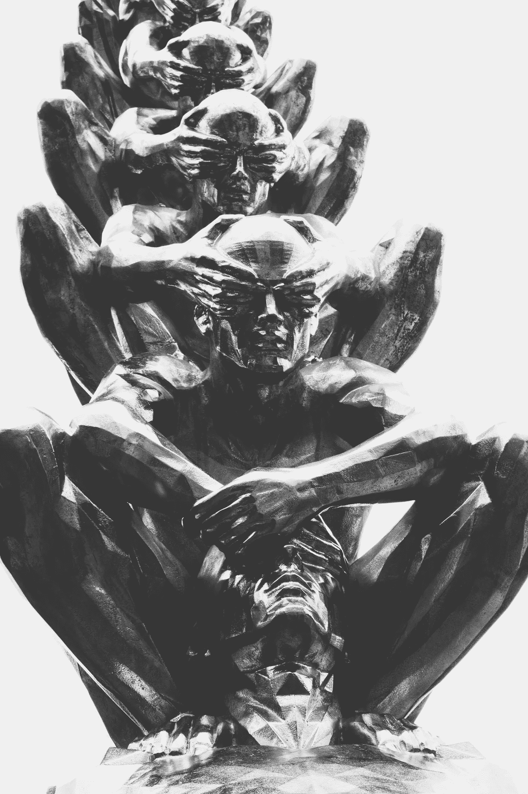
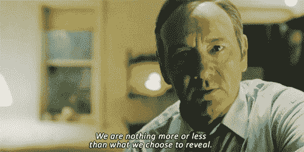
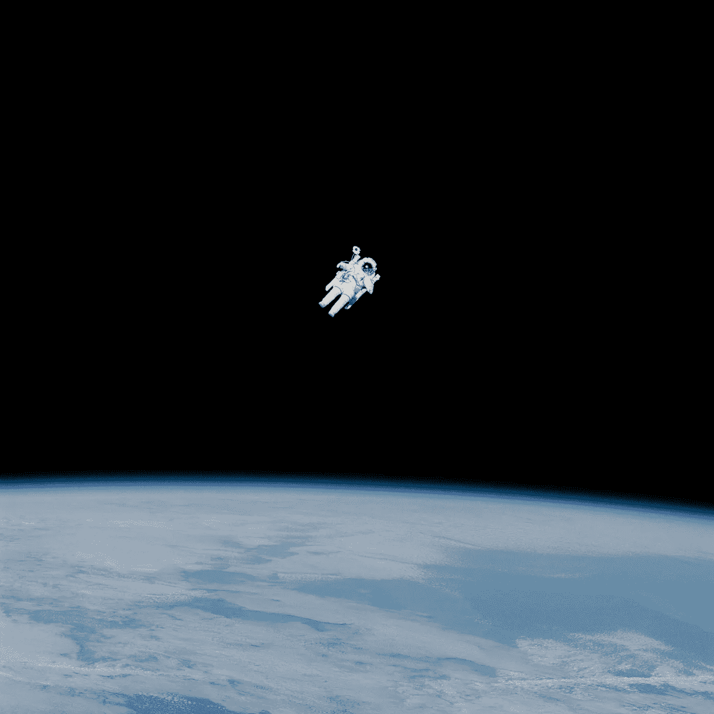
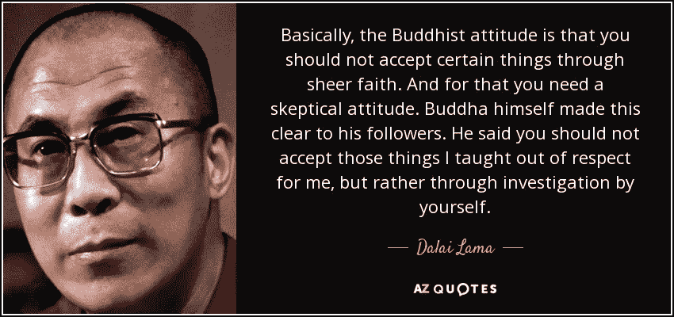
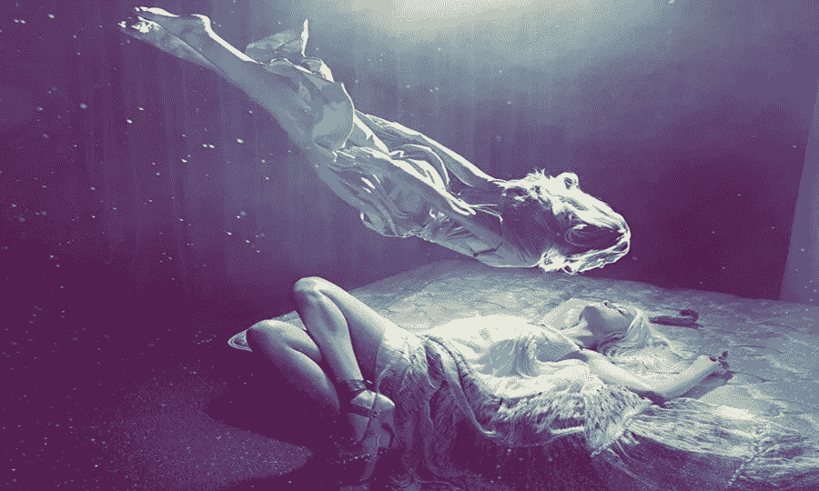
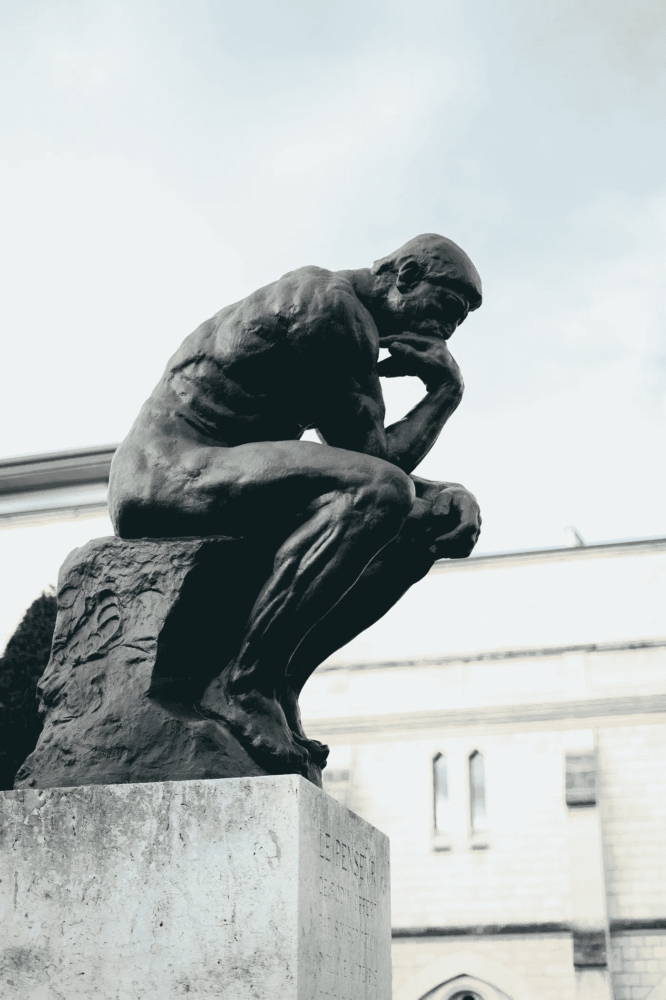

# 论意识的本质

> 原文：<https://medium.datadriveninvestor.com/on-the-nature-of-consciousness-4e6183a5f0b7?source=collection_archive---------1----------------------->

在这篇博文中，我将尝试通过三个类比来反思意识的内在属性。

*   作为光的意识-物理学的观点。
*   作为故事的意识--一种叙事视角。
*   作为灵魂的意识——一种精神视角。

 [## 哲学、象形文字和技术|数据驱动的投资者

### 在发现罗塞塔石碑之前，象形文字已经被视为信息，即使它们的语义…

www.datadriveninvestor.com](https://www.datadriveninvestor.com/2018/10/16/philosophy-hieroglyphics-and-technology/) 

# 在意识的指引下

在语言中，宇宙中感知到的混乱经常被描述为黑暗。在那个动荡的世界里，一根微不足道的火柴被点燃，代表着人文意识。

有了光，就有了视角、范围和温暖。

Photo by [Yaoqi LAI](https://unsplash.com/@yaoqiqiqilai?utm_source=unsplash&utm_medium=referral&utm_content=creditCopyText) on [Unsplash](https://unsplash.com/search/photos/flame?utm_source=unsplash&utm_medium=referral&utm_content=creditCopyText)

从火到电灯的进化增加了意识运动的范围。

现在的光可以聚焦在更大的画面上，就像歌剧中的灯光，或者聚集在公共管道中使用的激光中。

同样，意识可以用来理解超越个人的过程，如气候变化和国家债务。

相比之下，意识也可以放大，例如在瑜伽课上做平衡姿势时，或者在飞镖游戏中瞄准靶心时。

光源的规格总是可以升级和倍增。

因此，意识在个体生命中处于不断发展的状态。

此外，在灯光下还有各种各样的效果:

*   [物理激光实验中的光弯曲](https://www.youtube.com/watch?v=ifbCsha7Syc&t=5s)
*   [灯光融入比如 YAFI](https://www.youtube.com/watch?v=Hbxy1W9O_Wk)
*   [镜子房子里弯曲的光线](https://www.youtube.com/watch?v=fIqEuyYfYG4)
*   [在棱镜中进行光分离，以看到所有颜色](https://www.youtube.com/watch?v=Aggi0g67uXM)
*   [滤光，其中彩纸可以阻挡某种颜色](https://www.youtube.com/watch?v=2LRaKcFvED8)
*   [光线镜像，其中不同的反射为万花筒的视角。](https://www.youtube.com/watch?v=irqwLrvkRSI)

Photo by [Ramon Kagie](https://unsplash.com/@ramonkagie?utm_source=unsplash&utm_medium=referral&utm_content=creditCopyText) on [Unsplash](https://unsplash.com/search/photos/mirrors?utm_source=unsplash&utm_medium=referral&utm_content=creditCopyText)

同样，有意识的注意力会被挑衅或令人震惊的图像转移或吸引到某些区域。

意识也可以被混合，例如当我们学习一个新的整合了大量不同理论的框架时。

此外，感知现实的扭曲可以被视为独特的意识形式，这使得某些心理复杂现象成为可能，如[冒名顶替综合征](https://www.youtube.com/watch?v=ZQUxL4Jm1Lo)、[相互依赖](https://www.youtube.com/watch?v=kQYPFeD_AEw)、[厌食症](https://www.youtube.com/watch?v=jgjzUxosZ9o)、[消极思维成瘾](https://www.youtube.com/watch?v=m2zRA5zCA6M)等。

How many levels of awareness can we access in the psyche? Photo by [Jeremy Lishner](https://unsplash.com/@jeremylishner?utm_source=unsplash&utm_medium=referral&utm_content=creditCopyText) on [Unsplash](https://unsplash.com/@jeremylishner?utm_source=unsplash&utm_medium=referral&utm_content=creditCopyText)

意识也可以分为不同的层次，像在[脉轮](https://www.youtube.com/watch?v=CDLUKXq-po8) s 或[螺旋动力](https://www.youtube.com/watch?v=LdGjKOnxLtE)系统中。

镜像意识行为是普遍的，每种文化都有结婚、葬礼、约会等传统。

Stereotypical representation of love. — Photo by [Nathan Dumlao](https://unsplash.com/@nate_dumlao?utm_source=unsplash&utm_medium=referral&utm_content=creditCopyText) on [Unsplash](https://unsplash.com/search/photos/marriage?utm_source=unsplash&utm_medium=referral&utm_content=creditCopyText)

光对我来说就像精神一样，你不能直接触摸或感知它。相反，我们通常只会感受到光的颜色和温暖的副作用。

此外，在量子物理领域，光是一个抽象的概念，因为它同时像波和粒子一样发挥作用。

光可以被分成多束，就像在棱镜中一样，或者当我们用彩纸过滤光线时。

关于意识也可以这么说，我们认为有意识的人是有思想的、明智的或聪明的，但是直到今天还没有度量标准来验证意识的程度。

如果我们看看[马克·扎克伯格](https://en.wikipedia.org/wiki/Mark_Zuckerberg)、[史蒂夫·乔布斯](https://en.wikipedia.org/wiki/Steve_Jobs)、[埃隆·马斯克](https://en.wikipedia.org/wiki/Elon_Musk)和[托马斯·爱迪生](https://www.youtube.com/watch?v=pcrwTN5OEZY)，我们都会同意他们过去是，现在也是他们那个时代的天才。这是否意味着他们让更有意识的生活？如果意识与对所有生命和事物的仁慈有关，我肯定会请求区别。

此外，意识同时代表了精神的一种状态和一个方面。

例如，[比尔·盖茨](https://en.wikipedia.org/wiki/Bill_Gates)意识到他对人类的行为，通过与妻子一起创建慈善机构[比尔&梅林达·盖茨基金会](https://en.wikipedia.org/wiki/Bill_%26_Melinda_Gates_Foundation)，他通过在全球范围内投资健康、教育和政策，努力建设一个更美好的世界。

当有人允许比尔帮助 1000 名死于疟疾的人，让他的组织在政府保护下进入战区。这听起来好得令人难以置信。在谈判中，比尔不得不支持一个想在国外竞选的前战犯。

比尔不得不在价值和效用之间做出权衡。他可以回答说，他不会去做生意，因为他的良心不允许这样做。

良心或意识在上述情况下作为一个应该被倾听或保持纯洁的外部实体而行动。

此外，意识可以分为多个意识层次。就像早上喝咖啡的时候，你在思考未来或过去的同时，也在写子弹日记。

# 暗箱

生活的颤音很少能在电影艺术中得到更好的捕捉。

难怪，很容易把讲故事和意识活动相提并论。

每个故事都有多面，因为在旁观者的眼中，真相是灵活的。相应地，意识被感知为多种视角。

此外，故事的背景，如背景、体裁或风格，对于解读人物的情感、思想和感觉至关重要。

因此，戏剧或浪漫主义的体验是主角和观众意识水平的副产品。

因此，意识部分是由概念和语境背景决定的。

贯穿电影、摄影和文学的实验传统是意识研究的基础。

在发明延时摄影之前，显示时间流动的唯一方式是[蒙太奇](https://www.youtube.com/watch?v=DhQHlCaSR_w&t=113s)或者快进快退。这是否提出了一个问题，如果意识是一个[永远存在的流动或我们进入的正念状态](https://www.youtube.com/watch?v=mGYmiQkah4o&t=6s)，或者它仅仅是一个由头脑在当下创造的[编造的故事？](https://www.youtube.com/watch?v=lyu7v7nWzfo)

在电影中，第四堵墙可以被打破，其中的角色直接与观众对话，表明意识到在电影中展示的生活视角之外还有观众。

Frank Underwood- House of Cards — Netflix

如果你选择相信与神或灵性存在对话的故事，解释可能是意识的增强，这使得感官看不见的实体之间能够交流。

弗吉尼亚·伍尔夫和其他现代主义者以使用意识流而闻名。它突出了意识意识的跳跃。佛教徒称之为[的猴子思维](https://www.youtube.com/watch?v=4PkrhH-bkpk)。

> “真是百灵鸟！真是暴跌！因为每当我听到铰链发出的吱吱声时，我就仿佛听到了这种声音，我撞开了落地窗，一头扎进了波尔顿的露天里。多么清新，多么平静，当然，空气是在清晨；像波浪的拍打；海浪的吻；寒冷、尖锐，但(对我这样一个 18 岁的女孩来说)严肃，我站在敞开的窗口，感觉到一些可怕的事情即将发生……”——[达洛维夫人](https://www.youtube.com/watch?v=vS9ub4h0Hig)——作者[弗吉尼亚·伍尔夫](https://www.youtube.com/watch?v=d1W7wqXD_b0)

此外，使某些艺术形式成为经典的，如歌剧、文学、电影经典、复杂的诗歌、杰出的音乐，是批评家和学者对其他作品和艺术家的层次或参考。

这是否意味着意识的发展建立在先前对心灵的探索之上？[耶稣](https://www.youtube.com/watch?v=iIxUV0cEBP0)，[佛陀](https://www.youtube.com/watch?v=eYKdEnEqfQQ)，[老子](https://www.youtube.com/watch?v=Qsor69495ZQ)，[弗洛伊德](https://www.youtube.com/watch?v=dL0TvdiVN38)，[荣格](https://www.youtube.com/watch?v=wywUQc-4Opk)，[尼采](https://www.youtube.com/watch?v=AMFkSM5bHMo)，[阿伦特](https://www.youtube.com/watch?v=yYJqSN7dC_A)，[巴特勒](https://www.youtube.com/watch?v=piF4YOiIYS0)等的教导或发现之间是否存在模式？

如果实验的潜力是无限的，这是否意味着意识只受到人类创造力的限制？

Shall we discover worlds beyond our horizon? — Photo by [NASA](https://unsplash.com/@nasa?utm_source=unsplash&utm_medium=referral&utm_content=creditCopyText) on [Unsplash](https://unsplash.com/search/photos/galaxy?utm_source=unsplash&utm_medium=referral&utm_content=creditCopyText)

# 精神锁

如果我们相信精神或宗教，世界是由能量和精神的宇宙联盟创造的。

对一些人来说，这感觉像是神圣的解放，对另一些人来说，这被视为神圣的限制。

当我们谈论精神或灵魂时，我们超越了物理可观察的宇宙，走进了形而上学的领域。

如果意识属于形而上学背后的哲学，它将解释很多不太为人所知的科学现象，如[清醒梦](https://www.youtube.com/watch?v=qH-MGqokk_Y)、幻觉、[脱体体验](https://www.youtube.com/watch?v=Vf7qC_JOaVY)和[濒死体验](https://www.youtube.com/watch?v=y5qEBC7ZzVQ)。

传统上，灵魂是不朽的，因为它要么转世，传递到死亡的世界，要么被困在阴阳魔界。

我通过萨满教的[灵魂恢复](https://www.amazon.com/Mending-Past-Healing-Future-Retrieval/dp/1401906265)体验过前世，没有使用化学药品，而是只使用全意识冥想旅行，由[阿尔贝托·维罗多](https://en.wikipedia.org/wiki/Alberto_Villoldo)教授。尽管如此，我仍然对“精神领域”持怀疑态度，因为我有过服用无患子、鼠尾草、迷幻药和松露的经历，而且从未经历过人们向我描述的那种幻觉。

Instead of looking for the answers, I try to find them myself.

我们死后，我们的意识体验会在来世继续，这不是很好吗？

或者你会害怕你会下地狱吗？

两种来世都是心灵的陷阱。在一个一切都完美的世界里，你会变得无聊。同样的道理，假期最终会变得令人讨厌，尽管它能让人放松，也能带来冒险。

地狱并没有那么糟糕，即使你会受到挑战或最初遭受痛苦。痛苦最终会被接受，你会忘记它。通常，当人们接受痛苦时，情感上的痛苦就会消失。它仍然会在那里，但是你把注意力集中在更有用的事情上。

最坏的情况，你会被困在地球上。如果像鬼魂这样的东西存在，我只能开始想象他们有多痛苦。也许这就像我们的影子，他们在那里，但无法沟通。或者他们是我们生活中的笑料。例如，当你寻找你的手机时，它就在你的眼皮底下。

A man feeling stupid because he just had his phone one minute ago. Photo by [Ben White](https://unsplash.com/@benwhitephotography?utm_source=unsplash&utm_medium=referral&utm_content=creditCopyText) on [Unsplash](https://unsplash.com/search/photos/stress?utm_source=unsplash&utm_medium=referral&utm_content=creditCopyText)

精神并不植根于物质世界。

纵观人类历史，有许多关于灵魂出窍、星体投射和濒死体验的描述。

其中所有人都解释了在没有身体支持的情况下获得意识的可能性。

同样，在梦的世界里，做梦者可以通过清醒梦技术变得有意识，例如[狂野](https://www.youtube.com/watch?v=G87_OGrP1wE)技术。

然后一个人能够绕过现实的限制，像飞行、与自己的复制品交谈、创造世界、实体等等。

因此，意识并不根植于经验宇宙，因为它可以穿越幻想、梦境和幻觉。

Seeing yourself from above — Source — [Astral Travel](https://anomalien.com/astral-travel-for-beginners-the-eight-step-guide/)

另一个精神原则是罪恶和因果报应。

罪是认为某些行为是自我破坏并导致痛苦的想法，尽管它伪装成暂时的快乐。

[因果报应](https://www.youtube.com/watch?v=zO8QzMWZbN4)不是因果报应的原则，就像回旋镖一样。

业力债务意味着你的灵魂试图一遍又一遍地重现同样的情况，直到你学会了你必须学会的东西。

如果意识有业力或罪恶的倾向，这意味着它遵守精神法则。

因此，它从一出生就被固定下来，并遵循一定的模式。

它直接反对我们可以完全重组大脑的神经可塑性的想法。

虽然有一些旁注，根据像 [MBTI](https://www.youtube.com/watch?v=aW7P8DGMCHA) 、[九型人格图](https://www.youtube.com/watch?v=kURdIlRQjYE)、[五大](https://www.youtube.com/watch?v=KCwHV9HCxH0)这样的心理测试，我们对这个世界有一定的心理偏好。

你应该问自己的问题是:你能从根本上改变自己吗？

Photo by [Valentin B. Kremer](https://unsplash.com/@vbk_media?utm_source=unsplash&utm_medium=referral&utm_content=creditCopyText) on [Unsplash](https://unsplash.com/search/photos/rodin?utm_source=unsplash&utm_medium=referral&utm_content=creditCopyText)

*提醒:本文包含作者的许多观点。它是为个别读者的深思而写的，而不是为了告知读者的学术意图。*