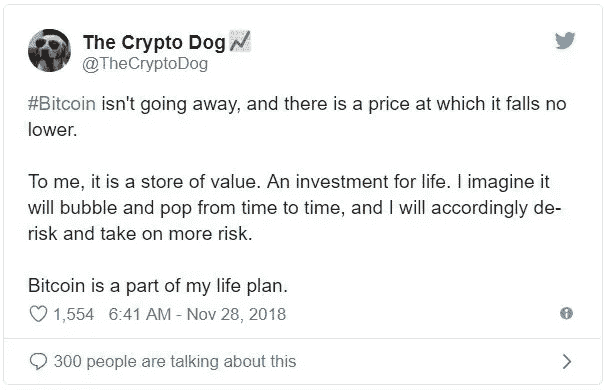
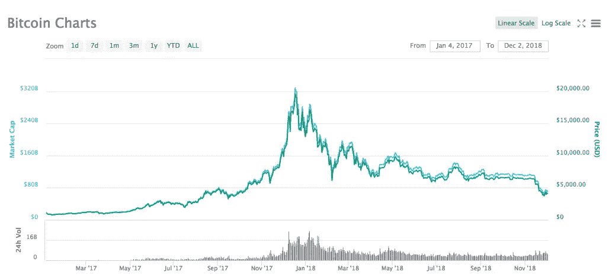
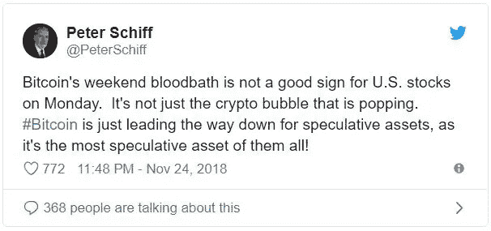

# 悬崖上:比特币是泡沫吗，什么时候会破灭？

> 原文：<https://medium.datadriveninvestor.com/on-the-precipice-is-bitcoin-a-bubble-and-when-will-it-burst-b506acfca72b?source=collection_archive---------3----------------------->

# 尽管比特币的价值下降，但加密市场正在蓬勃发展，所谓的泡沫并没有破裂。

加密货币已经迅速进入公众意识，以大批投资者(和交易员)的形式席卷了民粹主义支持和商业利益。

对于普通人来说，比特币代表了一种基于去中心化区块链设计的新货币。整个概念建立在严密的数学基础上，对单一分散分类账的实时更新确保了交易的稳健性。

对于投资者和交易者来说，比特币提供了一个绝佳的获利机会，而且很有可能是一种长期的价值储存手段。

> [DDI 编辑推荐—区块链和比特币基础](http://go.datadriveninvestor.com/bcfundamental/matf)

从历史上看，各种资产类别都可以比作比特币——无论是房地产、股票、债券，甚至是艺术品。关键的区别在于，资产类别通常有某种形式的实物支持，而比特币是数字资产，只有在其他人认为它有价值时才会有价值。

任何商品(数字或其他)的价值都可能上升或下降，这往往会吸引投资者和消费者或收藏家的兴趣。

比特币也是如此。

然而，资产类别也天生容易出现所谓的“泡沫”，换句话说，就是基于未来预期的价格通胀。在投资界，价格通胀可能因各种原因而发生，包括供应不足、需求增加或只是对影响特定市场的基本面未来变化的感知。

当未来预期偏离正轨并超出理性范围时，我们称之为“泡沫”膨胀，并最终破裂。

# 泡沫的成因

根据 20 世纪 80 年代金融市场研究人员的说法，泡沫被认为是“投机者以高于其基本价值的价格购买金融资产，并期望随后获得资本收益的情况。”

近 30 年过去了，在经历了 20 世纪 80 年代的繁荣和 21 世纪初的互联网泡沫之后，研究人员扩展了他们对泡沫的定义，增加了“投机”一词。

在过去的几十年里，进入金融市场的机会迅速增加，父母可以直接投资股票市场，更不用说包括零售交易在内的金融衍生品的巨大增长了。对股票和债券价值的投机成了一种民粹主义冒险，带来了“投机泡沫”的概念，被描述为“价格上涨的消息刺激了投资者的热情，这种热情通过人与人之间的心理传染而传播……在这个过程中，放大了可能证明价格上涨有理的故事，并吸引了越来越多的投资者，这些投资者尽管对一项投资的实际价值有所怀疑，但部分是因为嫉妒他人的成功，部分是因为赌徒的兴奋而被吸引。"

这是一种相当冗长的说法，人们倾向于跟随他人，而不是做出独立的决定。换句话说，就是“羊群行为”

进一步加剧投机泡沫的另一个关键概念是出售投资者尚未拥有的资产的可能性——也称为“卖空”，并通过“卖空”新成立的衍生品市场(如期货和期权)而进一步加速。

随着越来越多的人开始参与金融市场，人们发现投机泡沫可能是理性的，也可能是非理性的。投机和传染的概念导致了被认为是投机泡沫镜像的负面泡沫，导致价格大幅下跌。

即使是新手交易者也知道，市场在升值时倾向于上楼，而在贬值时会像电梯一样下降。所有市场参与者在 2008 年都意识到，在美国房地产市场前所未有(而且在很大程度上出乎意料)的泡沫破裂后，GFC 抹去了数万亿美元的资产价值。

# 泡沫狂热

那么，随着全球投资者多年来在几乎所有资产类别中都看到和感受到多重泡沫，有哪个市场不受泡沫影响吗？

似乎是这样。

Van Norden (1996)在 20 世纪 90 年代中期调查了外汇市场泡沫。(范诺登，s,《1996 年体制转换作为汇率泡沫的检验》。《应用计量经济学杂志》第 11 卷，第 3 期(1996 年 5-6 月)，第 219-251 页)。他使用他的两种货币投机泡沫模型，从 1977 年 9 月到 1991 年 10 月，对德国马克、日元和加拿大元等四种主要货币进行了研究，得出的结论是没有发现泡沫的“重要证据”。

这可能意味着，一个市场越容易进入，规模越大，经历泡沫的可能性就越小。然而，反诉可能是各国政府坚持通过利率、公开市场操作以及经常性的直接货币干预来管理货币，以防止混乱的波动。

尽管如此，市场参与者不太可能很快忘记瑞士央行(SNB)2015 年 1 月的市场行动。

SNB 出人意料的政策转变将瑞士法郎的估值推向了与普遍预期相反的方向，导致交易者蜂拥退出——俗称“黑天鹅”，永远留在了外汇交易者的记忆中。

# 解密比特币估值

比特币的价格在四年多的时间里相当平稳，约为每比特币 500 美元。2016 年，随着媒体报道的加剧，专业和业余投资者都开始涉足加密货币，这有助于价格上涨，从而以滚雪球效应吸引更多投资者。价格在 2017 年初越过了 1000 美元的关口，并在 2017 年 12 月 17 日这个著名的周日，在 12 个月内达到了近 2 万美元的历史最高水平。

这种急剧增长导致有人声称加密货币正在经历一场典型的泡沫。

在整个 2018 年，价格一直呈下降趋势，今天降至每比特币 3800 美元左右，可能是因为获利回吐以及人们意识到比特币价格有点高估。

然而，所谓的泡沫并没有破裂，也没有出现可察觉的抛售热潮。事实上，加密市场(顺便说一下，它包括其他货币，不仅仅是比特币)继续繁荣，一些国家以保护投资者为借口起草下意识立法来阻止首次硬币发行(ICO)。

# 相信比特币

比特币很可能值得投资，但如果考虑到历史，两件事变得非常清楚。

首先，需要对加密市场有足够的了解，以便让投资者做出明智的选择，减少非理性预期的影响。

其次，投资者必须明白，考虑到任何资产类别所面临的风险(以及市场参与者突然冲向出口的倾向，在进入时排成一列)——投资超过你能承受的损失，换句话说，过度冒险，是不明智的。

风险和回报之间的相互关系从根本上决定了金融市场的行为，这是一个被广泛接受的公理。因此，随着比特币价格继续振荡，成为疯狂购买和大幅抛售的牺牲品，投资者可能希望要么长期持有，要么考虑到剧烈波动的倾向，接受短期内估值大幅变化的风险。

买还是不买比特币——是许多投资者正在问的问题。答案是一个相当主观的答案，更多的是源于个人投资心理，而不是源于市场分析的客观答案。

戴上锡帽子。

*原载于 2018 年 12 月 02 日*[*【financemagantes.com】*](https://www.financemagnates.com/cryptocurrency/on-the-precipice-is-bitcoin-a-bubble-and-when-will-it-burst/)*。*