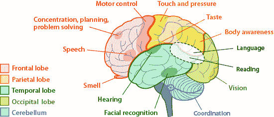

# 电子游戏研究现状

> 原文：<https://medium.datadriveninvestor.com/on-video-games-state-of-research-e4081dc6bd49?source=collection_archive---------6----------------------->

这一系列文章是我正在进行的名为“细胞生成”的技术研究的一部分。如果你想更多地了解这个系列，看看我的[介绍文章](https://medium.com/@ricknabb/on-poiesis-ac1d60c0ee03)。

在这个迷你系列中，我们谈论电子游戏。即使你不是游戏玩家，讨厌电子游戏，或者喜欢电子游戏，并且完全沉迷于电子游戏，我们也会谈论很多关于电子游戏的有趣观点——包括它们如何影响我们的大脑，我们为什么喜欢玩游戏，甚至我们如何看待我们的世界是一个非常复杂的虚拟世界，我们都被迫玩游戏。

这个迷你系列的每一部分都将首先在媒体上发布，然后作为播客发布。

这是我们的视频游戏迷你系列[第一部](https://medium.com/datadriveninvestor/on-video-games-introduction-75e8af06d574)的延续。

We lost a life, but picked up 30,000 points along the way 👍🏼

在过去的几十年里，围绕视频游戏的大量流行研究和学术讨论都集中在两个主题上:暴力和学习。每一次崛起都伴随着电子游戏基本性质的相应变化，这种变化使得电子游戏应运而生。例如，视频游戏中的暴力成为激烈辩论、讨论甚至政府立法的话题，一旦游戏图形变得足够逼真，足以打破一些人认为是卡通暴力的障碍。Pac-Man 选择吞噬 Blinky 作为宵夜似乎并不坏，因为游戏的图形功能，甚至控制系统都远没有复杂到足以描绘任何从 Pac-Man 的邪恶獠牙滴落的幽灵肉或外质。相比之下，像《光环》或《使命召唤》这样的游戏非常准确地描述了人类、僵尸或外星人的谋杀，有些人认为这是可怕的解剖学细节。《死亡空间》(Dead Space)是一款科幻生存恐怖游戏，游戏中你(非常逼真地)在太空中肢解可怕的外星人，这类游戏中出现的大屠杀在众多游戏中脱颖而出。

最紧迫的问题变成了类似于“我们的孩子因为电子游戏变得更加暴力了吗？”争论激烈，双方的脾气都爆发了，直到研究以认知科学的形式抓住了这个问题。研究表明，在参与虚拟暴力的儿童和在现实世界中发展暴力倾向的儿童之间存在一个关键的概念。这个概念叫做“转移”简而言之，迁移是一种将学到的概念应用于不同的环境中的能力。例如，学习生物学中基因排列和自然选择的过程可以转移到计算机科学算法的领域。学习制作荷兰酱的过程可以用来做炒鸡蛋。但研究人员认为，在《侠盗猎车手》中学习如何偷车，很少有甚至没有机会转变为实际偷车的行为。康涅狄格大学在一篇关于视频游戏和解决问题的文章中甚至进一步声称，“即使暴力游戏会引发普遍的攻击性，但攻击性的增加并不会自动转化为现实世界中的暴力行为……需要有一个调解教师，他可以在游戏和现实之间提供良好的引导……”围绕视频游戏的暴力问题的工作主体似乎足以扼杀慷慨激昂的火焰，从而不时地将讨论转化为闷烧的批评。要么是这样，要么是人们对这种争论感到厌倦，要么是简单地接受它，认为它注定失败。

There are some brain references coming up. Here’s a helpful guide. Source: [https://askabiologist.asu.edu/brain-regions](https://askabiologist.asu.edu/brain-regions)

相比之下，现在的人更热衷于评估视频游戏在教学方面的价值；这一概念对于反驳通过游戏转移暴力倾向的观点至关重要。如果有的话，电子游戏教会了我们什么？受该领域早期工作的启发，大多数研究人员不太愿意明确地说玩电子游戏能教会我们任何东西。相反，这项研究更旨在表明视频游戏以一般方式锻炼大脑，而*可以*导致在其他领域更有效地学习。神经科学的发展是这些主张的支柱，所以内容有时非常具体。幸运的是，研究可以大致分为许多类别，非专业人士更容易理解。

> 除了表现更好之外，参与者完成这项活动时拍摄的 fMRI 图像显示，视频游戏玩家实际上比非视频游戏玩家更少使用大脑。

许多研究都遵循类似的格式:设计某种实验来测试认知功能的某个领域，让游戏玩家和非游戏玩家参加这项测试，在参与者参与任务时使用功能性磁共振成像(简称 fMRI)扫描他们的大脑，并解释结果。例如，我们可以参考的第一个认知领域，也是以这种方式研究的，是所谓的“选择性注意”这个名字很直观，但为了清楚起见，选择性注意力被定义为我们专注于某些事情而忽略其他事情的能力。这项研究让游戏玩家和非游戏玩家都盯着屏幕，识别屏幕上闪现的图形。研究人员使用了两种形状:一种是简单的阵列，其中显示器显示一圈圆圈——有点像用圆圈代替数字的时钟——混合有一个或零个正方形；另一种是较难的阵列，其中显示器显示一圈随机形状，混合有一个或零个正方形。在圆形中检测正方形比在随机形状中检测正方形容易得多。为了增加难度，随机的点显示在屏幕上，试图分散参与者寻找正方形的注意力。受试者在按下显示他们是否看到正方形的按钮之前，有几分之一秒的时间来辨认图像。

这项研究的结果表明，在这项搜索和识别任务中，视频游戏玩家的表现优于非视频游戏玩家。除了表现更好之外，参与者完成这项活动时拍摄的 fMRI 图像显示，视频游戏玩家实际上比非视频游戏玩家更少使用大脑。随着任务难度的增加，大脑额顶叶区域(控制你注意力的区域)的活动增加，枕叶区域(处理视觉信息)的活动略有增加。更高的激活仅仅意味着你的大脑必须工作，或者激活更多的神经元，以完成一项任务。

还有许多其他研究类似地表明，玩电子游戏的人比不玩游戏的人在神经和认知方面有先天优势。2008 年的一项研究表明，在玩第一人称射击游戏的玩家中，一种叫做“工作量评估”的概念得到了改善。你的大脑的“工作负荷”是对在某个时间点它正在进行的处理量的一个总体衡量。更难的认知任务对应更高的工作量，反之亦然。用来测量这种现象的技术确实很吸引人。简单地说，因为你的大脑是一系列与电通信的连接细胞，所以当你的大脑做任何事情时都会产生电波。[神经科学将这些“脑电波”](https://brainworksneurotherapy.com/what-are-brainwaves)分为特定的类别，每一个类别都有不同的用途，并代表不同的精神状态。聪明的是，这项研究测量了一种名为“P300”的脑电波，这种脑电波是在决策过程中引发的，基于一个人对给定刺激的反应而发生。当参与者玩第一人称射击游戏时，研究人员随机播放玩家头部周围扬声器发出的声音。这些音调是为了分散玩家的注意力。每个玩家都试图在一系列简单、中等和困难的任务中获得尽可能高的杀伤比。在一些试验中，玩家必须在演奏时忽略音调，而在另一些试验中，他们被要求数音调。虽然这项研究的目的是评估播放音调和测量 P300 波以估计认知工作量的有效性，但它也注意到视频游戏玩家在玩射击游戏时表现出惊人的专注。

> 你可能已经看到了它的到来，但是像大多数神奇的药丸一样，电子游戏的“快速变瘦”式的好处充其量是微不足道的。

其他研究表明，游戏玩家玩游戏的年数(有趣地称为“操纵杆年”)与大脑海马旁区域的灰质数量呈正相关。随着年龄的增长，这可能会影响我们的记忆质量，或者影响我们处理空间导航的能力(比如开车时跟随并记住方向)。[更多的研究](https://www.youtube.com/watch?v=FktsFcooIG8)显示，视频游戏玩家更擅长在空间中跟踪物体，从一系列照片中识别不同物体中的旋转物体，甚至有些人的视力总体上更好，可以更好地区分灰色阴影，或者注意到不需要视力矫正的小细节。如果你钻研了足够多的文献，或者看了足够多的 TED 演讲，就有可能相信电子游戏是某种增强人类大脑的神奇药丸。

你可能已经看到了它的到来，但是像大多数神奇的药丸一样，电子游戏的“快速变瘦”式的好处充其量是微不足道的。虽然研究仅限于说明视频游戏激活了大脑的某些部分，或者游戏玩家使用较少的大脑来完成某些任务，但技术营销人员和思想领袖远没有这么谦虚。你可能听说过的公司，比如 Lumosity，就带着这种概念运行，并过度承诺玩他们的“大脑训练”游戏的好处。联邦贸易委员会[对 Lumos 实验室罚款 5000 万美元，因为他们的广告](https://www.wired.com/2016/01/ftc-hits-lumosity-with-fine-for-deceptive-brain-health-ads/)误导了消费者。TED 的演讲就像达芙妮·巴维利耶的“你的大脑在电子游戏上”，可能会通过游戏玩家可以完成的壮举激发敬畏，但在一天结束时，能够在你的脑海中旋转俄罗斯方块真的有什么好处？对于一群不久前还表示任何人都很难将视频游戏体验转化为现实世界的好处的发言者来说，他们似乎应该玩更多的游戏来提高他们的记忆力。

当一切都说了，做了，看来这一章的视频游戏研究故事可能被证明是一个不冷不热的阅读毕竟。这并不是说围绕游戏的认知研究毫无用处——它确实揭示了一些有趣的结果，这些结果很可能成为未来革命性想法的坚实基础。然而，视频游戏行业可能无法宣称比视频游戏有趣和引人入胜这一事实更多的东西。事实上，这可能不是一件坏事。

无论如何，享受做某事的乐趣到底意味着什么？为什么玩游戏甚至成了人们做的一件事？围绕着娱乐、玩耍和沉浸的领域有一个偶然的研究，它看起来更有希望让视频游戏在媒体形式的大厅中有一个独特的入口。电子游戏同时以一种其他媒体，如书籍或电视所不具备的方式吸引着我们，并允许我们通过各种令人眼花缭乱的规则结构来模拟不同的场景。从本质上来说，人类是有创造力的生物，而电子游戏很可能是一个深刻的、令人满意的创造力的宝库，而这个物种只是触及了它的表面。

我们迷你剧的下一个条目将描述和调查玩耍的概念，它不仅仅是我们这个物种的核心。在我看来，它将以一种比任何 TED 演讲都更鼓舞人心的方式来构建视频游戏。你不会想错过的。

非常感谢您的阅读！

我们的网站有更多关于为 Poiesis 所做的任何工作的信息，一旦整个迷你系列结束，将有一个完整的参考书目。

