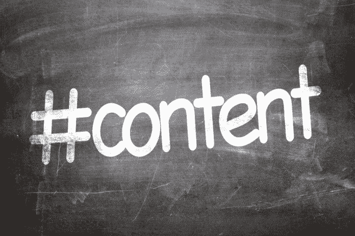

# 对于好的内容，一次是远远不够的

> 原文：<https://medium.datadriveninvestor.com/once-is-never-enough-for-good-content-4168dcc827d6?source=collection_archive---------18----------------------->

## 像常青树一样，你最好的作品总是当季的

旧帽子又是新的。这是获取几周、几个月或几年前发布的内容，并将其重新呈现给今天的观众的前提。借用[芝加哥市长拉姆·伊曼纽尔](https://www.youtube.com/watch?v=Pb-YuhFWCr4)的话，“永远不要浪费一个好的博客。”

改变用途让你有机会[对同样的内容有不同的看法——比如从同一个医生那里获得第二种意见。](https://www.datadriveninvestor.com/2019/02/01/evergreens-sprout-new-life/)

内容营销顾问布列塔尼·伯杰(Brittany Berger)“混合、重新优化和重新激发你最好的内容，让它像你一样聪明地工作。”她和数字营销策略师 Madalyn Sklar 讨论了为什么一次不足以充分利用 evergreen 的材料。

“重新利用内容是经济的，”伯杰说。“修改现有内容比从头开始花费更少。

“我将内容再利用定义为从你已经创建的内容中获得新结果的任何商业活动，无论它最初是在两天前、两个月前还是两年前发布的，”她说。“这可能是在新的营销中使用内容，或者发送给销售或支持团队使用。它可以包括创造新的内容，或者只是改进现有的内容。”

企业家需要了解他们自己和他们的员工的故事。讲故事创造了伟大的内容，人们的组合吸引了更多的目光。

 [## 在创业之旅中，拥抱学习|数据驱动的投资者

### 好像建立一个数百万美元的公司还不够困难，企业家必须额外照顾他们的…

www.datadriveninvestor.com](https://www.datadriveninvestor.com/2018/10/16/on-the-entrepreneurial-trek-embrace-the-learning/) 

伯杰说:“我会把重点放在提高你的成果上，而不是仅仅提高发表的质量。”。“我们需要放弃创造新的内容来从内容营销中获得结果的想法。

“不是说内容营销不需要创造内容，而是有时候你已经有了内容，只是需要更多的结果，”她说。“这就是再利用的用武之地。”

伯杰继续从 YouTube 上获得解释[。](https://www.youtube.com/watch?v=hAHUxDuy-Ws)

“离开一成不变的内容跑步机，看到内容营销森林的树木，”她说。

# 不要急于重做

如果你发挥你的想象力，创造和再利用会有相似的结果，特别是如果你的调整使最初的帖子特别流行。

Photo by Stefan Steinbauer on unsplash

“交付时间是重复使用内容的一个重要因素，这是我最喜欢的再利用方式之一，”伯杰说。“如果你过早地重复使用某样东西，它在你的观众的记忆中太新鲜了，以至于看不到同样的结果。

“然而，如果你在第一次发布内容一年后再次使用它，你可能会看到比最初更好的结果，”她说。“这是因为你的观众的记忆比这短，而且随着时间的推移而增长。”

 [## 常青树发芽新生命

### 接受旧的内容，让它重生

medium.com](https://medium.com/datadriveninvestor/evergreens-sprout-new-life-c41810f6b654) 

当改变用途时，检查你的原始内容，挑选出可以改变措辞或更新的内容。然后进行修正以强调关键点。任何平台都适合改作他用，只要你遵守那个场地的张贴规范。

伯杰说:“在将内容再利用注入到你的内容策略中之前，你总是，总是，总是希望从内容审计开始。“从战略上来说，大量重新调整用途和很好地重新调整用途之间有很大的区别。

“内容审计将告诉你重新定位策略所需的重要信息，如哪些现有内容需要重新定位，以及在哪些平台上重新定位，”她说。

至于哪个场地最适合再利用，还是要看情况。

伯杰说:“我建议在改变用途时使用的主要平台是你的目标受众使用的平台。”“审计有助于你发现这一点。然后使用重新调整用途来填补内容日历中的空白。

“我对客户的第一个问题是，‘我们在解决什么问题？’”她说然后，我们考虑如何调整内容的用途，以实现切实的业务目标。"

# 砰然语录

要分解一篇博客文章中的内容，首先它必须足够长才能被分解。如果美味的小块鸡块本身什么也没说，那它们就没什么营养了。伯杰描述了她将博客内容转化为社交内容的过程。

“寻找任何突出的报价和句子，真正包装自己作为一个可引用的冲击，”她说。“把它们转化成推文、引用图片等等。

“然后试着用几句话概括这篇文章，”伯杰说。"你可以从多个角度来研究它，从而得到几个摘要和几段内容."

 [## 是时候组织起来了——恰到好处

### 保持约定有序有助于创作者保持生产力

medium.com](https://medium.com/datadriveninvestor/time-to-get-organized-just-right-2e036b011237) 

伯杰认为，使用这种方法，营销人员“可以很容易地为每篇博客文章创建 10 篇以上的社交文章。”她在另一个 [YouTube 视频](https://www.youtube.com/watch?v=sb2hzcMDNsg)中解释了更多。

电子邮件排序也有助于改变内容的用途。

“这种排序创造了一个电子邮件营销自动回复器或自动序列，”伯杰说。“这是*如此神奇的*再利用内容。

“新订户——以及一般的电子邮件订阅者——是你最投入、最热情的受众，”她说。"基于再利用的电子邮件序列让你在一个系列中向他们展示你所有最好的内容."

Berger 有更多的视频来解释再利用的不同方面:

“用我已经制作的视频来帮助解释我的答案是一种再利用的形式，”伯杰说。“电子邮件*可能是我最喜欢的内容平台。这绝对是我为自己的观众创造内容最持续的地方。*

“我经常被问到同样的问题，”她说。“每个人都想知道关于再利用的同样的事情。使用视频是实践我所宣扬的东西的绝佳机会。”

社交倾听将有助于品牌评估再利用或任何其他内容的效果。指标将显示他们的内容对市场有多大的影响。

“看看你用来衡量一项内容成功与否的最初目标和关键绩效指标，以及它是如何随着时间的推移而变化的，”伯杰说。"再利用应该总是服务于更大的商业目标或指标."

Sklar 在一个[脸书现场视频](https://www.facebook.com/manage.soc/videos/262977087990387/)中继续进行再利用。

**关于作者**

吉姆·卡扎曼是拉戈金融服务公司的经理，曾在空军和联邦政府的公共事务部门工作。你可以在[推特](https://twitter.com/JKatzaman?source=post_page---------------------------)、[脸书](https://www.facebook.com/jim.katzaman?source=post_page---------------------------)和 [LinkedIn](https://www.linkedin.com/in/jim-katzaman-33641b21/?source=post_page---------------------------) 上和他联系。

*原载于 2019 年 8 月 6 日*[*https://www.datadriveninvestor.com*](https://www.datadriveninvestor.com/2019/08/06/once-is-never-enough-for-good-content/)*。*