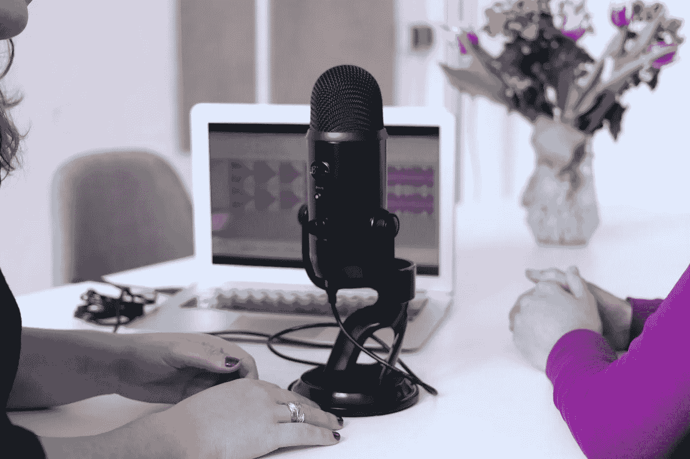

# 一个好的播客值得另一个

> 原文：<https://medium.datadriveninvestor.com/one-good-podcast-deserves-another-44d871ee4aba?source=collection_archive---------15----------------------->

## 播客使用最佳营销实践来推广他们的节目

Photo by CoWomen on Unsplash

随着她的“[制作一个营销人员](https://twitter.com/MakeAMarketer)播客，[梅根·鲍尔斯](https://twitter.com/meganpowers)决定尝试一些完全不同的东西:另一个播客。

“我发布了两个播客，因为一个对我来说不够，”鲍尔斯笑着说。

她每月两次的原创播客以有趣的方式探索并解释了从活动到社交媒体的营销的所有方面。权力主持人[珍科尔](https://twitter.com/jencoleICT)的[描绘媒体](https://twitter.com/depict_media)和营销经理[伊丽莎白格劳](https://twitter.com/elizabethglau)。

凭借她两年做营销的经验，活动应用和配对平台 [Swapcard](https://twitter.com/Swapcard) 聘请鲍尔斯制作其每月[内幕活动播客](https://twitter.com/TheEventProfs)。

鲍尔斯与营销专家 Madalyn Sklar 讨论了播客的策略和最佳实践，包括如何在 Twitter 上推广播客。

 [## 社交媒体收听让您随时了解|数据驱动型投资者

### 虽然社交媒体倾听是一种顶级趋势，但它应该是每个现代营销策略的一部分。保持和谐…

www.datadriveninvestor.com](https://www.datadriveninvestor.com/2019/02/26/social-media-listening-keeps-you-plugged-in/) 

鲍尔斯说:“在节目录制后取笑它是很好的，但不是在录制前，以防万一。”。“我们在 Zoom 上记录。为了做一个营销人员，我在屏幕上分享我们的照片，并在 iTunes 上提供播客的链接，让人们订阅并在下集时获得下集。

“一旦播客被发布，它是推广的关键，包括听众将会得到的任何可能的收获，”她说。“在单独的帖子中让人们关注你的特定剧集。还有，让你的客人帮助促销。利用他们拥有的影响力。”

对于内部事件，Powers 采取了不同的方法。

她说:“我们使用带有字幕的节目视频和嘉宾的图片来为下一场演出营造激情。”Swapcard 的 rafalle 和 [Jack Geddes](https://twitter.com/UnSocialJack) 做得很好。我们还可以使用图像和音频剪辑，让听众‘体验’节目的内容。”

Sklar 也有两个播客，包括她的旗舰#TwitterSmarter。

“我定期发推特，提醒人们我主持两个播客，”Sklar 说。“我会链接到苹果播客，因为大部分听众都来自那里。”

Sklar 还发推文[链接到剧集笔记](https://twitter.com/MadalynSklar/status/1164585784726499328)。

# **视频推广**

“推特视频是一个推广节目的选择，”鲍尔斯说。“大多数情况下，我更喜欢使用实际剧集的视频来充分表达内容。每隔一集，我们都会在脸书直播节目中录制，并为播客提取音频。我们两者都用。

“对于内部活动，我们使用变焦视频记录，并剪切视频剪辑来宣传，”她说。“这些视频也会上传到 YouTube 上。你可以使用两个工具来轻松创建精彩的视频——甚至是“听力图”——这两个工具是 [Wave](https://twitter.com/wave_video) 和[headlines](https://twitter.com/headlinervideo)。

Sklar 在营销方面不断提升视频的价值。

“你应该定期在 Twitter 上发布视频，并发挥创意，”她说。“一种方法是谈论当前或即将播出的剧集。让你的社区兴奋起来。”

一旦发布，播客总是可以定期推广。

“就像 Twitter 上的其他东西一样，不同的标签和主题会让不知道你的节目的人找到你，”鲍尔斯说。“我们用制作营销人员来度过一个暑假，然后我们继续推广过去的剧集，这使我们的数字和可见性保持活跃。

“如果你有专门的播客，一定要放上你的播客句柄，并在你的 Twitter 传记中链接到该节目，”她说。“重点是帮助人们尽可能容易地找到你的节目。”

如果播客内容是“常青树”，不受时间和年龄的影响，那么随后的推广效果最好。

Sklar 说:“我总是在推特上发布一些仍然非常相关的旧剧集的链接。

成功的播客以标签著称。

“这是为了让*找到*，”鲍尔斯说。“关键是使用一个与它所联系的行业相关的标签。独特的标签很可爱，但是如果一个标签不能让你被发现，它就没什么用了。虽然很普通，但#Marketing 和#podcast 这两个标签让我们发现自己是一名营销人员。

“对于内部活动，使用会议和活动行业黄金标准标签是必须的，那就是#EventProfs，”她说。“事实上，这就是为什么我们的秀 Twitter 句柄是@TheEventProfs，尽管我们也使用#InsideEvents 标签。”

# **仍在增长的行业**

尽管播客在业内广为人知，但在普通大众中还不流行。

“播客仍然是超级年轻的 T4，”鲍尔斯说。“越来越多的人开始了解它们，并开始使用它们。我被雇来为别人主持一个节目，这是一个很好的工具，也是一种学习的方式。”

Sklar 已经看到了她的品牌起飞，仅仅是通过将她的播客的#TwitterSmarter 标签添加到她的所有社交媒体平台上。

“我开始这个标签是为了每天在我的 feed 中分享有用的 Twitter 提示，”她说。“那是在 2013 年。从开始我每天都这样做。然后是我的 Twitter 课程，然后是播客，最后是我的聊天。一个好的标签策略是有效的。”

长期播客推广遵循金发女孩法则:不要太少，也不要太多。

鲍尔斯说:“我们尽量不过度宣传，但尽量每天至少宣传一集。”。“我们*确实*需要更多的一致性。如果共同主持人帮助宣传节目和嘉宾，这是很有用的。我们也可以更好地要求我们的客人帮助宣传他们正在上演的节目。”

Sklar 每天为她的两个播客中的每一个发一条微博，有时两次。

“我不会走极端，因为这会产生负面影响，”她说。

# **分道扬镳**

鲍尔斯为她的播客建立了单独的 Twitter 账户，但这并不是一个全面的建议。

“把节目和人分开，给了一个额外的推广渠道，”她说。“我的节目也有共同主持人。我们的个人和商业账户与节目之间的区别很重要。我也用我自己的账号来宣传这部剧，以获得更多的曝光率。

“许多个人和品牌的播客没有不同的推特，”鲍尔斯说。“这是‘带宽’问题吗？如果没有时间和精力投入到另一个账户上，最好*不要*有一个账户，但我仍然主张这样做。”

比如 Sklar 就没有拆分成不同的手柄。

“我没有为我的两个播客单独的 Twitter 账户，因为它们都完全符合我的品牌 Madalyn Sklar 账户，”她说。“这个问题没有对错之分。如果你觉得有必要有一个单独的账户，那就去申请吧。”

各种各样的播客很好地利用了 Twitter，尽管可能还有更多。

鲍尔斯说:“我很惊讶，很少有播客充分利用 Twitter 的潜力。”。“出色的图形是关键，这也是营销人员致力于做得更好的原因。与此同时，Inside Events 做得很好。”

Sklar 有最喜欢的有效使用 Twitter 的播客:[帕特·弗林](https://twitter.com/PatFlynn)，[蔡斯·贾维斯](https://twitter.com/chasejarvis)，[吉姆莱特](https://twitter.com/Gimletmedia)，[简·默里](https://twitter.com/jan_murray)，[凯文·加伯](https://twitter.com/Ke_Ga)和[诺亚·卡根](https://twitter.com/noahkagan)。

**关于作者**

吉姆·卡扎曼是拉戈金融服务公司的经理，曾在空军和联邦政府的公共事务部门工作。你可以在[推特](https://twitter.com/JKatzaman)、[脸书](https://www.facebook.com/jim.katzaman)和 [LinkedIn](https://www.linkedin.com/in/jim-katzaman-33641b21/) 上和他联系。