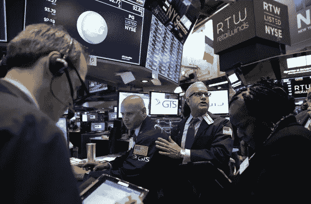

# 今年是市场上最糟糕的一天

> 原文：<https://medium.datadriveninvestor.com/one-of-the-worst-day-in-the-awful-year-in-the-market-b5942b4f8521?source=collection_archive---------40----------------------->

根据彭博的说法，今年是金融市场最艰难的一年。周二，情况变得更糟，整个资产领域沸腾的疲软让投资者无处可逃。

股票连续第二天下跌。标准普尔 500 下跌了 1.82%。油价暴跌至去年以来的最低点。信贷市场最近表现出崩溃的迹象。比特币从 5617.98 自由落体跌至 4366.81，而美国国债、黄金和日元等传统货币则保持不变。

总结起来，股票下跌了 2%，石油下跌了 6%。标准普尔 500 抹去了 2018 年的涨幅。油价跌至一年低点，一只跟踪垃圾债券的 ETF 创下了自 2014 年以来的最大跌幅。

## 股票

纳斯达克指数下跌 1.7%，至 6908.82 点

标准普尔 500 下跌 1.82%，收于 2641.89 点

道琼斯工业平均指数下跌 2.21%，至 24465.64 点

## 货币

晚上 9 点 34 分，比特币下跌 4.78%，至 4347.83 点

日元兑美元汇率上涨 0.08%，至 112.86

欧元上涨 0.02%，至 1 欧元兑 1.137 美元