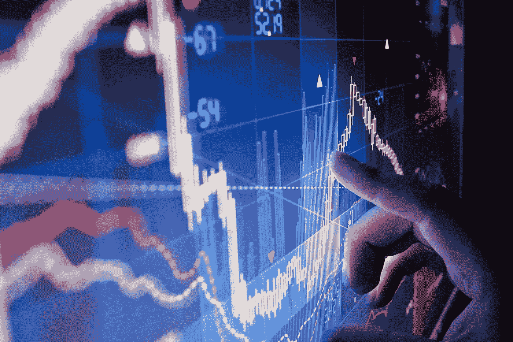

# 一刀切的交易策略？

> 原文：<https://medium.datadriveninvestor.com/one-size-fits-all-trading-strategy-c8c2d7954740?source=collection_archive---------6----------------------->

如果有这样的策略，这个世界对我和我所有的交易者来说不是一个完美的地方吗……唉，事实并非如此。但好的一面是，你可以根据自己的风险状况、交易风格和投资额，选择各种各样的策略。然而，正如我在交易生涯早期发现的，在进入交易世界之前，你绝对需要自学。只有这样，你才能做出明智的决定&明智地交易，而不是像我一样多次毁掉你的交易账户。在我们继续之前，我给你 3 条黄金法则:

1.  **教育自己——在潜水前尽可能多的了解，让你省去很多痛苦**
2.  **明智地选择你的策略——一个适合你的风险状况、投资&个人目标**的策略
3.  **坚持不懈——一致性是关键，没有任何策略总是有效的**

大约 11 年前，我在对交易一无所知的情况下开始了外汇交易……我的意思是，我有金融和经济学的背景，但他们几乎不会在大学里传授你任何实用的交易知识。我的好朋友认为我会喜欢交易，他给了我一些基本的指导，然后我就独立了。一个演示账户和一些有用的在线资源，我迈出了信念的一大步——这变成了激情。正如我之前提到的，在最初的几年里，当我试图解决问题时，这是一条艰难的道路。

事实证明，最适合我的策略是作为日内交易者交易技术水平。几年后，当我开始交易股票和外汇时，这甚至对我有用。。这么说吧，我不喜欢持仓过夜、周末或更长时间。我只是想晚上舒舒服服地睡一觉，知道早上不会有惊喜迎接我！现在，我并不是建议你必须做同样的事情，因为许多人都同样舒适&成功地权衡基本面，如数据发布、收益和并购消息等。或者仅仅是风险偏好和/或时间跨度更大的长期投资者。此外，如果我说我从未交易过外汇数据或股票收益，那我也是在撒谎——我进行过一些“乐透”交易……我的意思是每个人都会偶尔屈服于诱惑，但这种情况很少，而且很少。

回到在进入任何类型的交易或投资之前进行自我教育的问题上来——即使你是金融市场中的被动交易者/投资者，拥有长期的投资组合，你的投资组合由投资顾问或对冲基金经理管理，你也应该知道你的血汗钱得到了很好的利用，而不是盲目跟随呈现给你的东西。

此外，只有当你对交易有了基本的了解时，筛选大量的策略、专业人士的交易建议、成功交易者的在线资源和书籍才有意义——这适用于任何其他领域。基本上，我上面提到的 3 条规则都是相互关联的:当你更好地知道自己在做什么时，你可能会选择一个有助于你成功的好策略&一旦发生这种情况，你会更倾向于坚持下去，尽管会有一些小问题。

因为我只根据技术水平交易——无论是外汇、股票还是加密货币，我每天必须面对的最大挑战是筛选 Twitter 和 StockTwits 等社交媒体上的噪音，那里有很多情绪化的交易者，他们与我的交易风格无关，我偶尔会因为我的技术图表而被捕。 但是我又在同一个平台上发现了一些非常有知识的技术交易者，他们不仅是每天交易想法的好来源，也是灵感的来源。

我在所有社交媒体平台上都很活跃，所以如果你需要任何建议或指导，欢迎你联系我。如果你仍然觉得你没有时间做所有这些，但仍然想交易——我们在 [Tradealike](http://www.tradealike.com/) 每天发送可操作的股票、期权&外汇警报，以从我们的集体成功中获利。

**保持联系:**[Twitter](https://twitter.com/fklivestolearn)**|**[**StockTwits**](https://stocktwits.com/trade_nut)**|**[**LinkedIn**](https://www.linkedin.com/in/faisal-khan-2a3009b/)**|**[**trade alike**](http://www.tradealike.com/)**|**[**脸书**](https://www.facebook.com/cryptos.forex.stocks/)

*原载于 2018 年 6 月 20 日 datadriveninvestor.com***。**