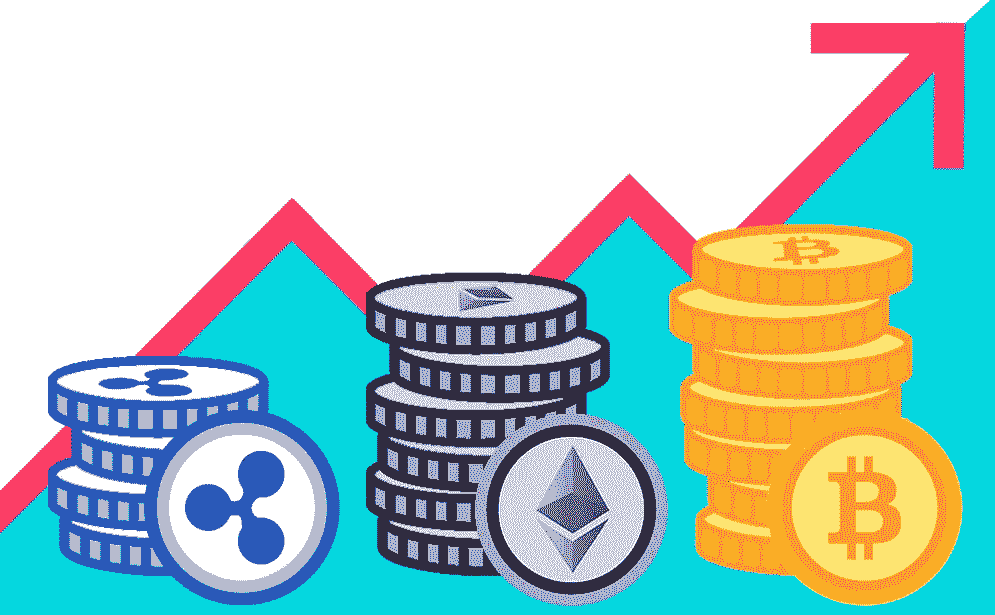
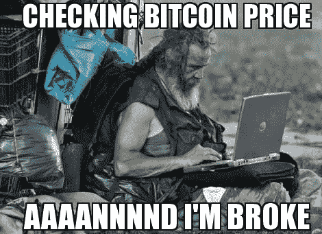
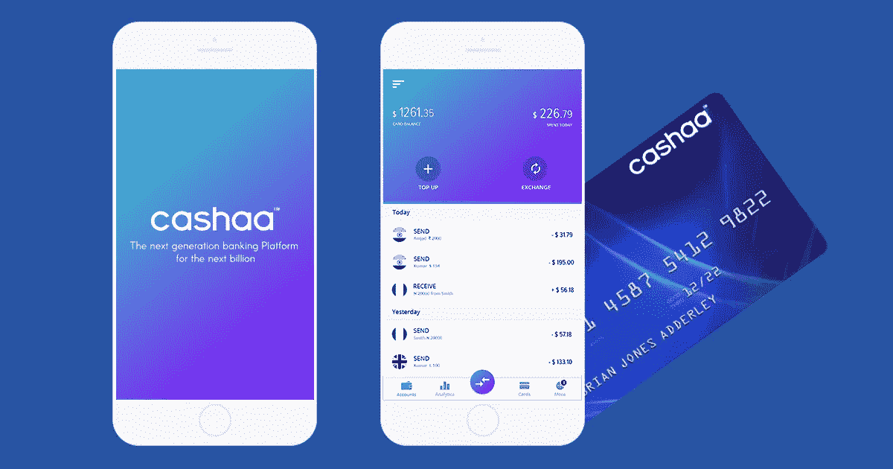

# 进入加密货币一年

> 原文：<https://medium.datadriveninvestor.com/one-year-into-cryptocurrency-fa5ee26fd91?source=collection_archive---------15----------------------->

整整一年前，在熟悉了区块链和密码学之后，我开始研究加密货币。我仍然记得当我买第一批硬币时的兴奋，当我等待交易完成时，我不知道会发生什么。从那以后，很多事情都变了，我不得不说我对加密货币的态度也变了。那时候，每当我成为新硬币的“收藏者”时，我总是很兴奋，我很好奇要了解各种项目并批判性地分析它们，最重要的是，我会一天几次查看我最喜欢的硬币的价格。我认为，在我们的加密冒险之初，我们都经历过相同的行为模式。

现在情况变了。我希望我当时就知道我现在知道的一切:如何研究新的代币、ico，如何交易，如何应对熊市，最重要的是短期内不要担心。这最后一条建议可能是我在这艰难的一年里学到的最重要的一课；因为是的，我们仍在经历一场持续了 7 个月的熊市，而且似乎不愿意再持续 2 个月左右(这也是一个非常积极的预测)。如果有一件事我们可以从我们以前的错误中学到:耐心，大胆和保持信念。因为这正是我们要做的:避免恐慌，坐好，尽量放松，享受旅程。

太多人在熊市中损失惨重，但我想说的是:除非你真的卖出，否则不会有损失。就像没有收益，除非你真的卖了更高的价格。我们现在看到的只是代币/硬币的潜在价值，仅此而已。我想，如果我们想到我们为得到这些代币“付出”了什么(当然这取决于我们购买的时间)，我们自然会感到恐惧，但我们不应该绝望。我们必须牢记的第一条规则是“永远不要投资超过你愿意损失的金额”。最终，就目前的情况而言，加密货币投资就像赌博一样。这个市场相对较新，对它的看法不是一边倒的，大投资者还没有进入(别忘了他们才是大钱！)而且一切仍基本不受监管。是的，在缺乏监管的情况下，我们可能会产生错觉，继续相信仙境，因为加密货币是未来，是自由。

让我们诚实地说:前提当然是高尚的事业，但事实是不可能有大规模的采用，在没有监管和政府批准的情况下在世界范围内每天使用令牌。那些你认为银行将不复存在的人只是在妄想:这永远不会发生。我更喜欢现实一点，分析加密对现有市场的影响。因为“颠覆”这个我们最喜欢的词可能会发生，但它并不意味着摧毁和取代现有的一切。意味着让它变得更好，为了未来而改变它。政府也将在采用加密中发挥基本作用:我们已经开始听到国家加密货币项目，如“cryptoruble”和/或“petro”(最后一个我连棍子都不会碰！

我相信加密货币会一直存在，并且是未来的趋势。但我希望现实一点，避免对金融、银行业和全球经济的未来抱有幻想。

这就是为什么我一点也不担心:我研究和投资的每一个项目都是长期项目。无论如何都不要着急，我也不认为我会因为巨大的收益而一夜暴富。所以，如果你正在阅读这篇文章，请重新考虑你对加密货币的看法，并开始用更批判的眼光来看待它。多学习，多阅读，问问自己为什么对加密感兴趣，如果答案是“我想变得富有”，那么我的朋友让我告诉你，比特币百万富翁时代已经结束了——你错过了火车。这并不意味着一些代币在未来不会触及高价值，但这意味着你应该在 2013-2015 年购买 BTC，成为百万富翁。即便如此，前提是你在合适的时机卖出。

我喜欢的项目是那些具有真实用例的长期项目，它们能够解决一个真实的问题:为新的市场份额提供新的或现有的服务，创新当前的系统等等。必须特别关注印度、中国和巴西等新兴市场。就科技行业而言，印度可能是最需要解决的问题。在这方面，我已经写过的一个非常有趣的项目是 Cashaa。我们正在讨论为下一个 10 亿人建立一个新的银行平台:既包括那些被排除在当前金融体系之外的人，即“无法接受银行服务的人”，也包括那些已经成为金融体系一部分的人。

一个允许存储，交易和保存法定货币和加密货币的平台，民主，对所有人开放，用户友好，尊重规则和 KYC 程序。我们所有人的平台:不是为政府或银行，而是为人民。同时，也不反对银行和政府。连接机构和普通人两个世界的纽带，让他们的生活更轻松，让每个人都能获得银行服务。毫无疑问，Cashaa 最有趣的特性之一是，由于 CAS 平台的本机令牌，无需银行帐户就可以访问现金。这也将使人们能够获得小额贷款，即使收入很低也能实现他们的梦想。这是 Cashaa 背后真正的革命。

该团队目前正在努力实现他们的目标，到今年年底，交易所应该会启动并运行。这个项目有很多东西可以提供，我建议你关注他们的社交媒体电报[https://t.me/CashaaLtd](https://t.me/CashaaLtd)、https://facebook.com/cashaaLtd/脸书[、https://medium.com/@cashaa](https://facebook.com/cashaaLtd/)和主网站[https://cashaa.com/](https://cashaa.com/)。如果你觉得这篇文章有趣、有启发性，或者你想保持联系，也可以在这里发表评论，喜欢这篇文章。

非常感谢您抽出时间:)

**免责声明**:本文不构成在任何司法管辖区买卖证券的邀请，也不构成 Cashaa、CAS token 或任何其他加密货币的招揽或投资建议，发布本文仅供参考。读者承诺进行适当的研究，并在任何情况下，在做出任何关于 Cashaa 或任何其他加密货币的决定之前咨询专业人士。本文中表达的观点属于个人性质，与任何公司、加密货币交易所没有任何联系，不构成金融或法律建议。使用平台及其他交易所风险自担。