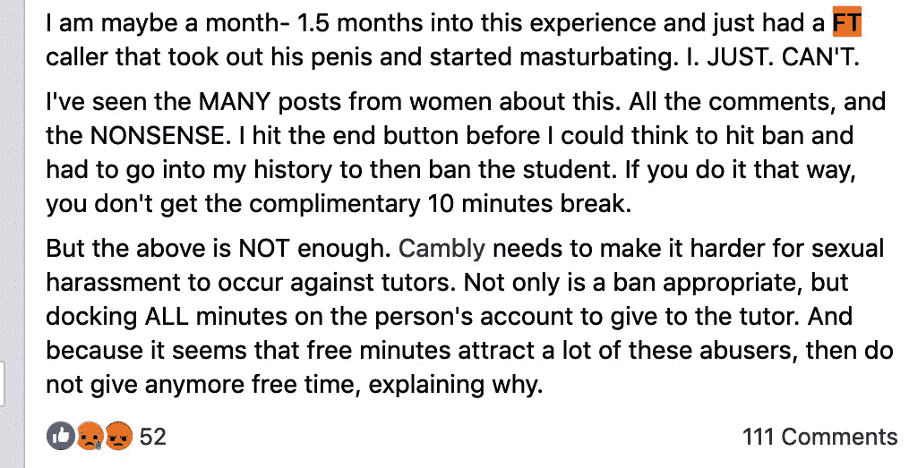

# 在线剑桥导师在#脸书页面上发布性骚扰事件

> 原文：<https://medium.datadriveninvestor.com/online-cambly-tutors-post-incidents-of-sexual-harassment-on-facebook-page-105e4d6743e6?source=collection_archive---------3----------------------->

Photo by [Daniel H. Tong](https://unsplash.com/@danieltong?utm_source=medium&utm_medium=referral) on [Unsplash](https://unsplash.com?utm_source=medium&utm_medium=referral)

今天早些时候，我很不情愿地打开了脸书，这是很久以来的第一次。我是为一个朋友做的，他正在做兼职，当然，他还建立了一个脸书主页。

**作者注:这个故事已经更新，以反映该公司的联合创始人凯文·劳*的回应

我加入了这个团体，并对它竖起了大拇指。愉快地。

然后我的目光转向了我的账户的右边(在过去的几年里，我几乎杀死了一百万次)。有好几个通知，有几个来自我作为 TESOL 认证讲师参加的另一个小组。

 [## 我们屏蔽了社交媒体，这引起了公愤。-数据驱动型投资者

### 上瘾，我们看不出来。在最近的一项研究中，基于以前的研究成果，我们想…

www.datadriveninvestor.com](https://www.datadriveninvestor.com/2018/12/01/we-blocked-access-to-social-media-it-caused-an-outrage/) 

我点击页面，开始滚动最新的帖子，其中大多数都不痛不痒。然后是这个，日期是 5 月 12 日:

**(I’ve cropped out the name of the poster for obvious reasons)**

FT 代表“免费试用”

虽然我知道不该被震惊，但我还是被震惊了。

我发现了很多很多类似的帖子。大多数来自女教师，但也有少数来自男性。

由 Sameer Shariff 和 Kevin Law 于 2012 年共同创建的 Cambly.com(T2)为用户提供与英语母语者的视频聊天点播。

“我们对 Cambly 上的不当行为采取零容忍政策，”Law 在我发表这篇文章几天后告诉我。

劳在通过 LinkedIn 发给我的一条消息中说:“除了允许任何导师永久和立即从 Cambly 删除任何用户外，我们还拥有自动保护措施，在他们联系导师之前禁止他们使用 Cambly 的账户。”

他提到了 Cambly 的导师[指南](https://cambly.zendesk.com/hc/en-us/articles/360022601731-Part-7-Important-Policies)，并补充说他的公司正在不断反思如何使其平台成为导师的安全之地。

支持坎布利的回应，而不是重影这个记者。

也就是说，有大量证据表明，互联网零工经济容易受到我们所谓的蜥蜴大脑驱动的最糟糕行为的影响。

啊，互联网！