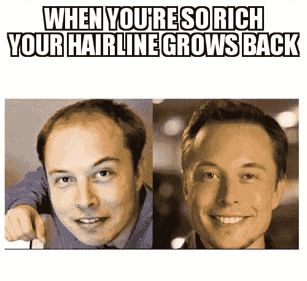

# 在线社区——第 2 部分:先决条件、扩展和一些很好的例子。

> 原文：<https://medium.datadriveninvestor.com/online-communities-part-2-prerequisites-scaling-and-some-great-examples-a43c9746a207?source=collection_archive---------12----------------------->

在[之前的文章](https://medium.com/@eylonaviv/online-communities-part-1-what-is-a-community-and-whats-wrong-with-what-we-are-using-today-d2c9c36faa4f)中，我们谈到了什么是社区。但是就像罗马或其他城市一样，社区不是一天建成的。这是一个过程，通常需要一个人或一小群人付出艰苦、集中和持久的努力。

**成功社区的关键**

你有没有想过为什么有些社区长期成功而有些没有，为什么他们会崩溃，是什么让人们离开他们？

我研究了创建成功的在线社区的一些特征和先决条件。有许多类别和子类别以及大量的文献。 [Stan Garfield，](https://medium.com/u/5571b9d42ed6?source=post_page-----a43c9746a207--------------------------------)这位传奇的社区传道者对此进行了广泛的研究，据他所说，这是实践社区的三个关键。

*   **一个*引人注目的话题* :** 成员和潜在成员必须对合作主题充满热情，并且必须与他们的工作相关。
*   **一个*临界数量*的成员:**你通常需要至少 100 个成员，200 个是更好的目标。见此[相关讨论线程](https://twitter.com/stangarfield/status/853239897179795457) (twitter)。
*   **一个*投入的领导者* :** 社区领导者应该了解主题，有激励协作的精力，有足够的时间投入到领导工作中，然后定期花时间增加成员，安排发言者，主持电话和会议，提问和回答问题，并发布对成员有用的信息。

前两点很清楚——你需要一个社区成员都感兴趣的共同话题，你需要足够多的人来创建这个社区。

让我们把重点放在第三个。社区需要一个领导者，如果没有一个或几个领导者投入时间和精力来构建社区，创建内容，并为社区及其未来成员设定路径和价值观，社区就无法形成。此外，社交媒体似乎已经让我们超越了邓巴的多达 200 个稳定关系的数量，是这样吗？

## 当天平开始断裂时

如果/当社区增长时会发生什么？大社区可以成为权力的来源——从组织变革运动到购买力和购买辛迪加，一直到[一起购买城堡](https://www.businessinsider.com/7500-people-banded-together-to-buy-a-fairytale-french-castle-2017-12)。

Yes I got spiderman in here

领导或创建社区的人现在发现自己拥有越来越多的权力。领导者常常意识到他的权力——“我建立了这个社区，这个社区是我的，我决定它会发生什么。”

但是等等，一个人怎么拥有社群，一个人怎么决定？那么共有呢，*不就是那个*小区吗？

随着社区的成长，他们的目的和目标也随之成长。从社区开始的地方开始，社区方向的支点和转移可能是相当剧烈的。当社区成员和领导者对这些转变有分歧时会发生什么？

我们来做一个思维实验。明天，你的社区会给你一份超过 60%成员签名的请愿书。在那里，他们要求你放弃管理权，把接力棒交给别人。
你会按照他们的要求去做，还是坚持己见？

在其他情况下，领导者不再为社区服务或强制推行他的议程。也许他厌倦了这个社区，不想再管理它了。或者他决定将它货币化。从以成员为代价的广告运作、[压制不同想法或反对他们的人](https://medium.com/altcoin-magazine/the-forking-of-the-israeli-bitcoin-community-group-and-why-should-you-care-406baad558f2)，一直到[出售集团](https://bigleaguepolitics.com/deplorables-destroyed-massive-pro-trump-facebook-group-sold-click-farm/)。

正如 80 年代辛迪·劳博尔、火人节的丹·艾瑞里以及无数的文章、歌曲和实验告诉我们的那样——当面对金钱时，我们会改变。

Money changes **everything**

另一个思维实验——有人给你 100 万美元来出售你的社区，让他们自由使用。这不是“在你的生活中永远不要再工作的钱”,而是一次付清。你们有些人是社区经理，对吧？你会怎么做？*(如果你决定把它给你的 10，000 名成员的社区，每个人将获得 100 美元)*

社区依靠他们的领导人公正地管理他们，而不是屈服于个人利益的诱惑——权力、金钱或地位。在扩展在线社区的过程中，领导者是唯一的失败点。

你如何越过这个障碍？有哪些社区和在线社区成功成长、繁荣和扩大的例子？对社区的形成至关重要的领导人是如何行动的？他们做的有什么不同？

# **成功的社区**

为了获得线索，让我们探索一些成功的社区，它们经受住了时间的考验。

## **维基百科**

2001 年 10 月 27 日，[吉米·多纳尔·威尔士](https://medium.com/u/97e02fd1c4ec?source=post_page-----a43c9746a207--------------------------------)创建了维基百科，后来成为第一个在线分布式社区。[这些是原则声明](https://en.wikipedia.org/wiki/User:Jimbo_Wales/Statement_of_principles)，强调开放性、开源和[中立的观点](https://en.wikipedia.org/wiki/Wikipedia:Neutral_point_of_view)，多年来一直指导着维基百科社区。

> 想象一个每个人都可以自由分享所有知识的世界。这是我们的承诺。—维基媒体基金会声明

其中一个原则是:

> ****新人总是受欢迎的。必须有****[*没有阴谋集团*](https://en.wikipedia.org/wiki/Backbone_cabal) *，必须没有精英，必须没有阻碍对新来者开放的等级或结构…这样，一旦人们在社区中待了很短的时间，他们就会自动获得全部特权。”***

**欢迎任何人加入，经过一个短暂的过程，你就是这个社区的平等成员和贡献者。— *共同所有权*。**

**维基百科现在是世界上访问量最大的网站的前五名，谷歌、Youtube、脸书和百度在它之前——因此，这些是世界上最富有的公司，由最富有的企业家领导。吉米一定是世界上最富有的人之一，对吗？嗯，不，他的净资产估计超过 100 万美元。**

**你们中的一些人可能知道维基百科是非盈利的，[它由社区运营，为社区服务](https://en.wikipedia.org/wiki/Wikipedia_community)。如果是为了利润，是否有个人动机去建立[吉米·多纳尔·威尔士](https://medium.com/u/97e02fd1c4ec)公司？你认为人们会为维基百科做贡献吗？别人的财富？我认为吉米意识到，维基百科实现其潜力并成为所有知识总和的唯一途径是成为一个真正的社区，由用户共同拥有，没有任何个人利益。**

> **维基百科首先致力于用地球上的每一个人自己的语言，创建并向他们分发尽可能高质量的免费百科全书。问社区是在这个目标之前还是之后到来，真的是问错了问题:社区的整个目的恰恰就是这个目标。**
> 
> **—吉米·威尔士**

****比特币****

**比特币是一种以数学为后盾的社会现象。我不认为任何人可以质疑比特币社区的力量，在超过 330 条讣告和统计之后，它仍然存在并继续创造头条新闻。那个社区的社会联系越强，比特币就越强。**

**为什么人们是比特币社区的一部分？表面上看是投机和金钱收益。人们购买比特币是因为他们推测比特币会升值。但是很多人，包括我自己，停留的时间不止这些。从[奥地利经济](https://en.wikipedia.org/wiki/Austrian_School)观点来看，银行[权力过大](https://positivemoney.org/issues/democracy/)，与经济不平等。**

**比特币的基本原理与社区完全相同——协议强制实行共同所有权。中本聪设计了一个假设自私行为的系统，并确保前进的唯一途径是通过合作和参与。他也明白，如果他真的想让比特币扩大规模并实现其潜力(这将在未来几年被发现)，他就必须退出比特币。或许向吉米和维基百科学习。**

****

**The bitcoin whitepaper — By Satoshi Nakamoto, October 31st, 2008**

**大约一年前，中本聪被列为世界上最富有的 50 人之一。哦，伙计，你能想象吗？数不胜数的财富掌握在你的手中，然而我们不知道他是谁，[他的资金一分也没有动过](https://www.quora.com/Did-Satoshi-Nakamoto-move-his-Bitcoin-Cash-coins-yet)，聪和吉米一样，为了社区的成功放弃了个人利益。**

## **Rajneeshpuram**

**20 世纪 80 年代早期，后来被命名为奥修的追随者们建造了一座容纳 7000 多人的完整城市，一座机场，一家酒店，甚至一个人工湖。看看网飞的纪录片《荒野之地》，我怎么推荐都不为过。它真正展示了如果他们有一个共同的目标/一些共同点，并且他们感到共同拥有，一个社区可以建设和做什么。**

**从各方面来看，Rajneeshpuram 是一个成功的社区，完成了令人难以置信的成就。然而，最终，谢拉和巴格万两位领导人都变得腐败，不再为他们的社区服务，而是领导社区追求他们的个人利益，因此社区崩溃了。**

**这就是那些拥有强大领袖、却被个人激励所迷惑的社区的命运。**

**还有许多其他的例子，我没有包括在内。比如宗教的根本也是基于这样的东西。但是它们堆积着一层层的个人利益和收获，这些利益和收获已经污染了灵性的基础层，而我认为灵性是人类经历的重要部分。**

# **最后**

**虽然领导者对于社区的形成至关重要，但如果社区要扩大规模并发挥其潜力，领导者必须放弃自己的全能，放弃权力，让社区来接管。当没有单一的权威、权力或所有权时，当社区成员感到平等并有能力通过行动、贡献和协作来影响社区时，这才是真正的社区。**

**借助互联网的连接机会，像维基百科和比特币这样的去中心化社区可以发展成为改变世界的运动，改善其参与者、贡献者甚至“潜伏者”的生活——大多数人只是使用维基百科，他们不会做出贡献。还有哪些小区可以建？可能性是无限的，我们的想象力是唯一的限制。**

## **在下一部分…**

**我们会从人类学和哲学的角度讨论为什么会这样。为什么权力的位置会改变人类的行为，我们能做些什么来改变它？**

**线索就在五个好皇帝中的最后一个、[马可·奥勒留](https://en.wikipedia.org/wiki/Marcus_Aurelius)，他是我的个人典范。他是那个时代最有权力的人，也是一个公正和正直的领袖。[谢恩·帕里什](https://medium.com/u/4e1546c1a1a1?source=post_page-----a43c9746a207--------------------------------)对他有一个极好的[介绍](https://fs.blog/marcus-aurelius/)**

**你好，我的名字是埃隆，如果你喜欢我写的废话，给我一些(50！)拍手跟我来！**

**我正在设计和建立一种不同类型的社交媒体，以安全和隐私的价值观为指导，用户不是产品，合作获得社会认可，用户拥有平台。**

**想得太大了？大概吧。你可以通过鼓掌和跟着我来帮助我。想听更多吗？救命？合作？请随意联系。**

**@推特上的 theeylon，instagram & telegram**