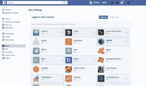
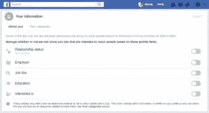
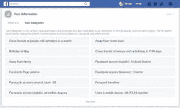

# 在线数据隐私-一个现代神话

> 原文：<https://medium.datadriveninvestor.com/online-data-privacy-a-modern-day-myth-70e085bd1090?source=collection_archive---------1----------------------->

在线数据隐私听起来像是一个现代神话。谷歌和脸书等社交媒体科技巨头似乎已经将隐私问题视为理所当然。

上周，Facebook 席卷了整个互联网世界，全球用户都感到震惊。

许多人在社交媒体上表达他们的愤怒，甚至完全删除了他们的 facebook 账户。

有一次，我的一个好朋友告诉我，为了在谷歌申请一份工作，你不必投简历，谷歌比你更了解一切，比如你的资格、你的地址、你的前任、你未来的伴侣等等。

听起来既好笑又恐怖。现在是您亲自保护数据的时候了，请遵循以下步骤来确保您的数据不会落入他人之手。

# 请遵循以下步骤:

**第一步**——在 https://haveibeenpwned.com/[运行一个快速典当搜索，查找你所有的电子邮件 id](https://haveibeenpwned.com/)

**第二步**——如果上述情况导致一个危险的红色标志，这意味着你的电子邮件 id 已经被泄露给某个第三方，你应该立即更改你的密码。

保持至少 15 个字符的强密码，请不要使用类似于 **password1234567** 或任何包含您的姓名或出生日期的密码。

**步骤 3** -启用双因素认证。

最重要的是要明智，每隔一段时间就要更换密码。保持每月更改密码。

**第四步**——停止使用脸书、推特、亚马逊账户注册其他服务。

这一步非常关键，因为它涉及第三方服务之间的数据交换。我知道这很容易，而且通过避免填写那些长长的注册表格节省了很多时间，但是这也伴随着巨大的风险。

## 让我给你一个真实的例子。

最近我从 play store 安装了一个名为 Audible 的应用程序，它提供了很多有声读物。

我一打开应用程序，就被提示使用我的亚马逊账户创建一个新的 Audible 账户。

现在，我正在使用 Audible 的 30 天试用服务，在第 31 天，我收到了我的银行发来的消息，称从 Audible 服务中扣除了一定金额。

我已经联系了 Audible，要求他们解释他们是如何获得我的借记卡信息的，我从未向他们提供过这些信息，我从他们那里得到的回应真的令人震惊和不安。

他们说 Audible 和亚马逊是同一家公司，我存储在亚马逊的借记卡信息可以被亚马逊的子公司使用。令人震惊的权利！这让我们进入下一步。

**第五步** -不要在任何电子商务平台上保存您的借记卡/信用卡信息。

我当然不会删除我的 facebook 账户，但肯定会实施接下来的几个步骤(6-7)来控制脸书如何使用我的数据与第三方网站分享。

**步骤 6** -进入设置- >应用- >所有使用您的脸书凭证和数据的网站列表。

删除所有你不再使用的不需要的网站和服务。

**第七步**——限制脸书与不同广告公司共享的个人数据量。

进入设置->广告首选项->您的信息->取消选择您不想再分享的数据。

**第八步**——不要点击垃圾邮件中的链接或下载附件。你可以使用[https://virusdesk.kaspersky.com/](https://virusdesk.kaspersky.com/)来扫描任何病毒或木马。

总结一下这个话题，保护你的数据不被互联网上的窥探落到你自己的手里。既聪明又安全。