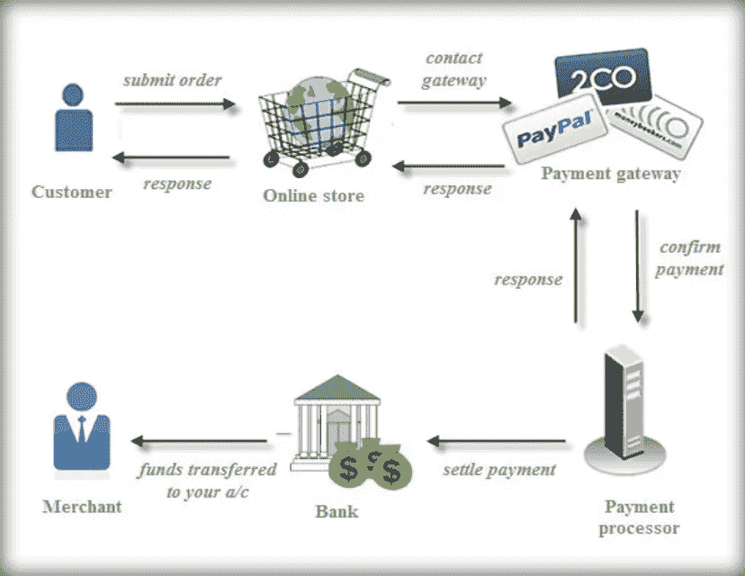
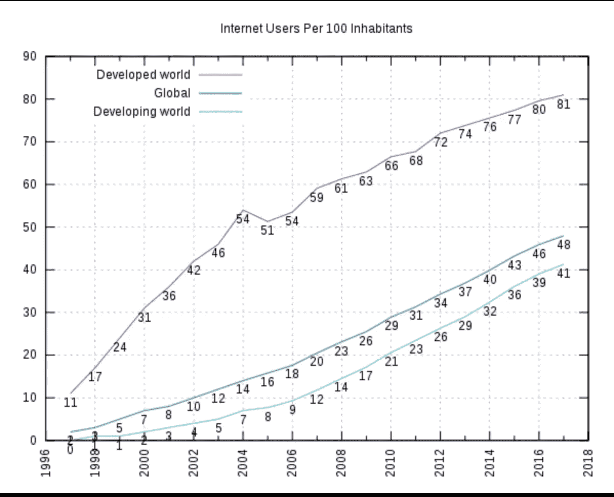
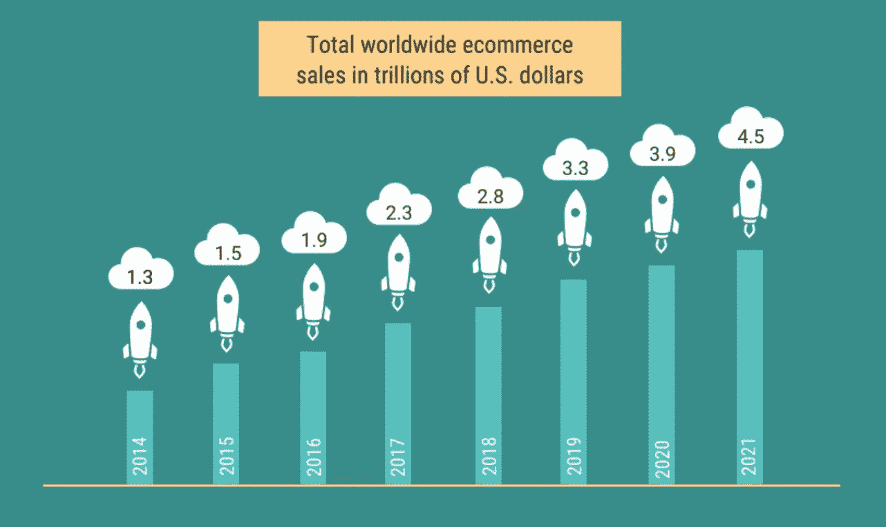
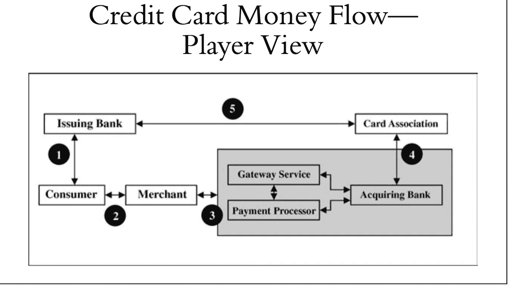
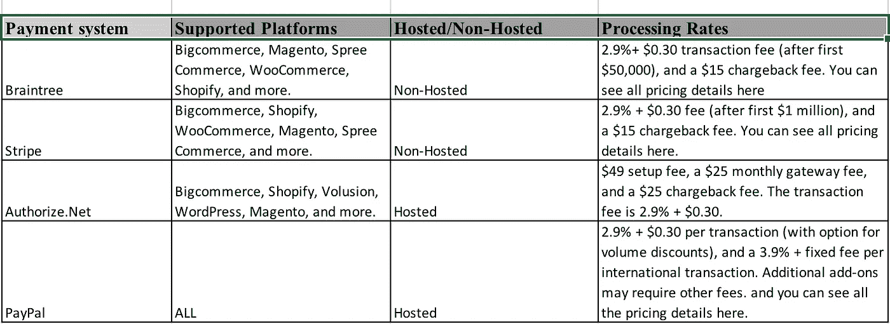

# 在线电子商务支付——参与者、支付聚合者、选项

> 原文：<https://medium.datadriveninvestor.com/online-e-commerce-payment-players-technologies-options-de5f59bd2a1c?source=collection_archive---------4----------------------->

[https://financesonline.com/payment-gateway-processor-difference/](https://financesonline.com/payment-gateway-processor-difference/)

在我之前的故事中，我试图帮助我的读者理解[支付生态系统](https://medium.com/datadriveninvestor/payment-ecosystem-demystified-beaa08d85959)，在那里我们学习了典型信用卡交易的流程/步骤。在[的实体](https://en.wikipedia.org/wiki/Brick_and_mortar)里，商家通常使用[的销售点机器](https://en.wikipedia.org/wiki/Point_of_sale)接受不同持卡人的支付并处理交易。

但是在**在线电子商务支付**中会发生什么。在这个故事中，我们将深入探讨在线支付生态系统。我们将理解以下内容:

*   为什么和谁应该关心网上支付！
*   参与的玩家
*   支付网关 vs 商户账户 vs 支付聚合器
*   支付网关的不同选项

## 但是等等！为什么我们真的关心这些？？

根据维基百科的说法，目前世界上有一半的人口正在积极使用互联网的力量。无论是发达国家、发展中国家还是全球其他国家，我们都能看到互联网用户的增长。

所以这意味着互联网上有巨大的商机。这是显示电子商务渗透率的统计数据

**Global Retail Ecommerce Sales Will Reach $4.5 Trillion by 2021**

## 好吧，那么在线领域肯定有机会，但是谁在这个领域获得了机会呢？

> 虽然选择实体店可能有一些原因，如能够看到、感受和试用商品，但消费者希望购买，然而当谈到便利性时，在线是消费者的最佳选择。

**这意味着任何想开始销售东西的人都有机会在这个领域脱颖而出。**无论你是小企业主、顾问还是为消费者做点有用的事的小 app 都有机会。

## 商家/卖家在开展网上业务和接受支付时应该注意什么！

假设你有一个网上商店，你计划在那里销售你的产品，并希望在网上发展你的业务。你可能需要一个简单的形式的东西，客户可以提供付款细节，并继续支付。

客户将拥有银行发行的信用卡/借记卡，可以与 Visa、MasterCard 或 American express 等信用卡品牌关联。

现在，要接受客户在线付款，您有两种选择:

**选项 1 —支付网关和商户账户**

1.  为了能够在线处理卡交易，首先你需要一个**支付网关**，它类似于一个销售点的物理机器。支付网关将执行与 POS 机相同的任务:

*   检查卡的有效性；
*   确定卡的发行银行；
*   加密与卡相关的数字；
*   告知商业银行是否启动资金转账；
*   将答案发送回您的站点。

因此，支付网关将**安全地将支付信息**传输到卡网络以供进一步处理。**但问题是商家去哪里寻找交易资金呢？**

2.这就是为什么你需要知道**商业账户的概念—** 这不同于**商业银行账户**。商户账户是资金在存入您的商业银行账户之前存放的地方。一个商家账户对你和你的企业来说是独一无二的。

**开立商户账户有两种方式**

1.  通过收单银行
2.  虽然第三方商家服务提供商(MSP)也称为 ISO(独立销售组织)

> 用支付网关建立一个商业账户很费时间，而且需要大量的文书工作。然而，真正的商家账户为店主提供了获得低得多的信用卡处理费率的机会，并使用各种终端和 POS 系统集成。

## 选项 2— **第三方支付处理商(支付聚合商、第三方商户、商户聚合商)**

> 这种支付方式对那些在银行开立商户账户有困难的商户很有吸引力。商户账户属于主商户，主商户负责维护与收单银行的协议。子商户将与主商户签署单独的协议，授权后者代表他们收款，并确保主商户将偿还子商户作为回报。

**示例** — PayPal、Stripe、Square 和亚马逊支付

## 支付网关—托管和非托管，选择哪一个？

在决定支付网关时，商家必须知道托管和非托管之间的区别

**场景 1 :**

如果作为一名消费者，您曾经使用 Paypal 付款，您会注意到，当您在购物结账页面选择 Paypal 作为付款处理程序时，您将被重定向到 Paypal 付款页面，而不是商家页面。这种来自支付网关的用户体验被称为托管。

虽然这是安全的，因为所有的 PCI 合规性都是由支付处理器/网关完成的，但是这并没有给用户带来很好的体验。

**情景二:**

如果作为一个商家，你想为消费者提供一个用户体验，让他们不必离开商家购物页面，那么你可以选择非托管的支付网关。要在现场进行支付，您通常需要 SSL 证书，并遵守特定的法律和技术 PCI 要求。

例如—条纹

## 支付网关与支付聚合器

**在所有情况下——支付聚合器或商户账户——接受在线支付都需要支付网关**。

> 正如 Helcim 前营销主管乔丹·艾尔(Jordan Ale)所说，“支付聚合器可能提供支付网关，但支付网关不能提供支付聚合器。”简而言之，它们是不同的。

简单地说，网关在网上相当于实体企业中使用的卡终端。如果没有在线支付网关，电子商务网站就不能接受支付交易。

## 可能的资金流动

***Source — ESSENTIALS of Online Payment Security and Fraud Prevention -David Montague***

商户可以使用以下任何方法将信用卡订单发送给收单银行:

*   通过商户账户直接连接到收单银行
*   连接到支付处理器，支付处理器连接到收单银行
*   连接到网关服务，该服务连接到收单银行
*   连接到网关服务，网关服务连接到支付处理器，支付处理器连接到收单银行
*   连接到直接提供收单银行服务的支付处理器

## 选项—流行的支付聚合器(/网关)

**注意**——Authorize.Net 要求商户开户。

**结论**

由于涉及如此多的实体，有时很难理解在线支付交易中谁在做什么。互联网上有很多有用的信息，我把它们放在一个地方。对于一家初创公司来说，支付聚合器肯定是最好的选择，在那里你可以快速开始接受支付。不过，在最终确定之前，最好先研究一下你的需求。

希望你喜欢阅读！