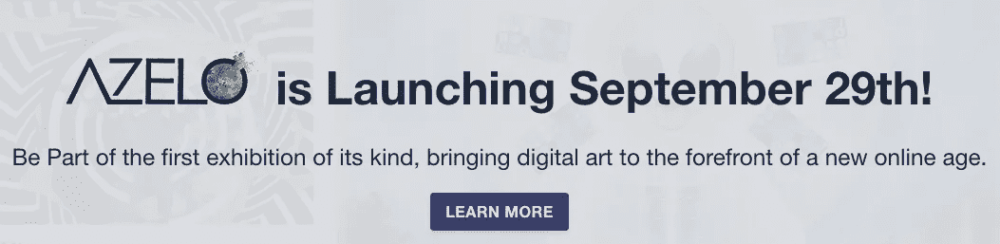

# 在线展览:为了对互联网的热爱

> 原文：<https://medium.datadriveninvestor.com/online-exhibition-for-the-love-of-internet-79e8d6afd759?source=collection_archive---------13----------------------->

zelo 将于本周末发布，届时全世界将见证第一次此类在线展览。欢迎大家参观展览，并成为世界上第一批参加在 azelo.org[拍卖**真正**限量版艺术品的参观者。](http://azelo.org/)

此次展览将展出 Cyborg Art Collective、Heleen Mineur、Arthuro Medina、Caspar van Bavel、Dora Kerekes、Carmen Dusmet Carrasco 和 Arina Livadari 等的后互联网艺术作品。现在，一个完全在线的展览应该处理什么？好吧，我们有我们的策展细节来看看我们创造了什么！

# ***对互联网的热爱***

在过去的几年里，有一种明显的趋势，即当代艺术机构和博物馆试图向更广泛的公众开放。想想卢浮宫博物馆最近允许卡特夫妇(碧昂斯和 Jay-Z)使用卢浮宫作为他们的音乐视频 Apeshit 的电影布景。抛开大多数艺术机构可以从这种曝光中获得的经济利益不谈，这导致了那些通常没有社会或文化资本去参观博物馆或艺术机构的人的进入。重要的是要承认，博物馆或艺术机构对艺术的“开放”是为数字艺术特别是只能存在于互联网领域的数字艺术而特别展现的。这种艺术，以及它使用互联网作为艺术创作的起点，具有向所有人(可以访问互联网的人)开放的内在潜力。互联网媒体及其无限的网站为向公众展示数字艺术创造了新的可能性。最终有可能举办一场真正开放和免费的基于网站的数字艺术展览吗？*中的艺术家出于对互联网的热爱*专注于这种更新的数字艺术展示方式，并拓展网站作为其作品材料的可能性，同时能够出售真实的数字艺术作品。在某种程度上，对互联网的热爱与现实生活中的艺术展览保持着联系，但没有要求数字艺术家将他们的作品翻译成实物形式，因为那样会失去所有的真实性和氛围。展出的作品只存在于网站上，对所有能上网的人开放。

展览将在 Azelo 展览网站上持续大约一个月。这个展览标志着 Azelo 的推出，也是世界上第一个此类展览。每件艺术品也将在 Azelo 的拍卖网站上拍卖。每件艺术品都通过其在开放数据库(区块链)中的收录进行验证，任何人都可以验证每件作品的合法性。

W 蚂蚁看耐人寻味又值得纪念的作品？想要深入在线展览的世界以及如何授权数字艺术家？想成为 21 世纪新兴艺术家的赞助人吗？想投资数字艺术和尖端技术的未来吗？加入 Azelo，成为新艺术之旅的一部分。

作者:Alireza Parpaei