# 帮助你拥抱风险投资的在线资源

> 原文：<https://medium.datadriveninvestor.com/online-resources-that-help-you-embrace-venture-capital-3d27f2071ce6?source=collection_archive---------11----------------------->

**年终**在即。作为一个回顾和总结，我把今年我发现的关于**风投**的很棒的资源放在了一起。你可能已经知道，如果你想在这个领域工作，你应该沉浸在大量关于风险投资的优秀资源中。下面，我列出了几个我最喜欢的。我有意省略了书籍，因为我将在这里单独发表。

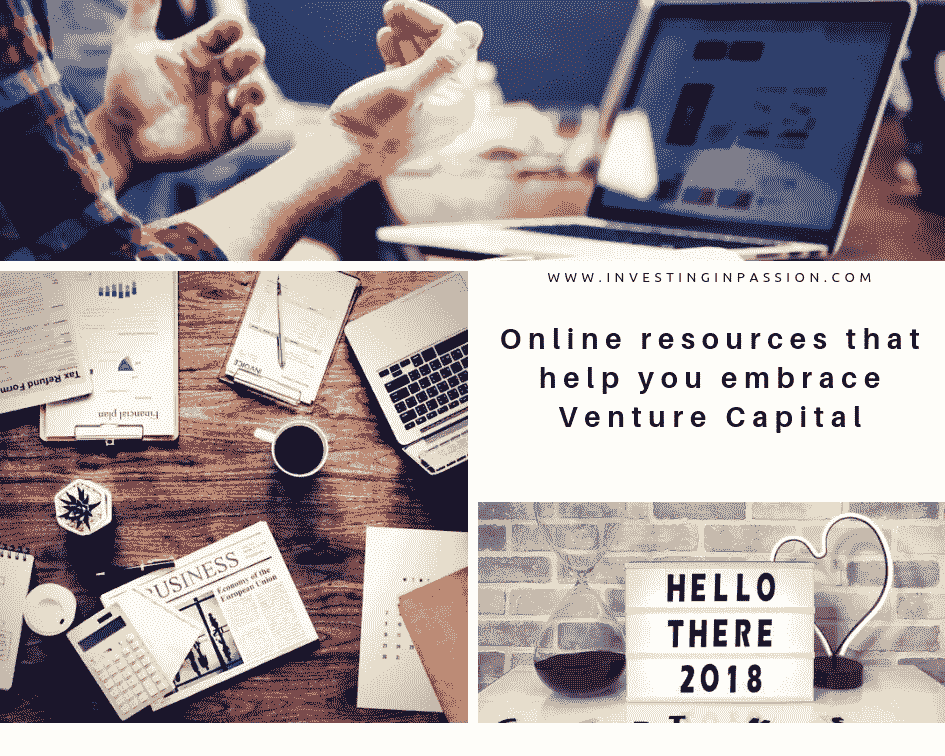

今年我学到了很多，我发现了许多非常鼓舞人心的公司和个人，他们带着真正的热情做着他们的工作，并在市场上创造出令人惊叹的、**持久的**产品。这是令人难以置信的自我发展和令人兴奋的一年，最终，让我觉得我在一个好的地方，我找到了我的道路，我正朝着正确的方向前进，你想要的任何事情都可能发生。重要的是你的决心和真正的热情，因为你可以学习其他一切。这可能需要一些时间，但最终，这是值得的。学习和发现新事物的过程是如此的**充实**和**愉悦**。

另外，记住人是你生命中极其重要的部分。他们可以引导你，向你展示好的和坏的例子，可以激励你或者只是帮助你认识到你所在的地方实际上并不是你的方式，你生来就真正被别的东西所激动。发现你的激情是你一生中最重要的事情之一。

***“人生中最重要的两天，是你出生的那一天和你找到原因的那一天。”* —马克·吐温**

尽可能多的将自己暴露在舒适区之外的环境中。它会让你成长，帮助你明白这一切是怎么回事。这可能是你人生的转折点，所以要不断学习，为他人创造巨大的价值。

在这个冗长的介绍之后；)现在开门见山，下面你可以找到一些帮助你增长 VC 业务知识的链接。

# 播客

哈利·斯特宾斯的 20 分钟 VC。Harry 是 Twenty Minute VC 的创始人，这是世界上最大的独立风险投资播客，拥有超过 100，000 名听众，与 Mattermark 和 ProductHunt 建立了合作关系，并有来自 200 多家风投公司的嘉宾，包括 Accel、Kleiner、Y Combinator、Benchmark 和 Index 等。他也是 TechCrunch 的撰稿人，报道创业公司和风险投资的所有事情，最近他加入了 Saastr 的 Jason Lemkin，以建立平台并扩展到新的垂直领域。

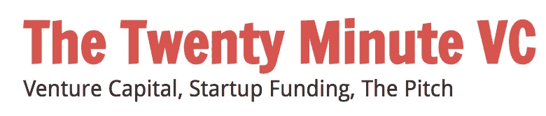

[创始人和出资人](https://www.avgfunds.com/founders-and-funders/)由校友创业团体。企业家和投资者讨论建立伟大公司的 AVG 播客。

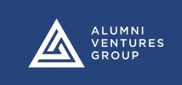

[像最好的一样投资。在每一集里，我都和我能找到的最有趣的人交谈，他们的故事将帮助你更好地投资你的时间和金钱，并教会你如何在自己的生活中玩边界游戏。你会在这一页的底部找到每一集的链接和相应的节目说明。](http://investorfieldguide.com/podcast/)

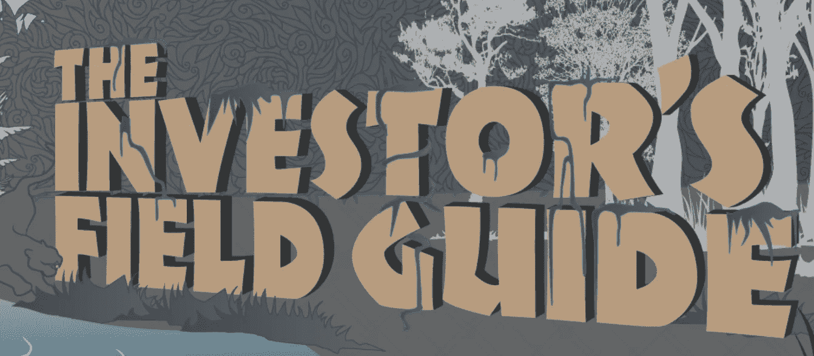

[产品搜索电台](https://www.producthunt.com/radio)——一个每周一次的播客，与人们一起创造和探索未来。每周请收听 Ryan Hoover 的节目，他将与创始人、投资者、记者和制造商一起讨论最新的技术。它并不总是完全与风险投资有关，但许多内容都与创始人、初创公司、天使投资者和风险投资有关。很多灵感和非凡人物的例子。

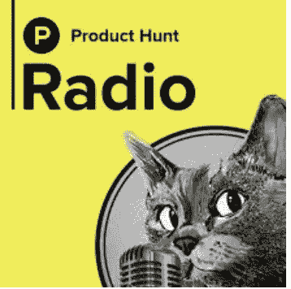

安德森·霍洛维茨的 a16z 播客。a16z 播客讨论技术和文化趋势、新闻和未来，尤其是“软件吞噬世界”。它包括来自世界各地的行业专家、商业领袖和其他有趣的思想家和声音。每周发布多集。

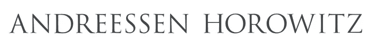

杰森·卡拉卡尼斯的播客。天使和机构风险投资者的精彩访谈。

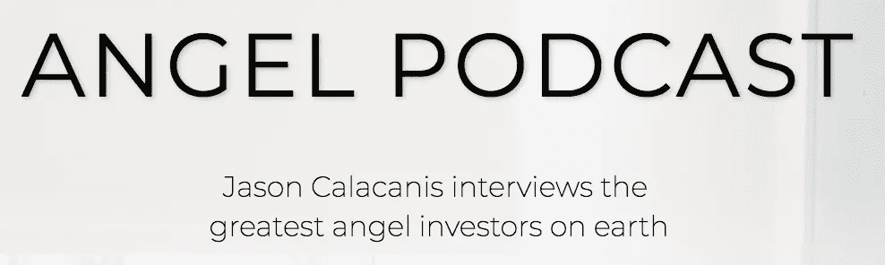

[**无形资产**](https://www.intangiblespodcast.com/) 史蒂夫·伯格著。播客是关于企业家可以培养的特质、行为和品质，以帮助他们变得更加成功。

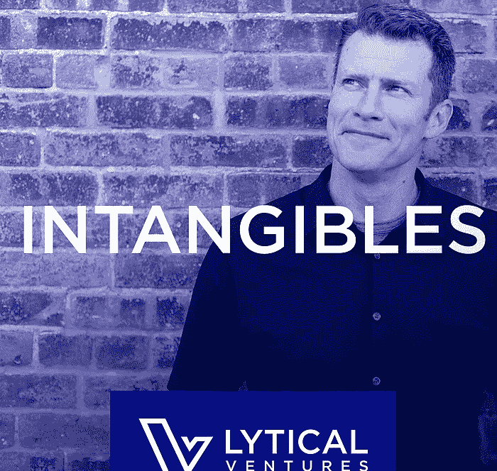

****——**致力于揭开风险投资世界神秘面纱的播客。尼克·莫兰创作了将近 200 集。**

**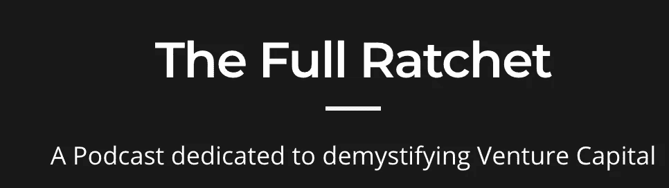**

**[**来源于记数大写**](https://notation.vc/#podcast) **。Origins 是一个关于有限合伙人的播客，有限合伙人是投资风险投资基金的公司和机构。通过一系列采访，我们探索了创业生态系统中历史上不透明的角落，并了解了资本背后的人们是如何做出决策的。****

****

# **网站/博客**

**约翰·甘农的另一个(前)风投博客。关于风险投资的最佳信息来源之一，如何获得风险投资工作，职业道路，它是什么以及如何在这个特定的业务中取得进展。说真的，这是任何试图进入风险投资的人的首选来源。约翰想出了一个主意，创建一个风险投资学院，接受那些希望超越自己技能的人的申请，像风险投资家一样参与项目，并获得在面试中与公司交谈时至关重要的经验。**

**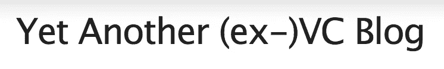**

**[创业站](http://bit.ly/2AoXZqM)——特别推荐给未来的风投准候选人:)以及创业公司创始人。**

**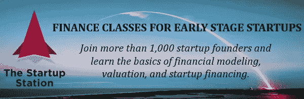**

**为了对早期软件和服务创业进行建模和估值，你需要知道的一切都可以在这个简明但对初学者友好的课程中找到！主要重点是财务建模和分析、估值和融资工具，但也包括其他术语，如现金流和资产负债表分析、全面分析，以帮助开发和优化产品市场适应性和广告支出。它可以在 http://bit.ly/2AoXZqM 的[网站](http://bit.ly/2AoXZqM)和 [YouTube](https://www.youtube.com/channel/UCQcTgPRm88yJ4-cPMraHWJA) [上找到](http://bit.ly/2AoXZqM)**

**[问风投](https://avc.com/)弗雷德·威尔逊。Fred 自 1986 年以来就是一名风险投资家，他经常从风险投资的角度写关于市场和创业的文章，几乎每天都写。**

****

**[17，000 学分博客](https://www.17000credits.com/):由 Jordan Kong 撰写的关于风险投资、技术以及两者之间的一切的文章。**

****

**[TechCrunch](https://techcrunch.com/) 和 [VentureBeat](https://venturebeat.com/) 专业新闻网站，发布每日信息、风投事件和创业环境。**

******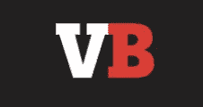**

**[VC 学院](https://www.vc.academy/) -风险投资教育，加速你的职业生涯。VC 学院提供了几门课程，你可以购买并按照自己的进度完成。你可以有一个导师或者自己完成作业。他们有一个巨大的图书馆和关于 VC 的报告来源，你可以使用。也有免费选项，你也可以受益于没有购买完整的课程。**

**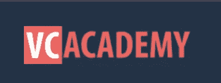**

**风险投资黑客**

**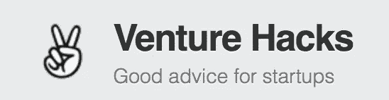**

**[VCdium](https://medium.com/vcdium) - VCdium 是讨论风投业务的地方。它的目标是帮助人们更好地理解每笔交易和估值背后的工作——揭开一个经常秘密行事的行业的面纱。**

**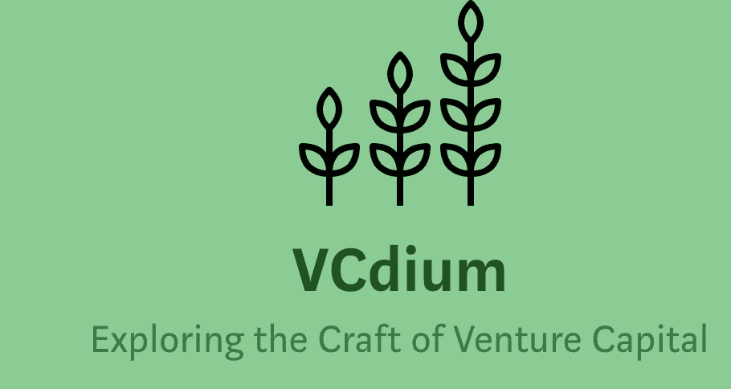**

# **VC 术语词汇表**

**[EquityZen 知识中心](https://equityzen.com/knowledge-center/glossary/) -风险投资术语词汇表和风险投资交易术语的另一个好来源。EquityZen 为二级投资者、股东和公司代表策划了优质资源清单。**

****

# **时事通讯**

**[strictly VC](https://www.strictlyvc.com/)——一封免费的每日电子邮件，里面有你开始一天所需的一切。此外，跟踪将在未来几个月和几年塑造行业的公司和人物。让 StrictlyVC 成为你自己的风险投资管家。**

**[财富条款清单](http://fortune.com/tag/term-sheet/)由财富**

***原载于*[*www.InvestingInPassion.com*](http://www.InvestingInPassion.com)**