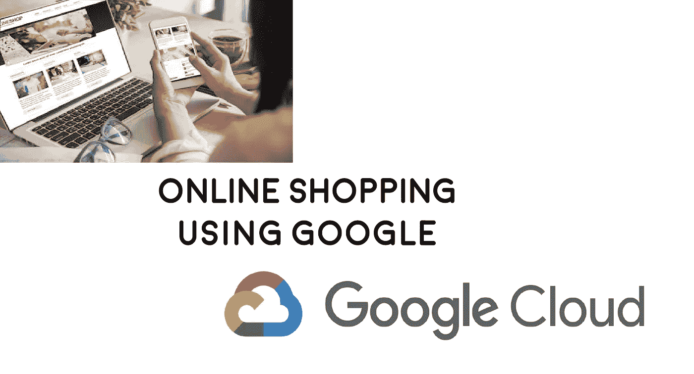
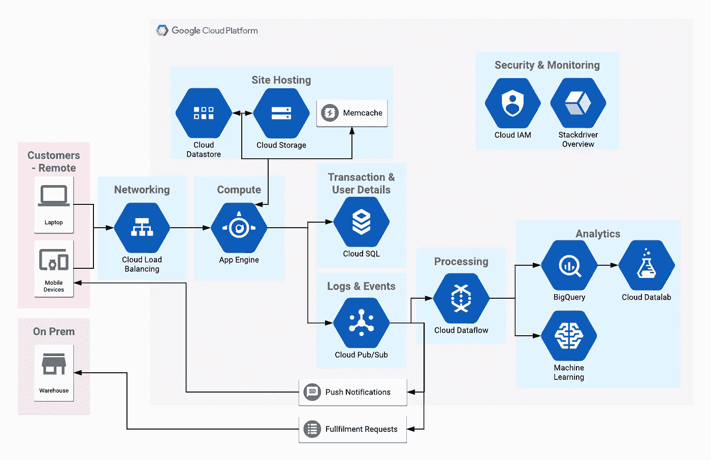

# 使用谷歌云进行在线购物

> 原文：<https://medium.datadriveninvestor.com/online-shopping-using-google-cloud-3c249884b86e?source=collection_archive---------14----------------------->

在这个系列中，我将采用真实世界的服务和流程，并使用 GCP 或 AWS 对它们进行建模。这个想法是让人们在幕后看看这些产品如何在云平台上运行。作为参考，我是 GCP 和 AWS 认证。

# 为什么要网购？

在英国，网上购物已经变得无处不在。现在，它已经成为数百万人日常生活的一部分，这些人想买任何东西，从每周的食品店到衣服和汽车。

2017 年，英国 16%的零售采购发生在网上，年增长率约为 2% [1]。2015 年，英国是欧洲网购普及率最高的国家[2]，80%的人口全年至少使用一次网购。然而，大多数其他发达国家也不甘落后。

所有这些增长都迫使零售品牌为客户提供优质的在线体验。这也造就了 ASOS、NET-A-PORTER 和 Farfetch 等纯在线零售商的崛起。

创建在线平台意味着开发和新技术，然而，每个公司都有一个独特的遗留应用程序和未来计划的组合，因此，每个后端都将是不同的。

下面，我为一个仅基于在线的网站建立了一个基础设施的模型，没有预先的组件，只使用谷歌云平台。

# 设计

# 为什么是这些服务？

## **云负载均衡**

通过自动扩展平均分配和处理传入请求，确保 App Engine 不会因流量突然增加而不堪重负。

## **App 引擎**

快速无限的自动缩放和“随用随付”的成本结构意味着它非常适合托管您的在线商店或移动版本。

## **数据存储**

完全管理的自动伸缩数据库，专门处理大量的读取请求。将其与处理小的 *blob* 文件的能力结合起来，它非常适合快速地将您的产品库存提供给客户。

## **云存储**

完美的存储选项，可存放要在商店展示的较大图像和视频。

## **内存缓存**

用于缓存应用引擎和数据存储之间的常见查询，以便快速返回热门结果。

## **云 SQL**

全面管理、安全的自动伸缩数据库，用于保存用户帐户和处理购买交易。

## **发布/订阅**

监听系统内的所有事件，以便监控/维护和启动附加流程。

## **推送通知**

使用 Pub/Sub 向使用移动应用程序的客户提供实时通知，让他们了解新到股票/促销和最近交易等方面的更新。

## **履行请求**

使用 Pub/Sub 链接在线商店和您的仓库，在新的购买完成时触发履行流程。

## **数据流**

ETL 服务，用于转换进入的事件，以适应以后的分析功能。

## **BigQuery**

无限扩展的 OLAP 数据库，用于存储可随时进行分析的数据。

## **机器学习**

使用生成的数据和事件创建 ML 模型，以帮助预测和分析商店的关键区域。这些领域可能是未来的收入预测，网站的哪些领域表现更好，什么类型的产品卖得最好。

## **数据实验室**

用于更详细地可视化和浏览 BigQuery 结果，以便获得和理解更好的见解。

## **我是**

使用 IAM 来保护对数据的访问，并确保只有正确的人有权执行某些任务。

## **堆栈驱动**

一体式监控和日志记录工具，旨在提供环境中发生的一切的可见性，并在发生意外时发出警报。

# 参考

1.  [https://blog . salecycle . com/stats/11-best-ecommerce-stats-2017-far/](https://blog.salecycle.com/stats/11-best-ecommerce-stats-2017-far/)
2.  [https://www . statista . com/topics/2333/英国电子商务/](https://www.statista.com/topics/2333/e-commerce-in-the-united-kingdom/)