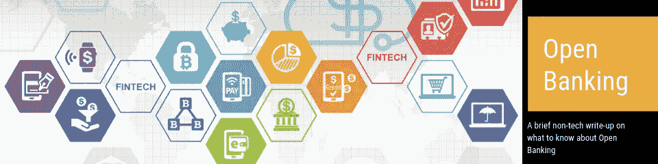
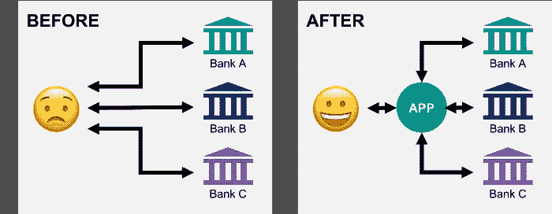

# 开放式银行——作为账户持有人，你应该知道什么？

> 原文：<https://medium.datadriveninvestor.com/open-banking-what-should-you-know-as-an-account-holder-d194a4459121?source=collection_archive---------27----------------------->

“开放银行业”，也许你听说过这个术语，在谷歌上搜索后来到了这里。开放银行业是一个越来越受欢迎的流行语，你应该知道，因为它更多的是关于普通大众，而不是银行家。在不久的将来，它将改变你的日常银行业务(事实上，在一些国家已经这样做了)。想象一下，从你的智能手表付款，或者你的自动驾驶汽车在当地服务站获得预定服务后自己付账(并在回家的路上给你买零食……；)酷！).听起来太好了？是的，但不是再过 5 年或 10 年。嗯，那是关于未来的。让我们看看今天开放银行业对你有什么好处。

根据定义，开放银行业务是“使用开放 API，使第三方开发者能够围绕金融机构构建应用程序和服务，利用开源技术为账户持有人提供从开放数据到私人数据的更大金融透明度选项”。(看起来太 techy 了？别担心，这很简单。简而言之，开放银行将允许应用开发者(第三方提供商——TPP)在获得你(支付服务用户 apps)的许可后，开发可以访问你的银行账户数据并进行支付的应用。这意味着您不再局限于银行开发的移动应用程序。您可以选择任何支持您的银行的可用应用程序，并从那里管理您的所有账户，甚至从单个应用程序中了解您的财务状况。有了开放式银行，你甚至不需要再去银行了(除非你真的对银行感兴趣！)

How open banking is making your life easier

让我们来解决困扰你的下一个问题。“我的数据在开放式银行安全吗？”答案是肯定的，只要你使用授权的第三方提供商，并观看你同意的内容。以前，如果你与任何第三方分享了你的账户数据，银行可以让你承担欺诈的责任。但是，随着促进开放银行业务的新法规的出台，银行必须允许你与授权的第三方共享你的数据。因此，如果发生任何不好的事情(最糟糕的情况是你醒来时账户余额为 0 美元)，银行和第三方提供商将不得不自己解决问题，你将获得退款。因此，我们可以说，只要你注意自己在做什么，你就没有什么可害怕开放银行业的。

你可能想知道，为什么第三方应用程序开发者会费心为银行开发应用程序。嗯，他们这样做是为了让他们的应用程序受欢迎，并获得财务优势。(或者为了更大的利益，如果你是一个社会主义者..)这意味着竞争。应用程序开发者将相互竞争，为你提供最好的银行应用程序，包括你能想到的与银行相关的所有设施。因此，除了查看您的帐户详细信息和进行支付，还会有一些奇特的设施来分析您的购买模式，进行预定的支付，帮助您控制您的支出，每周支出报告，统计图表，以及您能想到的任何东西。开放银行业旨在推动创新。它将以我们目前还不知道的方式改变银行业。随着开放银行业务，银行业务将被未来几代人视为后台服务，就像我们今天看到的电力一样。你知道它就在那里，它让你的生活变得更容易，它是让事情运转的必要条件，但是你几乎没有注意到它。

嗯，这些是作为账户持有人你需要知道的关于开放式银行的基本知识。在本文的第二部分，让我们从更技术性的角度来看开放银行。