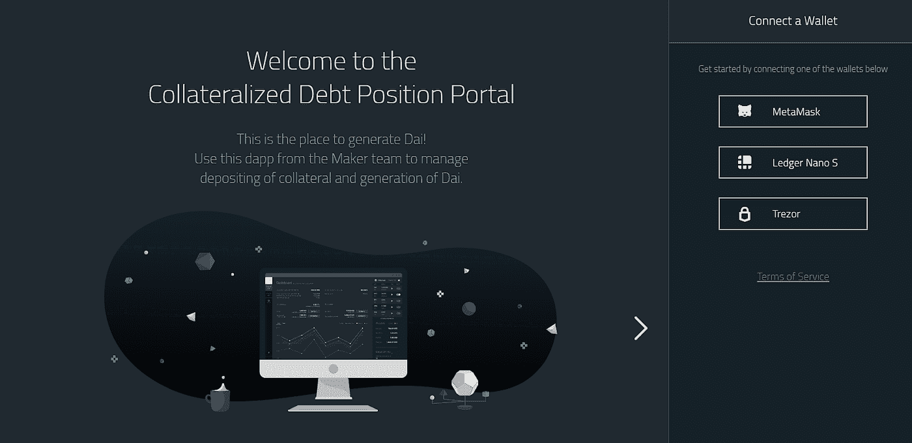
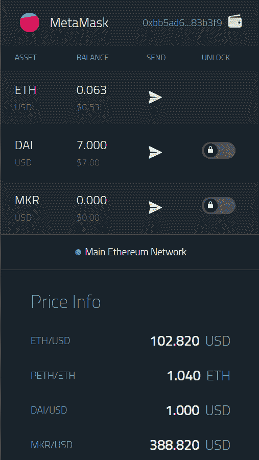
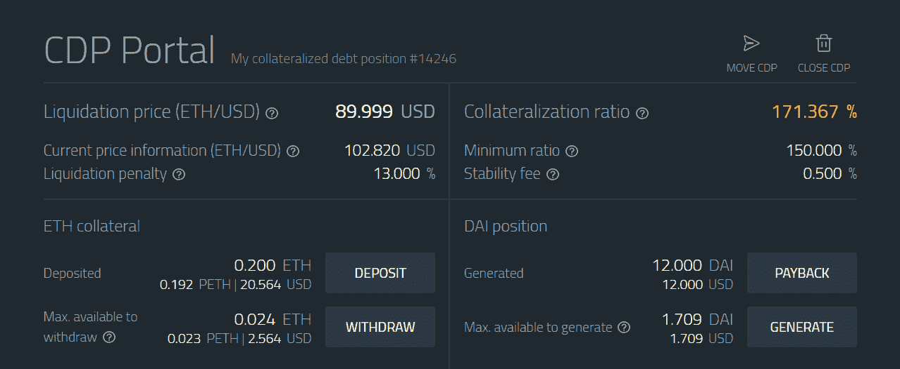
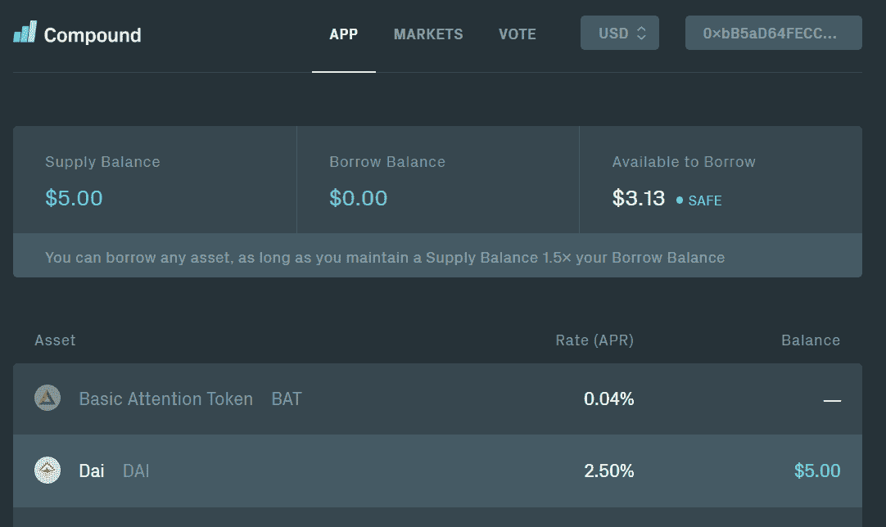
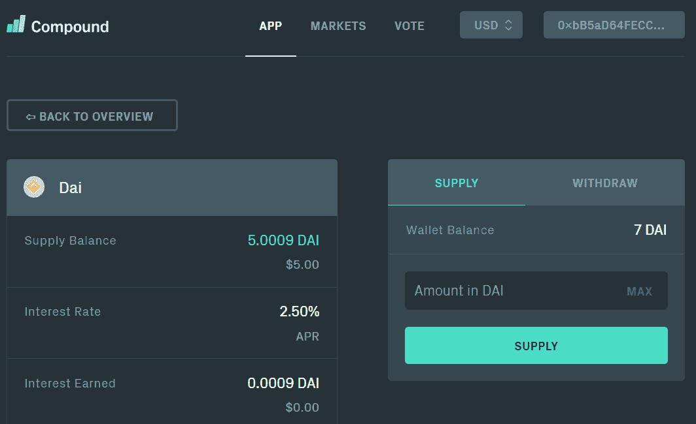
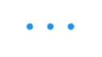

# 开放金融:使用 MakerDAO 和 Compound 的简单指南

> 原文：<https://medium.datadriveninvestor.com/open-finance-a-simple-guide-to-using-makerdao-and-compound-dafd4c0c30f0?source=collection_archive---------1----------------------->

[*MakerDAO*](https://makerdao.com/en/) *和*[*Compound*](https://compound.finance/)*是两种新兴的加密服务，有可能成为开放金融系统的关键基础设施。MakerDAO 系统提供了一种抵押加密货币，或称“稳定货币”，即 DAI。复合是算法和有效货币市场的协议。这两个系统都是开源的，构建在以太坊之上。这篇文章是一个实用的指南，告诉你如何开始开放金融系统或“分散金融”的第一次应用。此外，您将了解这些系统如何相互受益，并理解一个有财务动机的实体如何从这些服务中受益。*

# 马克道与戴马刀简介

戴稳定币是一种加密抵押货币，与美元软挂钩，汇率为 1:1。DAI 与其他已知的 stablecoins(如 Tether 和 USDC)之间的区别在于，DAI 是分散的，并且是使用以太坊上的智能合同构建的。

Maker 是一个智能合约平台，它通过一个名为债务抵押头寸(CDPs)的系统来稳定戴。基本上，任何拥有以太网的人都可以生成 DAI，并有效地以 crypto 作为抵押获得低息贷款。未来，MakerDAO 系统将采用多抵押品 DAI，这意味着除 ETH 外，其他加密资产也可以用作抵押品。

这篇文章不会深入解释 MakerDAO 系统背后的细节，但对于任何有兴趣尝试它的人来说，它是一个实用的指南。要了解更多详细信息，我推荐阅读 [MakerDAO 白皮书](https://makerdao.com/en/whitepaper/)及其[中的帖子。](https://medium.com/@MakerDAO)

让我们继续前进！

# 步骤 CDP 门户

让我们前往 https://cdp.makerdao.com/的 CDP 门户网站。我们的目标是产生 DAI，将这个 DAI 转移到复合货币市场，并从我们的 DAI 资产中赚取利息。

最初，门户希望您将钱包连接到系统:

一旦您连接了钱包(并购买和转移 ETH 到钱包)，您就可以继续。对于[元掩码](https://metamask.io/)，CDP 门户中的 UI 将如下所示:

# 第二步:戴一代

一旦你的钱包装满了 ETH，你就可以通过将你的 ETH 作为抵押品来生成 DAI。通过点击“生成”按钮，门户将在后端启动生成过程(发起 DAI 需要在以太坊区块链上完成几个智能合约交易)。

当门户创建 CDP 时，视图将显示关于您的贷款的关键信息:

让我解释一下术语和数字是怎么回事:

*   **平仓价格**:由于您已经有效地利用 ETH 作为抵押品建立了杠杆头寸，因此存在一个贷款将被强制平仓的价格，即“追加保证金”。
*   **清算罚款:**在强制清算的情况下，您将支付您现有抵押品的 13%的费用。该费用根据做市商系统参与者的风险分析进行动态调整，并且随着加密波动性的降低和更稳定的资产被接受为抵押品，该费用在未来可能会降低。
*   **抵押比率**是你的抵押债务比率，告诉你你的杠杆比率。你可以动态地添加更多的抵押品来确保你的贷款，以保持足够高的比率，而不会被强制清算。
*   **最低比率**是当您的抵押比率低于该水平时，您将被强制平仓的比率。
*   **维稳费**是用代币支付的费用，需要和你借的代一起支付才能结清贷款。将来，稳定费可以通过使用 DEX 协议以不同的代币支付(后台仍需要 MKR)。

恭喜你，你刚刚使用以太坊智能合约将阿呆贷款从开放的金融协议中移除！接下来，让我们更加理性地为我们的戴寻找一个收益率高于借贷成本的地方，这与其稳定费相同，目前的年利率为 0.5%。

需要强调的是，在实施多抵押品 DAI 后，Maker 平台将包括 [DAI 储蓄率(DSR)](https://medium.com/makerdao/dai-reward-rate-earn-a-reward-from-holding-dai-10a07f52f3cf) 功能。但是，与此同时，让我们现在就找一个有利可图的地方来存放我们的戴。

# 第三步:进入复合——有效货币市场的协议

复合是一个分散的流动性池，使您能够通过向市场提供加密资产来赚取利息。

当你进入[https://compound.finance/](https://compound.finance/)并将你的以太坊钱包与平台整合后，你的 UI 看起来会类似于这个:

当您单击 DAI 时，您将看到 DAI 的供给和需求的利率:

如你所见，供给利率高达 2.22% APR(撰写本文时)，远高于你在 MakerDAO 平台上借你的 DAI 所支付的 0.5% APR 的稳定费。活期(借款)利率的复利为 8.59%。

你可能想知道这怎么可能，为什么不是每个人都套利。

利率的差异可以解释为你承担了 ETH 波动性和 MakerDAO 协议的风险。从 Compound 的货币市场*借入 DAI 的人不一定必须只使用(或根本不使用)乙醚*作为抵押品，因此可以有更多样化的风险敞口。此外，利率可以从整体上反映对协议的信任度。

没有无风险回报这回事。这种策略目前为任何 ETH 持有人创造收入的原因是，有人希望借入 DAI，但他们不愿意将 ETH 作为唯一的抵押品。

在你对你的 DAI 产生了一些兴趣之后，这里有一张用户界面的图片:

# 结论

MakerDAO 和 Compound 协议代表了已经被称为“开放金融”或“分散金融”的第一个实际使用案例。如果您成功地遵循了这篇文章，并最终与您的 DAI 进行了复合，那么您就做了一件在 crypto 出现之前的历史上从未有过的事情:从协议中取出一笔美元稳定贷款，而无需信任任何中央实体来协调这一过程。为了获利，你把戴借给了另一个人，这个人不想只持有瑞士法郎，但仍想获得与美元挂钩的稳定货币。

这是任何以太网持有者的一种策略，利用建立在以太坊区块链之上的协议，以一种不可信的方式从他们的持有中赚取利息(但不是无风险的)。在未来，随着多抵押品 DAI 的实施，人们可以通过直接利用 MakerDAO-native 利用更多样化的加密资产投资组合来赚取利息。

期待这些协议成为去中心化和开放金融的一滴雨滴。

我希望这篇文章对你有用——我们生活在激动人心的时代。

请将此分享给你所有的媒体朋友，并点击下面的♥按钮。乐意接受反馈并进行更多讨论。你可以在推特@teemulau 找到我。