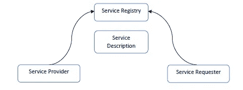
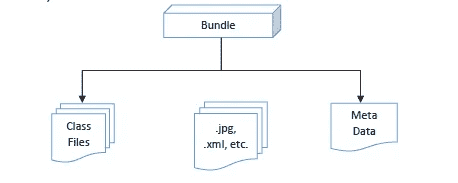
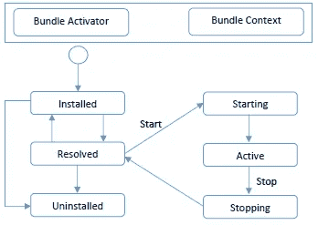

# 开放服务网关倡议(OSGi)框架——一个服务平台

> 原文：<https://medium.datadriveninvestor.com/open-service-gateway-initiative-osgi-framework-a-service-platform-768834be030f?source=collection_archive---------2----------------------->

我想在这篇文章中回归到一个普遍的，然而流行的理论阐释。这篇文章将浏览 OSGi 框架及其基本布局。

OSGi(Open Service Gateway initiative)框架提供了一个动态的模块化架构，已经在很多应用程序中使用，如 Eclipse Equinox、Apache Felix 等。考虑 OSGi 框架的后端功能有助于开发 Eclipse 插件和类似的原子程序。

 [## 2019 年最值得学习的编码语言——数据驱动的投资者

### 在我读大学的那几年，我跳过了很多次夜游去学习 Java，希望有一天它能帮助我在…

www.datadriveninvestor.com](https://www.datadriveninvestor.com/2019/02/21/best-coding-languages-to-learn-in-2019/) 

OSGi 框架体系结构包括 3 个理论层。每一层都依赖于它下面的层。

1.  服务层
2.  模块层
3.  生命周期层

## 服务层

这是满足来自作为请求者的客户机的服务请求的层。服务请求者/客户将向服务提供者请求服务，如果服务可用，服务提供者将发布服务。

这类似于 web 服务中广泛使用的面向服务的体系结构(SOA ),并以类似的方式发挥作用。

The Service layer’s typical architecture

## 模块层

这一层阐明了被称为束的概述或概念化。这个包是一个 JAR 文件，包含关于项目组件的元数据。类文件和相关资产如图像和 XML 文件封装在模块层中。

manifest.mf 是模块层中的元数据文件，它规定了哪些文件被设置为对外部环境可见、该包所依赖的外部包等等。

The module layer’s typical architecture

## 生命周期层

生命周期层定义了如何在 OSGi 框架中动态安装和控制软件包。它为捆绑包访问基础 OSGi 框架铺平了道路。

这一层也是应用程序编程接口。

The lifecycle layer’s typical architecture