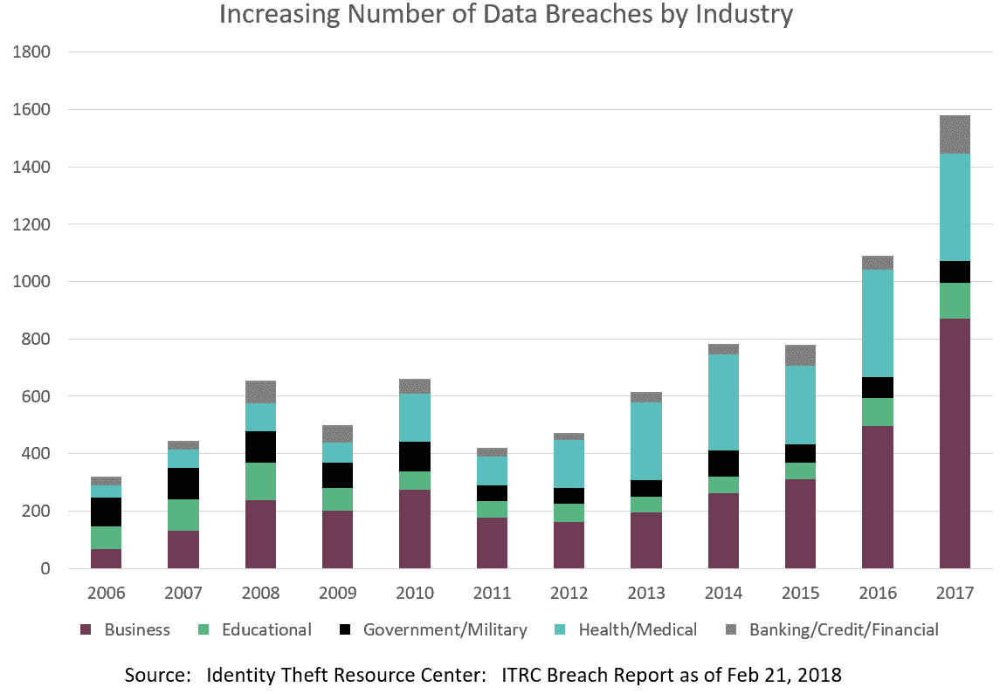

# 开源安全与“一刀切”的运行时环境

> 原文：<https://medium.datadriveninvestor.com/open-source-security-vs-one-size-fits-all-runtime-environments-fb921a818dfa?source=collection_archive---------13----------------------->

当使用开源语言开发时，最简单、最快速的解决方案是获取你能找到的任何有信誉的打包运行时环境，其中运行时环境被定义为语言本身+流行的第三方包+解释器(如果需要的话)。这样，您可以避免:

*   评估哪些第三方库可以信任
*   从头开始编译库
*   解决所有依赖关系

例如，在 Python 世界中，您可能会下载 Anaconda 或 ActiveState 的 Python，ActivePython，这两者都附带了数百个预编译和预验证的流行 Python 包。当然，对于任何一个项目来说，你可能最终会使用不到一半的包含包。然而，与为每个项目构建和维护多个运行时相比，臃肿的运行时代价要小得多。

或者是？

# 安全性和合规性随着时间的推移而下降

Synopsys 的最新报告 [2018 开源安全和风险分析](https://www.synopsys.com/content/dam/synopsys/sig-assets/reports/2018-ossra.pdf)显示了大型运行时环境可能导致的风险类型，包括膨胀、大型攻击面和缺乏许可证治理。有关更多详细信息，请参见下面的图 1。

图 1:“一刀切”运行时环境的后果

上图中详细描述的问题对任何人来说都不是(或者至少不应该是)新闻。每年都有数据证明，针对越来越多的第三方库，报告的开源漏洞数量不断增加。如图 2 所示，违规数量也在增加。

图 2:按行业划分的数据泄露

但是，即使面对图 1 和图 2 所示的压倒性证据，我们仍然继续在我们的软件开发过程中做同样的事情，我们总是希望事情会(以某种方式)变得更好。

例如，企业中充斥着为自动化业务工作流而创建的应用程序。一旦部署，这些应用程序很少更新，因为它们很少产生收入，因此更新它们的商业案例很少。因此，随着时间的推移，内部应用程序的安全性很容易下降。[问问 Equifax](https://www.cnet.com/news/equifax-ceo-data-breach-heres-what-went-wrong/) 就知道了。

即使是定期更新的应用程序，在任何开发冲刺中，安全更新也必须与新功能和错误修复争夺宝贵的速度点。因此，安全任务通常会被降低优先级，并被推到下一个冲刺阶段，在那里它们不得不再次争夺速度点。事实上，[最近的一项研究](https://snyk.io/opensourcesecurity-2019/)显示，从漏洞被发现到被修复的平均时间超过 2 年。为什么？想法大概是这样的:

> *我*可能*被黑，但我*会*损失收入。*

# “最佳实践”可能不再符合我们的最佳利益

我们明白了。毕竟，在 ActiveState，我们也是软件开发人员。我们非常熟悉创建和维护多个运行时环境的工作量(这是我们的工作)。我们还从我们的许多客户那里听说，每当他们想要对他们现有的运行时环境进行更改时(更不用说创建一个新的了)，律师需要参与审查开源许可证，从而推迟了上市时间。

换句话说，我们的运行时最佳实践基于这样一个事实:为每个项目创建定制的运行时，除了少数几个最大的企业之外，成本太高，更不用说为以下项目定制的运行时了:

*   开发——包括开发人员想尝试但永远不会发布的所有包。
*   测试——包括所有的功能和集成测试实例(其中运行时需要包括所有的测试工具),加上所有的安全性和性能测试实例(其中运行时应该只突出那些被部署到生产环境中的包)。
*   生产—应该包含支持应用程序的最小运行时环境，以最大限度地减少潜在的攻击面。

这种“为每个环境定制运行时”的策略成本太高，甚至无法考虑。

*直到现在。*

# ActiveState 平台最小化运行时管理

我们设计了 ActiveState 平台，使任何人——不仅仅是构建工程师——都能够在任何平台上为任何项目自动创建开源运行时环境。只是:

*   选择一种语言(比如 Python 或 Perl)和一个版本
*   选择要部署的平台(例如 Linux，Windows 和 Mac 支持待定)
*   选择您想要包含的第三方软件包

当您等待时，ActiveState 平台会自动获取所有依赖项，解析它们，并为您构建运行时环境。换句话说，一个人，在大约一个小时内，就可以为他们的项目将要部署到的每个环境——开发、测试和生产——创建运行时。同样的任务可能需要一个专门的构建工程师团队数周才能完成。

更重要的是，当发现漏洞和发布新的包时，ActiveState 平台将自动更新您的运行时环境，从而减少您的工作量，只需根据您的自动化 CI/CD 链进行验证。

[了解有关 ActiveState 平台](https://www.activestate.com/products/platform/)如何帮助您的更多信息:

*   消除创建、维护和更新多个运行时的开销
*   减少生产中应用程序的攻击面
*   发货前识别许可证冲突

ActiveState 平台现在处于公开测试阶段，等待您的输入。立即创建一个免费帐户。

[创建免费账户](https://platform.activestate.com/create-account)