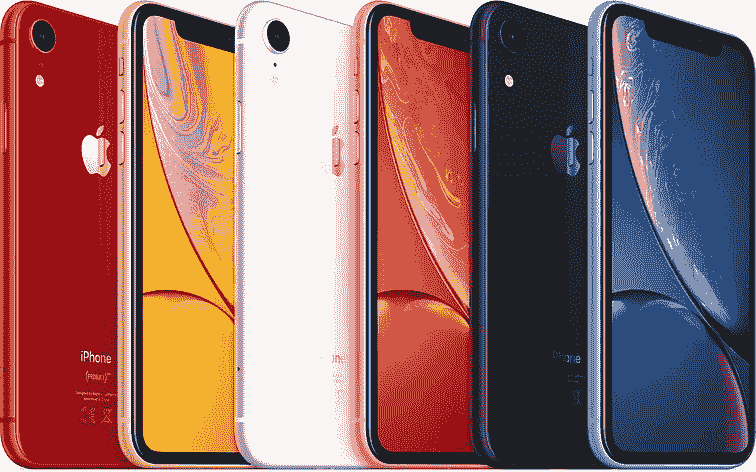
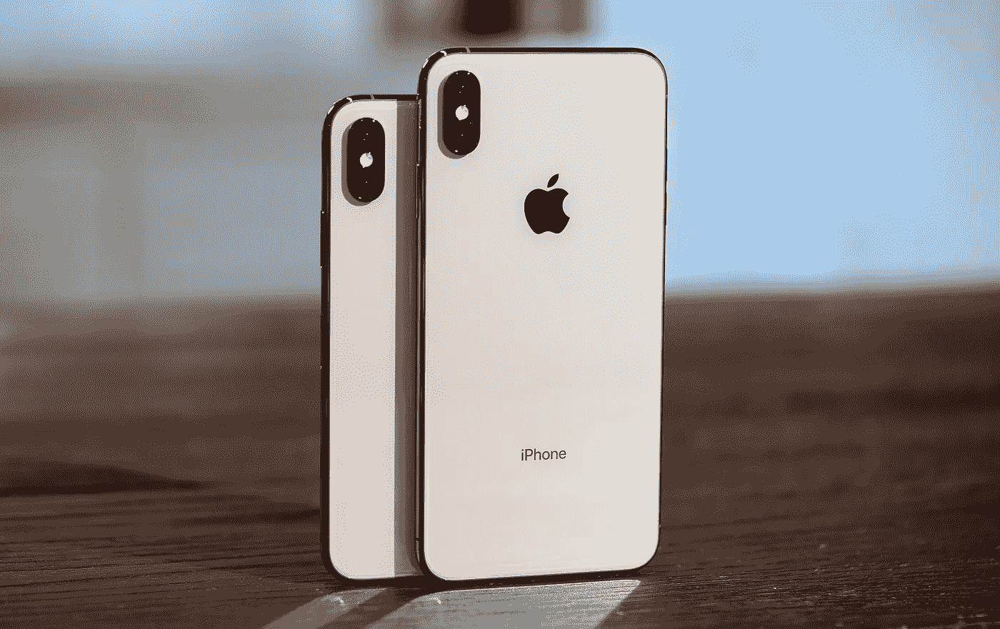

# 观点:2018 年该拿哪款 Iphone？

> 原文：<https://medium.datadriveninvestor.com/opinion-which-iphone-should-i-get-in-2018-ec9c8a1165a3?source=collection_archive---------57----------------------->

又到了一年一度苹果发布新 Iphone 的时候了。我们都已经习惯了，我们都知道年复一年，新的 Iphone 会再次上市。去年对苹果来说是重要的一年，因为他们推出了 Iphone X，与之前的 Iphone 相比，采用了大胆的新设计。上一次我们看到如此彻底的设计变化是在 Iphone 6 上市的那一年。

今年的 Iphone(或 Iphone)在设计上并没有如此彻底的变化，但我认为对于那些希望跳到苹果生态系统的人来说，这是一个好的一年。为什么？因为今年苹果推出了三款可以迎合任何买家的新 Iphones。

因此，如果你在问自己，你应该买哪部 Iphone，这真的取决于你在寻找什么，以及你的预算是多少。让我们来分解一下:

# 首次预算购买者

如果这是你第一次买 Iphone，并且你还想省钱，我建议你买 Iphone XR。Iphone XR 是苹果的“预算友好型”Iphone，老实说，对于任何希望加入苹果生态系统但负担不起其他型号高昂价格的人来说，这是一个不错的选择。

Iphone XR 与其他高端 Iphone 一样好，比 Iphone XS 便宜近 250 美元(约 13500 Php ),比 Iphone XS Max 便宜 300 美元(16000 Php)。这是为一部 Iphone 省下的一大笔钱，这部 Iphone 本质上会给你和其他两部 Iphone 一样的体验。

Photo taken from Apple.com

这不是苹果第一次生产更经济的智能手机，因为他们之前发布过 Iphone 5C 和 Iphone SE。Iphone 5C 和 Iphone SE 的唯一问题是，你知道它们真的永远无法与当时推出的当前 Iphone 的设计相媲美。Iphone 5C 只是看起来廉价而有趣，而 Iphone SE 在与 Iphone 7 和 7 Plus 一起推出时使用了 Iphone 5 的机身设计。

Iphone XR 改变了这一点。是的，它看起来仍然不同于 Iphone XS 和 XS 马克斯，但它本质上是完全相同的手机内部和几乎完全相同的机身设计。唯一值得注意的区别是单摄像头布局，以及 Iphone XR 有不同的颜色(这实际上不是一件坏事，取决于你喜欢什么)。这里唯一明显的区别是屏幕使用 LCD 而不是有机发光二极管(很可能是为了省钱)，但对于普通用户来说，LCD 屏幕和有机发光二极管的区别并不明显，除非你真的吹毛求疵。

因此，如果你是第一次购买 Iphone，或者你想升级到新一代手机，但不想花太多钱，Iphone XR 是一个不错的选择，基本上可以给你相同的体验。

# 球员或苹果爱好者

现在，如果预算对你来说不是问题，你真的想要最好的，那么就去买最新的 Iphone XS 或 Iphone XS Max。对于这一类别，这实际上可以归结为偏好，因为除了屏幕尺寸和 Iphone XS Max 的电池更大(使用时间大约多 1 小时)之外，二者本质上是相同的，但其他功能本质上是相同的。

Photo from Endgadget

在选择购买哪一款时，我认为对于今年购买 Iphone 的人来说，Iphone XS 已经是完美的了。我不会购买 Iphone XS Max，我只会把额外的钱花在获得更多存储空间上，因为 Iphone 没有可扩展的存储空间，基本型号的 64Gb 可以很快被应用程序和其他文件填满。大小和电池的差异并不是一个值得额外支付 100 美元升级的巨大卖点。毕竟，额外的屏幕尺寸可能是弊大于利，尤其是如果你的手很小的话(没有人想处理破碎的 Iphone)。额外的电池大小，虽然看起来值得升级，但我相信大多数阅读本文的人都已经有了一个随身携带的电源，随着处理器变得越来越高效，更大的电池并不会真正影响手机的整体使用。

总的来说，这真的归结为买家:如果你有现金，那么无论如何，买一部能让你开心的 Iphone。无论你买什么样的 Iphone，我相信你都会对你将获得的体验感到满意。