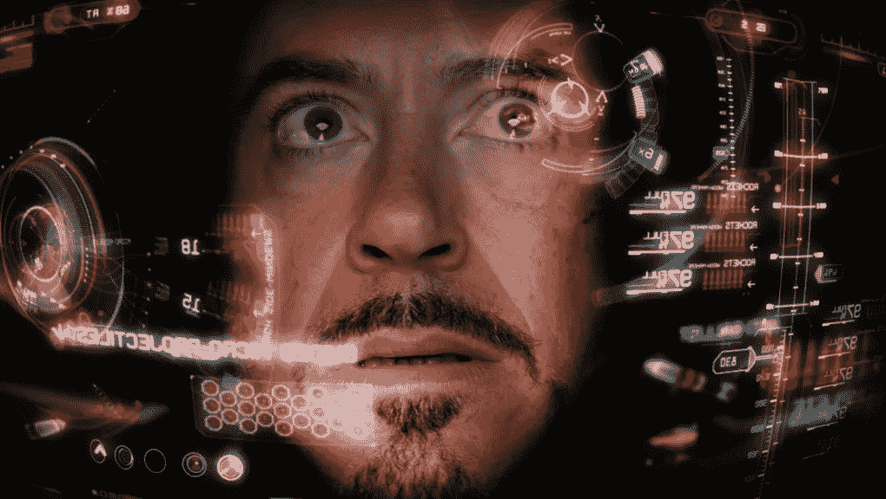

# 对技术未来的乐观态度

> 原文：<https://medium.datadriveninvestor.com/optimism-on-the-future-of-technology-a84042d34163?source=collection_archive---------27----------------------->

电影中围绕科技的疯狂想法实际上正在变成现实。老实说，这非常令人兴奋，并让我对未来充满乐观，因为这会让我们的生活变得更轻松，并提高创造力。我一直对技术很痴迷，甚至有时候会依赖它。关键是适度使用它，但是随着科技的进步，我们可能会极度依赖它。然而，让我们不要害怕，相反，让我们适应并拥抱未来！

**人工智能**已经成为新技术浪潮中我最喜欢的部分之一。自从我买了我的 AI Alexa Echo，我就可以在处理日常任务的同时，通过语音设置闹钟，播放我喜欢的歌曲，接收即时新闻简报。如果我对某个特定的话题有一点疑惑，我会问 Alexa:“Alexa，从芝加哥开车到西雅图要多长时间？”她会回答，“从芝加哥开车到西雅图大约需要一天六个小时”。多么节省时间啊！

**就技术进步而言，无人驾驶汽车**肯定是最节省时间的汽车之一。这是很不真实的，我们过去不相信出租车能安全地把我们送到目的地，现在我们相信一个技术系统能完全安全地把我们从一个地方送到另一个地方。令人惊讶的是，这辆车能够在很少或没有人类输入的情况下理解它的整个环境。非常好。现在，我不会完全信任自动驾驶汽车，因为仍然存在缺陷。然而，在我尝试之前，我会给这些车 5 年的时间。

虚拟现实已经成为最能改变生活的体验之一，我们即将把它变成一件平常的事情。如果我们认为孩子们在 fortnite 上一玩就是几个小时，那么我们就享受到了巨大的乐趣，因为 VR 将让孩子们和成年人在室内呆上好几天。他们能够在自己舒适的客厅里体验真实的生活！看到质量如此之高的清晰度以及音频准确性真是太疯狂了。我非常相信虚拟现实会成为我们日常生活的一部分，比如开会、面试和打电话。

*技术在进步，发展很快。这些年来，任何人都不会停止这项技术的发展。让我们张开双臂欢迎技术，并利用即将到来的技术充分利用这些令人惊叹的岁月！*