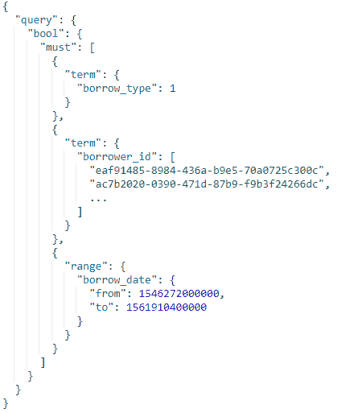
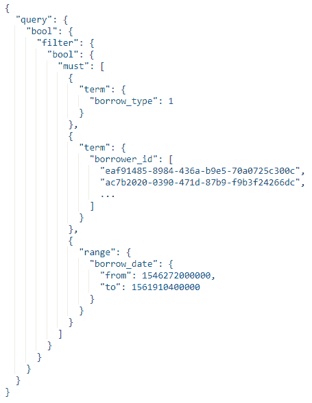
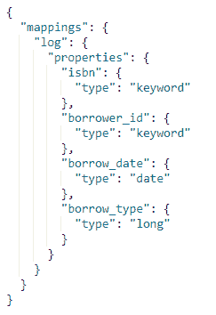
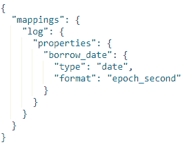
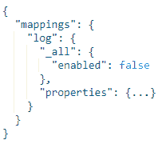

# 优化我们的弹性搜索查询

> 原文：<https://medium.datadriveninvestor.com/optimizing-our-elasticsearch-queries-f09fa4b4e5ec?source=collection_archive---------4----------------------->

达米安·法德里

我们的查询越来越慢。随着大数据源源不断地进入我们的# **Elasticsearch** 服务器，我们的实例似乎正在达到顶峰。我们之前已经为可伸缩的设置应用了[必要的调整，但是查询花费的时间太长，有时甚至会超时。](https://medium.com/datadriveninvestor/making-elasticsearch-indices-manageable-d49ac113a6be)

为了解决这个问题，我们从确定问题的根源开始，最后加快我们的搜索速度。

 [## 模式和机器人:复杂的现实|数据驱动的投资者

### 哈耶克的名著《复杂现象理论》(哈耶克，1964)深入探讨了复杂性的话题，并断言…

www.datadriveninvestor.com](https://www.datadriveninvestor.com/2019/03/04/patterns-and-robotics-a-complex-reality/) 

## **快速排练**

我们的查询片段如下所示:

在这个简单的查询中，我们获得了列出的借款人过去 6 个月的借款记录。很基本的东西。只是，当查询超过数千万条记录时，它的速度开始变慢。

## **得分开销**

在挖掘了论坛之后，我们发现 Elasticsearch 在我们的查询旁边运行一个评分算法。它将分数与我们的搜索结果关联起来。也就是说，除了获取哪些记录与我们的搜索参数匹配之外，它还会对每一条记录进行评分。

现在，这对于数千的数据来说似乎无害，但是对于非常大的数据集来说，开销会变得很明显。

那我们该怎么办？我们简单地切换到非评分查询，也称为过滤器。

它们与我们的查询做同样的事情，只是它们不对结果进行评分。

首先，我们用一个`**filter**`子句包装现有的查询，如下所示:

请注意，我们删除了这个函数，因为我们的查询不需要评分方面。我们只需要过滤掉匹配的记录，提高搜索的性能。不过，对你来说可能不是这样。因此，只有在你不会很快利用分数的情况下，才进行调整。

## **进一步优化**

配置我们的索引还需要做更多的工作。

下面是我们的数据映射图像:

整个事情被削减了一点，但这些是必不可少的部分。如您所见，我们得到了 ID 字段和日期字段。现在，这里需要指出几件事。

## **切换到 epoch_second**

首先，默认情况下， **Elasticsearch** 中的日期以毫秒为单位存储在内部。我们的约会不需要那么精确。我们只需要知道一本书是哪一天被借走的，在这种情况下，存储精确到毫秒的日期是多余的。

我们找到的一个解决方案是将日期格式显式设置为`**epoch_second**`，如下图所示:

有了这个，日期将会以秒而不是毫秒来存储。这个变化看起来可能不多，但在 Elasticsearch 执行的缓存中帮助很大。

## **禁用 _ 全部**

当您向索引中插入一个名为`**_all**`的数据时，Elasticsearch 还会生成一个隐藏字段。该值与附加在一起的文档中的所有数据相关。当您不知道字段值属于哪一类时，这主要用于通配符搜索。

这带来了另一个问题，因为它也消耗资源。如果你的记录非常复杂，这个字段会变得很长。由于字段也会被缓存，这可能会影响查询的性能。在这种情况下，禁用它将是一个更好的选择。

禁用`**_all**`字段就像在映射中添加一个子句一样简单，如下所示:

这些只是优化弹性搜索查询的一些简单方法。请记住，您需要重新索引您的数据，以应用这些映射更改。为了安全起见，在尝试更改之前，请务必备份您的数据。

**立即获得免费的#RPA 工具！参观**: [https://www.raxsuite.com/freedownload](https://www.raxsuite.com/freedownload)

**通过我们的社交媒体账户了解我们:**

https://www.facebook.com/RAXAutomationSuite/
[脸书](https://www.facebook.com/RAXAutomationSuite/\)

推特
[https://twitter.com/raxsuite](https://twitter.com/raxsuite)

领英
[https://www.linkedin.com/company/raxsuite/](https://www.linkedin.com/company/raxsuite/)