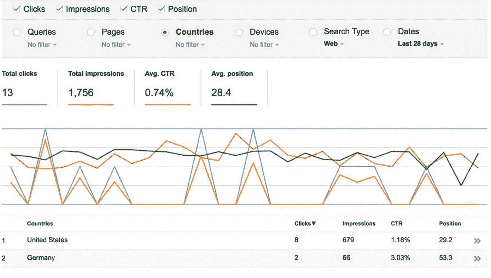

# 为有机搜索引擎流量优化网站

> 原文：<https://medium.datadriveninvestor.com/optimizing-websites-for-organic-search-engine-traffic-flow-75607cb545d3?source=collection_archive---------26----------------------->

Photo : Credit Screenshots on Google Webmaster Tool for Search Engine Data Analytics

任何网站的成功都在于用户如何在正确的时刻找到它。用户使用像 Bing 和 Google 这样的搜索引擎来找到他们想要的东西。企业可以付费并保持在顶级位置，但这需要付费广告。带来流量的另一种方法是通过搜索引擎的查询。

这里有 5 个关于如何确保你的网站有机搜索流量的质量份额的提示

# 1.了解搜索引擎的业务功能

首先你必须了解搜索引擎如何为访问者提供最相关的搜索结果。搜索引擎会考虑很多指标。例如，日期时间就是其中之一。想象一下，如果你搜索热门电影，2014 年的热门电影出现在最初的几个链接中。不好吧。它必须是日期和时间以及你所在的位置。因此，请记住搜索在设计网站时考虑的基本指标——时间、相关性、内容、推荐、他人的认可、领先组织的认可。

# 2.提供优质内容

用对访问你网站的访问者来说真正有意义的高质量内容来装饰你的网站。搜索机器人做的第一件事是读取你网站的文本内容，制作一个关键词地图，并计算它们在网站中出现的次数。因此，如果你是一个优惠券，销售和交易网站，像 Goynaa.com，销售，优惠券，交易等词的计数将确保机器人在搜索者寻找交易，优惠券和销售项目时，它是相关的网站。因此，这取决于网站向机器人发出信号，表明该网站是关于什么的，并创建针对其主要商业目的的优质内容。谷歌刚起步的时候买了很多高质量的博客和网络内容。因此，每当有人搜索时，谷歌自己购买的内容的前几个链接与搜索极其相关。这让用户非常高兴，谷歌证明了自己是一站式搜索引擎。喜欢点击链接并在链接后寻找他们需要的正确内容的人。3 .将时间视为保持相关性的一个因素。

# 3.定期发布

如果一个网站是新的，大约需要三个月才能在搜索引擎中找到。这是一个下降的时间，成为搜索引擎的眼睛。但是，一旦你被索引，被发现，变得相关，网站需要继续和保持相关。发布新内容，保持业务运营。不幸的是，除了保持现状和保持有意义，没有其他选择。

# 4.分析搜索引擎指标

谷歌和 T2【必应都为他们在你的网站上记录的目标提供了深入的视觉数据分析。他们就如何改进网站提供工具和建议。利用这些宝贵的数据可视化和分析工具。网站什么时候获得流量，哪个国家，哪个城市，他们在哪里下车，他们在网站上花了多少分钟，他们在哪里登陆，哪个是网站的主要流量来源——社交，推荐，有机，付费。研究、分析并努力改进。

# 5.分析有机搜索查询关键词

一旦你手里有了这些关键词，就要好好珍惜。这些词可以让你一窥访问者在搜索引擎中寻找的是什么词，你的网站在什么位置给什么词留下了印象。不是所有的单词对你的网站都有意义，但是有意义的单词，你能做些什么来提高你的网站的相关性。检查点击率的多少点击链接被点击从链接搜索引擎显示从您的网站。

# 结论

并不是每个人都能通过有机搜索而进入顶级榜单。但这是值得的。付费搜索可能是你预算的一部分，这也是搜索引擎赚钱的方式，但请记住这个笑话，“在谷歌搜索结果的第二页，往哪里藏尸体”。Google 和 Bing 要对他们的客户保持承诺，就必须给他们的客户带来公正的搜索结果，唯一可以确定的最佳方式是为用户提供高质量的内容和相关服务，除了提高网站在有机搜索中被索引的机会，没有其他选择。