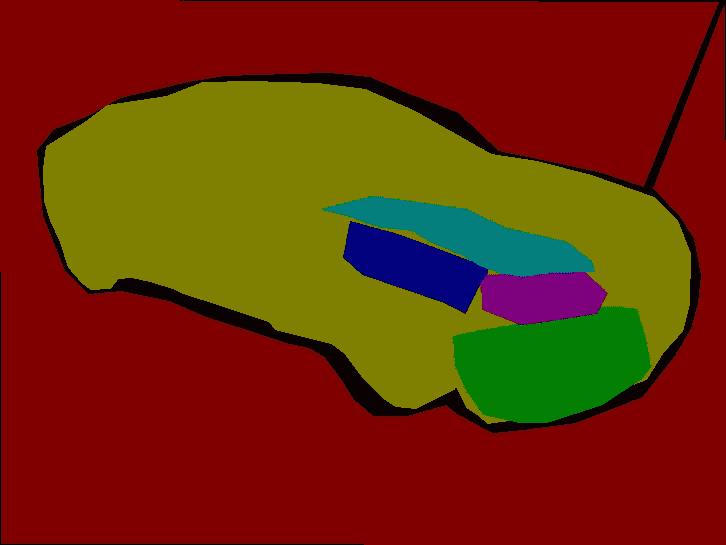
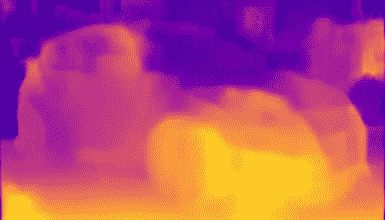

# 优化您的计算机视觉管道——周报

> 原文：<https://medium.datadriveninvestor.com/optimizing-your-computer-vision-pipeline-weekly-paper-d9db9ffb54b0?source=collection_archive---------13----------------------->

Semantic segmentation

随着所用技术的不断创新，计算机视觉正在迅速发展。真实世界的数据很难建模，但视觉算法越来越擅长。我们看到了一个新的趋势，人们将图像处理技术与深度卷积网络结合起来，以产生更好的结果。

**Siggraph 2018 有很多有趣的论文，可以增强计算机视觉算法中现有的管道。**

## 语义软分割

这是一篇有趣的论文，其中深度学习遇到了光谱抠图。抠图是图像处理中最困难的问题之一，因为它涉及到选择和合成不同背景的对象。很少有深度学习技术来解决这一问题，但创建高质量数据的成本非常高。选择和合成图像并将其覆盖在不同的背景上需要数小时，网络试图预测的是 alpha(每像素不透明度)值，该值使合成照片逼真并识别前景和背景之间的边界过渡。利用软分割在具有精确边界像素的图像中自动选择目标是本文试图解决的问题。

**难度**

数据集的创建非常困难，因为选择和合成图像需要数小时，而且准确性取决于编辑人员。

## 光谱抠图

在 2008 年 Levin 提出了通过*拉普拉斯分解图像的特征向量来寻找图像边界的逻辑，并且具有最低特征值的特征向量产生边界过渡。*由于现实世界的图像具有复杂的图像纹理分布，并且存在遮挡，这使得标记对象的边界很困难，因此该技术存在缺陷。这是深度学习之前的时代，因此这种技术可以很好地用于具有单个对象的图像，而不需要太多纹理或材料属性的复杂性。

像 Adobe 这样的图像处理公司已经致力于深度学习项目，以创建一个可以创建对象抠图的神经网络。有一个数据集是手工制作的，但它的使用受到限制，因为它只用于 30k 影像。让我们深入研究替代技术。

在 Siggraph 2018 上，yagiz Aksoy 等人发表了一篇论文。下面是论文链接-> [语义软切分](http://people.inf.ethz.ch/aksoyy/papers/TOG18-sss.pdf)。*它将深度学习技术与光谱抠图结合起来，产生了甚至深度学习模型都无法实现的精确边缘。*我们知道，在语义分割中，我们手工制作地面标签，并且总是有可能出现不属于物体的相邻像素，尤其是人的毛发或毛茸茸的狗的轮廓。2008 年，莱文发现包含最小特征值的特征向量与边界转换相关。

本文建立在这一思想之上。它结合三种信息来产生拉普拉斯矩阵。

**地方色彩亲和**

它建立在最近的相邻像素之间的颜色相似性的概念上。具有相似颜色特征的像素将具有较小的亲和力差异(fp- fs = 0)。而不同的图像像素将具有更宽的间隙。真实世界的纹理很难单独使用这种方法建模，因为对象通常有多种纹理(例如，人的头发颜色与他们的皮肤/身体颜色不同)。附加信息模型将 RGB 表示为每个图层上具有透明度 Alpha 值的像素的加权和。

**非局部超像素**

这也是一种颜色亲和力技术，但是范围是区分因素，而先前的方法聚集相邻像素以形成边界。在许多情况下，对象可以在很大的区域内繁殖，并且在第一个对象的边界内可能有其他对象(遮挡)。基于超像素之间的相似性，引导采样被用于在图像中创建超像素。选择产生图像大小的 20%的半径。要考虑的关键因素是保持拉普拉斯矩阵的稀疏性和鲁棒性。

使用超像素平均颜色上的高斯误差函数来计算两个超像素区域的质心之间的颜色亲和力，并且使用控制参数来发现亲和力退化有多快以及亲和力变为零的阈值。

**语义信息**

全局上下文总是有用的，因为对象具有不同的纹理，因此理解属于同一对象的像素将需要上下文感知的高级特征识别。在语义分割任务中，我们分割对象，深度神经网络学习对象的特征，如形状、颜色、纹理和像素变化。该信息可以帮助导航系统以找到软边界和透明度。*像 deep lab v3 这样的训练模型具有如此多的上下文场景信息，并且它们拥有深度信息(相对的),因为它们在前景和背景之间进行分类。*

更有趣的是它在本文中是如何应用的。**将神经网络中不同阶段的特征图组合在一起。语义分割的目标被修改为识别两个像素是否属于同一类别。损失函数被修改以测量像素之间的 L2 距离。使得同一类别的像素之间的距离最小化，而属于不同类别的像素最大化。来自 deep lab v3 网络的输出通过 PCA 系统发送以降低维数。这里的主要目标是类不可知的，并使用上下文来识别属于对象的像素和不属于对象的像素。**

颜色相似性和语义信息之间的主要区别在于，每个像素包含关于对象形状和纹理的信息，而不仅仅是基于颜色的相似性。

*很少有其他应用程序是从图像识别模型开发的，例如感知引擎，它对 imagenet 训练的模型使用约束优化来生成工业产品的新设计。*

**使用约束稀疏化创建层**

L 从上述三种技术中提取特征向量，形成应用矩阵，并使用两步稀疏化过程来创建层。只是一个提醒，从光谱抠图特征向量与小特征值构成一个边界过渡。在拉普拉斯分解之后，选择具有最小对应特征值的 100 个特征向量。作者没有使用 K-均值来聚类特征向量，而是使用像素的 K-均值聚类来将其减少到包含场景分割和软过渡的 40 层。大多数层是零，并且层最终减少到 5 层，但是这种方法仍然过度地限制了问题。尽管这种方法比普通的光谱遮片技术产生更好的结果。稀疏化的更宽松版本可以提供更准确的结果。

**使用能量方程进行更宽松的稀疏化**

通过使稀疏性适应图像内容的变化，在稀疏性方程上放松了约束。这种方法背后的直觉是部分不透明度来自图像中的颜色过渡，因为在许多情况下它与物体中的过渡相关。尖端的想法是重新聚焦目标。首先，他们通过确保生成的层遵循遮罩稀疏性来放松子空间约束。则放松原始光谱遮片中的和为一的约束。然后，它们在空间上改变稀疏度能量，这意味着当像素的颜色梯度改变时，能量值也改变，这不利于大的颜色梯度。对于 0 到 1 之间的 alpha 值，能量分布是平坦的。这有助于捕捉图像中的软边界过渡。

**什么因素影响图像像素的不透明度？**

相邻物体或背景的复杂纹理，材料属性，如反射率、不透明度、照明、光照变化等。

## 总体目标是这样实现的

像语义分割这样的深度学习模型拥有关于对象及其与背景的关系的高级语义信息。他们理解遮挡、物体几何形状、边界和背景的深度。虽然像局部颜色亲和力或非局部超像素这样的光谱遮片技术缺乏这种信息，但是它们善于理解附近相似的像素。

仍然存在的一个问题是光谱遮片是一项耗时的任务，处理一个 640*480 的空间结构的单幅图像需要大约 2 分 30 秒。宽松的稀疏化需要 30 秒，但当使用 cupy 放置在 GPU 上时，它可以走得更远。

与其他抠图和分割技术(如自然抠图、柔和颜色分割和语义分割)相比，语义软分割提供了平滑的结果，甚至适当地抠图头发。

> 真实世界的复杂性仍然停留在照明、光照变化、分辨率变化、锯齿、反射等方面。场景理解是解决上述复杂性的一种方法。如果你使用生成性对抗网络，它们会学习图像中的大部分复杂性来翻译它，并保持照片的真实性。像对象关系、动作识别、语言语义和深度信息这样的视觉线索提供了更好的场景理解，因此复杂的图像甚至可以产生更好的结果。

**深度图有助于提高语义分割的准确性吗？**

Depth maps from kitti depth prediction model. Monocular Depth Estimation.

O 物体检测和分割主要基于图像特征，因此它克服了现实世界的物理特性，如材料属性、光照变化等。*拥有深度图可以让神经网络更深入地了解物体的形状(如果图像包含噪声、照明、&高反射材料，这些信息会很有用)。*

## 深度学习中的用例

为实例分割和语义分割任务在对象上建立精确的边界。最重要的是自动化数据创建部分。

神经网络学会令人信服地辨别图像中的像素。

## 图像处理中的用例

对于 photoshop 和其他 3d 工作室用户来说，这将是一个很好的插件。这将大大减少使用套索工具选择图像边界的时间。

利用在 COCO、kitti、cityscape 等上训练的现有深度学习模型。大部分都是自然场景。它加快了生产过程。

## 优化您的计算机视觉管道

计算机视觉是基于图像特征和变换的。现在的问题变成了增加什么功能会增加管道的价值？

全局上下文可以为语义分割模型提供大量的空间信息。如果我们不能单独从特征识别物体，我们人类总是使用参考和全局上下文。场景关系或对象之间的关系可以在识别对象及其边界时增加更多的洞察力。它带来了更大的区分能力来区分阶级。

在真实世界的图像中，由于背景变化、光照变化、物体的材料属性——反射&折射、分辨率变化、气候等，会有纹理变化。这些因素阻碍了神经网络区分精确边界的能力。然后归结为有足够的数据来模拟现实世界的微妙之处。很少有技术可以在一定程度上缓解这个问题。GANs(不成对域到域翻译)、域适应和随机化可以增强模型的性能。已经发现，结合低级图像特征和高级语义特征有助于更好的精度。

> 将超分辨率与对象检测一起用作联合优化问题将使网络学习如何表示输入图像，以便神经网络可以产生最佳结果。

下面是论文链接-> [语义软切分](http://people.inf.ethz.ch/aksoyy/papers/TOG18-sss.pdf)。

感谢您通读。本系列的目标是优化计算机视觉管道，使其在现实世界的复杂性面前更加强大。*下一篇文章将介绍 GAN，特别是用于模拟真实世界噪声的数据生成的不成对域转换。*