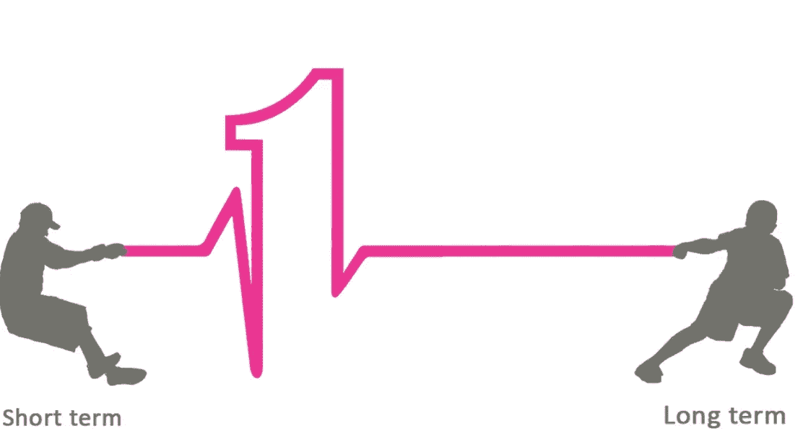

# 企业创新的期权交易

> 原文：<https://medium.datadriveninvestor.com/options-trading-on-firm-innovation-ac8dea36b31b?source=collection_archive---------41----------------------->

什么是选项？如下图，类似于保险。投资者支付溢价(期权价值基于市场报价，或使用 Black Scholes 模型计算)购买看跌期权，这是一种在到期日以特定价格购买标的(股票、玉米蒲式耳、黄金等，你想投资的东西)的权利。看涨期权则相反。通常，投资者会低买高卖。因为它是用来抵消基础价格波动的损失，它保护你不失去一切。

Photo from Internet

那么，期权交易对创新有什么影响呢？活跃交易市场中的期权交易。市场越活跃，期权或股票的价格就越能有效地反映基础商品或公司的价值。专利是一个可以用来替代创新指标的因素。专利越多，公司的创新就越多，尤其是在 R&D 这样的密集型行业。当管理者参与期权交易时，他们需要定期评估未行权期权的有效性。这迫使他们衡量公司的基本价值，而不仅仅是考虑短期因素。当公司在对外交易中面临风险时，公司通过投资利率互换、期权、期货或远期合同进行外汇对冲投资。无论如何，对我来说，这是一个赌注，对未来的赌博。

如果交易不是赊账，而是现金交易，我们还需要对冲风险吗？

Photo from Internet

来源:

金融衍生品的光明面:期权交易和企业创新。作者:伊万·布兰科，大卫·维尔海姆。金融经济学杂志，2017。