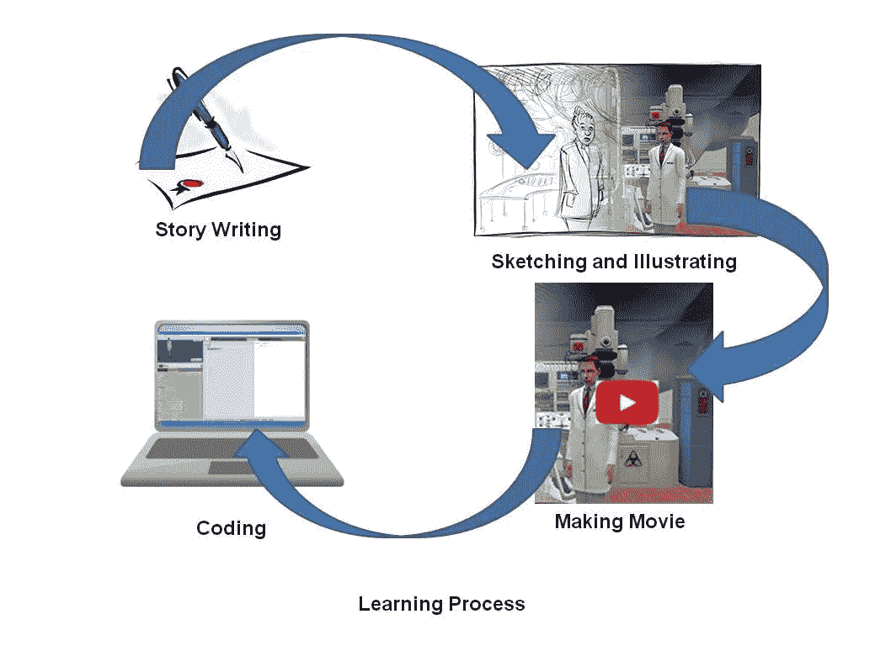
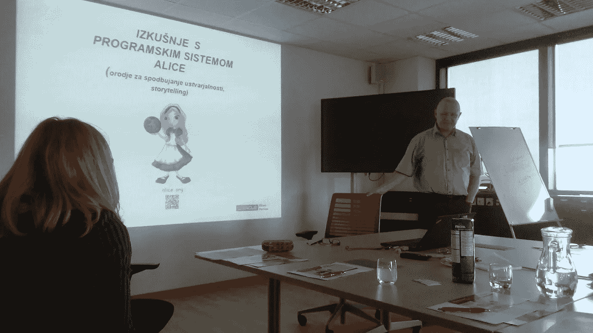
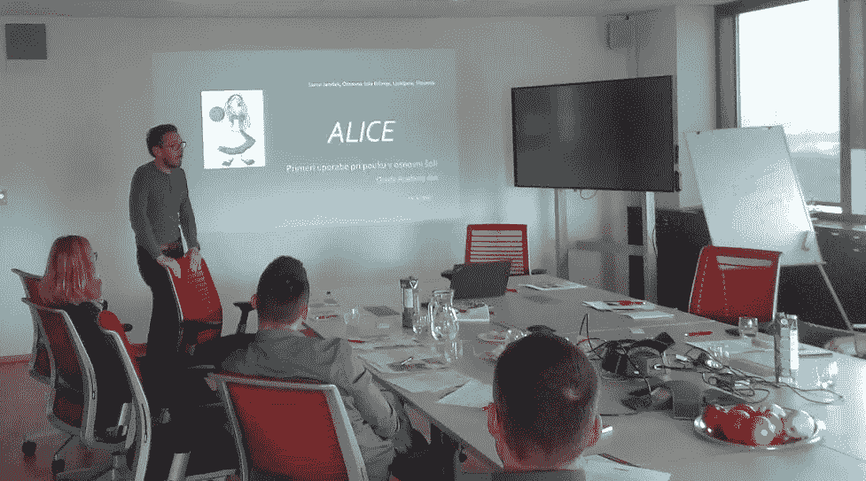

# 甲骨文学院日:爱丽丝是谁？

> 原文：<https://medium.datadriveninvestor.com/oracle-academy-day-who-is-alice-adb9febd8a26?source=collection_archive---------32----------------------->

Picture: Carnegie Mellon

我们所有使用 Oracle 工具的人或多或少都有同样的问题。我们希望软件能尽快卖到数十亿美元，但我们不考虑 10 年或 15 年后谁还会这么做。我知道这样的结论有点太快了，因为 Oracle 可以为合作伙伴提供自己的学校和大学学院。这里的问题是 IT 教育从大龄学生开始，相对较晚。原因很简单。人需要时间去学习。成为理学士通常需要 20 年的学习。之后，学生们有更多的时间来完成 IT 课程。但这并不是结束。课程结束后，需要几年的 IT 经验。我在这里描述了我们未来将要面临的问题[。](http://www.linkedin.com/pulse/avoiding-technological-feudalism-better-education-system-marussig)

我已经意识到，如果我们想教育年轻人，我们必须很早就开始。这意味着不是经过几十年的基础教育，而是在幼儿园。那个年龄的孩子对世界有着完全不同的看法。他们通过视觉来理解和学习，生活在自己的想象中，还不会写作，正在从事研究。他们对技术的使用没有偏见。

这是我们必须开始帮助他们的时候了。我们不能在他们完成幼儿园教育后就停止，而是需要在他们接受小学和中学教育的整个过程中与他们在一起。

如果我们想要所有这些，我们需要教育孩子的老师，以及他们的父母。

为了解决这个问题，卡内基梅隆大学给了我们一个奇妙的免费教育软件，在 3D 环境中教学生计算机编程，叫做 Alice。3D 环境是增加孩子动力和唤起他们快乐的工具。Alice 基于一个教育过程，而不仅仅是学习编码。这个过程从讲故事开始。这意味着孩子们根据他们的想象力创造他们自己的故事。如果已经识字，他们可以在纸上手写和画草图。在这之后，他们使用 Alice 工具，根据他们的草图用 3D 对象创建场景。这是他们的第一个虚拟世界。在爱丽丝中拍摄场景后，他们可以将图片放入他们的故事中。

第二阶段是在爱丽丝虚拟世界中移动物体，添加声音和制作电影。

在这个教育过程的第三阶段，他们开始使用分组代码编程。这个过程需要大一点的孩子。爱丽丝 2 之后，我们从爱丽丝 3 开始，一般在中学。与此同时，学生们将获得一些其他语言和数据库的基础知识。

我的想法是将爱丽丝传播到世界各地，让老师、孩子和学生参与国际合作。我们是联系在一起的，我们可以随时随地交流。那么，为什么我们不在早期学习阶段教会年轻人如何分享知识、技术和思想呢？今天的时代比以往任何时候都更方便。我们在东欧的甲骨文学院日是爱丽丝第一次被介绍给雄心勃勃的老师。

马特加斯·马鲁西格

**参考文献**

一种在 3D 环境中教授学生计算机编程的教育软件。(2017).可用地点:【http://www.alice.org/index.php【2017 年 3 月 22 日访问】。

唐·斯莱特-爱丽丝团队|卡内基梅隆大学。(2014).上市地点:【https://www.youtube.com/watch?v=9WPnPlfmmbY【2017 年 3 月 22 日上市】。

甲骨文学院。(2017).概述。上市时间:[https://academy.oracle.com/en/oa-web-overview.html](http://academy.oracle.com/en/oa-web-overview.html)【2017 年 3 月 22 日上市】。

甲骨文大学。(2017).概述。可在:[http://education . Oracle . com/pls/web _ prod-plq-dad/db _ pages . get page？page _ id = 3](http://education.oracle.com/pls/web_prod-plq-dad/db_pages.getpage?page_id=3)[2017 年 3 月 22 日访问]

原刊[此处](https://www.linkedin.com/pulse/oracle-academy-day-who-alice-matjaz-marussig/)。