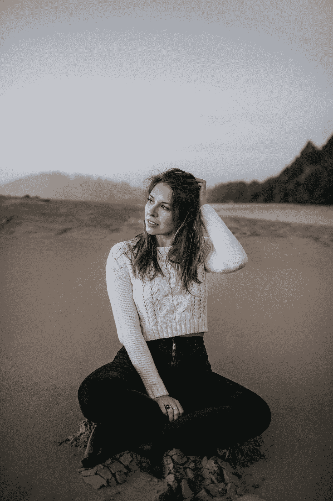

# 创意是无限的

> 原文：<https://medium.datadriveninvestor.com/originality-is-infinite-824e56551262?source=collection_archive---------45----------------------->

Photo by Wiley Putnam Photography [www.wileyputnam.com](http://www.wileyputnam.com)

> 写作是一个非常个人化的过程。随着每一个单词被固定在适当的位置，你的想法、观点和观点就会暴露在世界面前。虽然这是一种解放，但也感觉你的一部分突然存在于你的身体之外，不再受到嘲笑和评判。
> 
> *每个创新者都知道那些极度专注和灵感迸发的时刻。无论你是在写作、商业策划、绘画、雕刻——无论你的手艺如何，当你在创作时，就好像有人把你的大脑从你的身体里抽出来，像茶壶一样倾斜，倒出里面的东西，然后它就在你面前神奇地成形了。创造的过程是有机的，只要你对灵感保持开放，每个人都可以创造出美好的东西。*
> 
> *我最近在社交媒体上看到一个帖子，里面有非常熟悉的词语。我仔细阅读了它们，当我意识到它们是我的时，我的胃一阵绞痛。进一步探究这个人的账户，我发现有几个帖子包含了我的原创文章，这个人声称这些文章是他自己写给成千上万的追随者的。没多久就找到了所有帖子的真正作者，这暴露了整个报道都是抄袭的。*
> 
> 随着对这个问题的进一步了解，人们发现这个人不仅剽窃其他作者的作品，还盗用他人的摄影作品，复制原创作品并倒卖牟利，甚至伪造自己的运动成绩，将他人的成就据为己有。有几十名受害者。
> 
> 你倾注心血的作品被别人夺走，这真是一种令人心痛的感觉。感觉就像你身份中最脆弱的部分被窃取和歪曲。
> 
> *抄袭就是盗窃。虽然这看起来只是一个说明，或者好像复制别人的作品没什么大不了的，但请记住，事情远不止看上去那样简单。让别人欣赏和分享你的工作是令人愉快的，但是在使用别人的话之前，请征得同意，并在适当的地方给予肯定。不管你认为自己有多(不)有才华，我保证如果你用心去做，你也会有一些有趣和美丽的东西可以说和创造。这里有无限的创意。*
> 
> 所有的作家、摄影师、艺术家和创新者，请保持强烈的原创性。我很欣赏你。