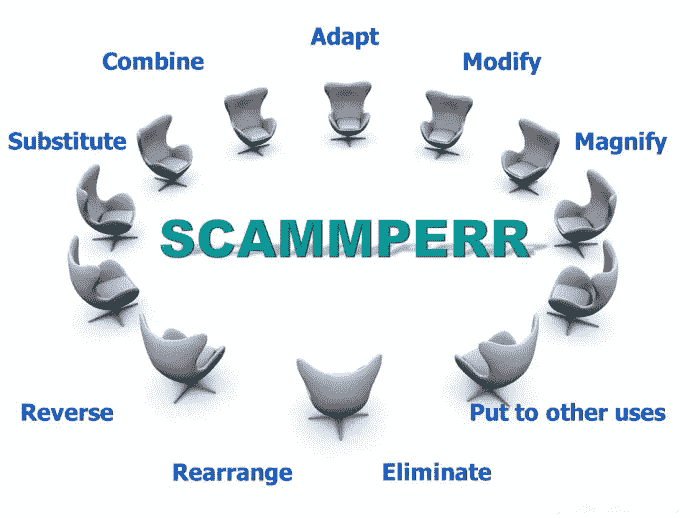

# 奥斯本的清单和头脑风暴

> 原文：<https://medium.datadriveninvestor.com/osborns-checklist-and-brainstorming-5bf1c9667763?source=collection_archive---------1----------------------->

Google search

亚历克斯·f·奥斯本是经典头脑风暴法的创始人。头脑风暴对设计团队来说是一种极好的技术，因为它给团队成员提供了跳出框框思考的自由，并提出了最有效的解决方案。这里的主要好处是团队成员可以探索和改进他们自己的想法，也可以借鉴他们同事的想法。有一个明确的问题并对该主题进行研究是至关重要的。在头脑风暴会议期间，目标是将所有想法放在板上并与小组成员分享，这将在每个人的创造性思维过程中激发他们的想法。此外，在这个环节中被认为是领导者的人必须确保每个人都说出来，因为有时内向的人是有想法的人。另一个重要的方面是确保团队紧扣主题。在头脑风暴中保持相同的观点并只讨论相关的内容是至关重要的。

 [## 成功的生活数据驱动型投资者的 25 种自我提升方式

### “我活得越久，学到的就越多。学的越多，体会的越多，知道的越少。”―米切尔·莱格兰德时间到…

www.datadriveninvestor.com](https://www.datadriveninvestor.com/2019/03/12/25-self-improvement-ways-for-a-successful-life/) 

> 淡化一个疯狂的想法比想出一个新想法容易。
> 
> *-亚历克斯·奥斯本*

他创造的另一个技巧是 Osborn 的列表，这是一个关于想法和问题的简单问题的综合列表，可以在小组中使用，也可以单独使用，以在面临问题时提高创造力和多样性。在使用这种技巧时，重要的是问题要有一个焦点，并在适当的时候使用。这些问题应该有助于探索解决问题的新方法。

奥斯本的清单也被称为 scamper——替代、组合、适应、修改/放大、用于其他用途、消除、逆转/重新排列。在所有这些关键词下，都有不同的子问题来推动团队前进。

Google search

在我的一个硕士班里，我们用这两种技术完成了一些活动。我们做的第一个技巧是头脑风暴。我们的问题与社交媒体及其对心理健康的影响有关。我们正在寻找解决这个问题的方法。然而，我们的问题非常广泛，这给了我们很多空间去超越主题本身。尽管我们在董事会上提出的一些想法与这个问题有关，但它们对问题的解决并不十分有益。

奥斯本技术在我的课堂上更有益。该组织坚持有益于并有助于改进产品或服务的想法。我们想出了改进遥控器和改善电影院服务的主意。这种方法耗时少，而且直截了当，而头脑风暴需要更多的创造性思维和时间。

我发现这两种技术既有用又有趣。仅仅是听听别人的想法就能帮助你发挥创造力，打开你自己想法的新局面。所有这些都是在组织内部建立团队精神，并有助于提高创造力，从而更快地解决问题。

参考资料:

什么是头脑风暴？(未注明)。检索自[https://www . interaction-design . org/literature/topics/brainstorming](https://www.interaction-design.org/literature/topics/brainstorming)

关于合作伙伴项目提供方法联系登录。(未注明)。检索自[http://www . hosting transformation . eu/methode/osborns-check list/](http://www.hostingtransformation.eu/methode/osborns-checklist/)