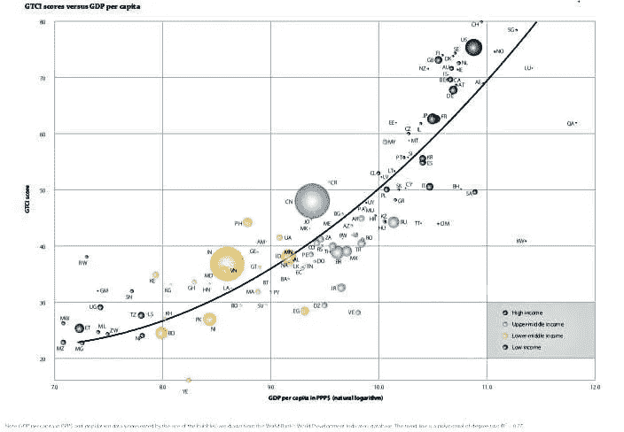

# 我们的孩子和成为未来全球人才的竞赛

> 原文：<https://medium.datadriveninvestor.com/our-kids-and-the-race-to-be-the-global-talent-of-the-future-22658d8dc3d6?source=collection_archive---------4----------------------->

2018 年版全球人才竞争力指数(GTCI) [报告](https://gtcistudy.com/wp-content/uploads/2018/01/GTCI-2018-web.r1-1.pdf)，特别关注多元化的重要性。他们强调了在一个越来越依赖人才的世界中，社会合作伙伴之间的合作对于应对我们所面临的巨大挑战至关重要。因此，一个国家吸引人才的能力将最终为一个能够解决自身问题的更具创新性的社会铺平道路。该研究富有洞察力和深入的分析。我想强调几个支持未来工作和教育以及使我们的社会更可持续的两个关键点——教育和社会公平。及时的讨论，因为教师在美国各地罢工，要求更好的工作条件和公平的报酬，这几乎没有触及我们日益扩大的教育赤字的表面。我们可以从 GTCI 报告中了解到，我们需要做些什么来制定社会政策，让我们的学生为全球竞争做好准备，并让我们的家庭能够支持他们。

# 2018 全球人才竞争力指数与社会公平

GTCI 得分最高的仍然是发达的高收入国家，人均国内生产总值和 GTCI 得分之间有很高的相关性。正是这些国家有资源和意愿创造更多的社会公平。在这些国家，我们可以看到一个良性循环，即建立更多社会资本的公共政策创造更好的生活条件，从而吸引和留住更多本地和全球人才，实现繁荣。这就是下图所显示的。它清楚地表明，减少社会不平等对于长期的全球竞争力和社会稳定至关重要。当教师必须为争取最低条件而罢工时，这清楚地表明我们在通过优质教育创造社会公平方面做得不够。

# 教育和多样性:挑战和机遇

教育是当今社会公平议程的焦点，旨在使社会在 21 世纪具有竞争力。不会有什么不同。在当前全球化和不平等的世界中教育多样化的学生不是一项简单的任务。我们需要为每个学生创造合适的条件，让他们在未来的信息经济中茁壮成长，而不仅仅是少数人。从教育的角度来看，日益增加的多样性提出了一个问题:确保所有学生都能在学校内外取得成功的最佳方式是什么？传统的教育体系注重统一和标准化:统一的目标、相同的内容、标准化的学习进度、分配给学习的无差别的时间量以及共同的成功标准——而不管学生群体中人才的多样性。重点是学习者(和结果)的同质性。这种同质性范式要求学习者在许多方面被视为相似，并且故意不承认差异。在教育大众化和扩张的时代，这种方法可能是合适的，但在现代社会，这种方法根本站不住脚。对于教师来说，拥有一个背景、文化、学习偏好和能力各异的班级已经不再罕见。经济合作与发展组织的国际学生评估项目(PISA)测试提供了充足的证据证明了多样性的重要性，但也许并不总是像我们希望的那样:有移民背景的学生在 PISA 测试中的平均表现不如他们的本土同龄人；来自富裕家庭的孩子比不富裕的孩子表现更好；此外，长期以来，在成绩上存在性别差异，平均而言，男生(在数学方面)和女生(在阅读方面)更胜一筹。尽管这些绩效差距至关重要，但各国之间的巨大差异表明，这些差异即使不能克服，也可以在很大程度上得到缓解。为所有学生提供在学校内外茁壮成长所需的技能和能力意味着能够满足他们的各种需求。

# 学生学什么:从课程到能力

统一和标准化不仅塑造了学校的教学环境，也塑造了学生应该学什么和教师应该教什么。许多教育系统正在努力摆脱一种课程框架，在这种框架中，以集中的方式规定统一的学习目标和内容，以便在全国所有学校中教授。呼吁个性化教育教师需要能够使学习活动适应学生不同的能力、素质和动机，以及他们的语言、文化和社会背景。这必须辅之以敏感的评估，让学习者的优势和劣势得到确认。技术在允许信息、通信和材料的个性化方面起着至关重要的作用。必须投资装备和培训教育生态系统。学习矩阵同质学习环境——针对“普通”学习者调整教学内容——可能会给一些学生带来过重的学习挑战，而不会给其他学生带来足够的激励。在这两种情况下，学习结果将是次优的。管理认知负荷和学习挑战，使所有学习者都能平等受益，需要设计良好的教学方法和适当的评估系统。如何支持教师:多样化的能力多样化的教室、新的教学方法和注重新能力的课程框架将要求教师具备不同的技能和行为。因此，问题变成了:老师们准备好了吗？还是教师本身就是为了职业角色而接受教育，把一致性和一致性放在第一位？

# 决策地点:政策挑战

认真对待多样性的教育系统不能再依赖命令和控制的治理模式。与统一化和标准化相对应的政策是一个高度集中的治理体系，在这个体系中，所有学校通过中央指导和问责安排受到同等对待，这些安排迫使学校遵守中央做出的决定。在日益多样化的社会中，当地条件往往千差万别，如果学校不适应这些条件，就无法实现其社会使命。因此，多样性带来了灵活性和放松管制，学校承担了教学和课程的所有权。根据 PISA 2015 年的数据，表明当课程或评估的责任由学校管理层和教师承担，而不是由国家教育当局(如部委)承担时，学生的学习成果会受到积极影响。

# 从事

过去的表现并不能保证未来的成功。有这么多的事情要做，我们所有人都必须了解当前的情况、工作和教育的未来，并通过负责任地投票来促进必要的变革，以实现现代和有效的社会政策。我们不能再等了，要重振我们的公共教育体系，创造更多的社会公平，这样每个家庭都可以支持他们的孩子成为竞争激烈的全球就业市场的赢家。

*最初发表于*[*【www.collectivebrains.org】*](https://www.collectivebrains.org/editorial/our-kids-and-the-race-to-be-the-global-talent-of-the-future)*。*